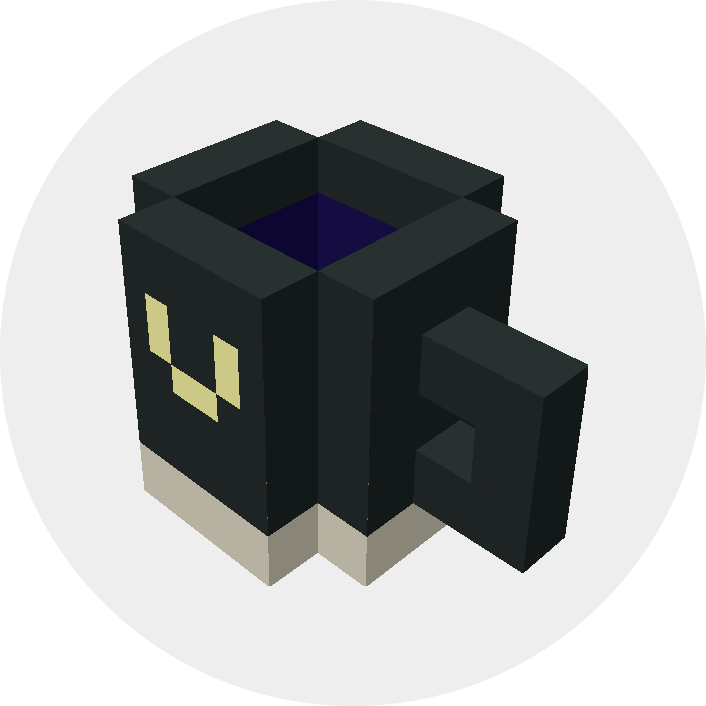

<div align="center">

<a href="https://shaoruu.io">
  
</a>

<h1><a href="https://shaoruu.io">Voxelize</a></h1>

<p>A multiplayer, <i>super fast</i>, voxel engine in your browser.</p>

<a href="https://discord.gg/9483RZtWVU">
  
</a>


</div>


## Quick start

Requires: [Rust](https://www.rust-lang.org/tools/install), [Node.js](https://nodejs.org/), [cargo-watch](https://crates.io/crates/cargo-watch), [protoc](https://grpc.io/docs/protoc-installation/)

```bash
git clone https://github.com/shaoruu/voxelize.git && cd voxelize
pnpm install && pnpm run proto && pnpm run build
pnpm run demo
```

Visit http://localhost:3000

## Links

- [LIVE DEMO](https://shaoruu.io) · [Backend docs](https://docs.rs/voxelize) · [Frontend docs](https://docs.voxelize.io/tutorials/intro/what-is-voxelize) · [Support](https://www.patreon.com/voxelize)

---

[@shaoruu](https://github.com/shaoruu)
