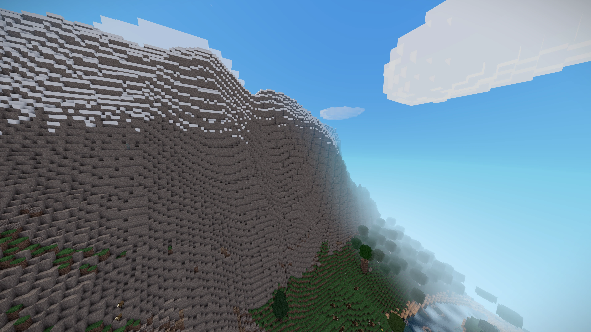
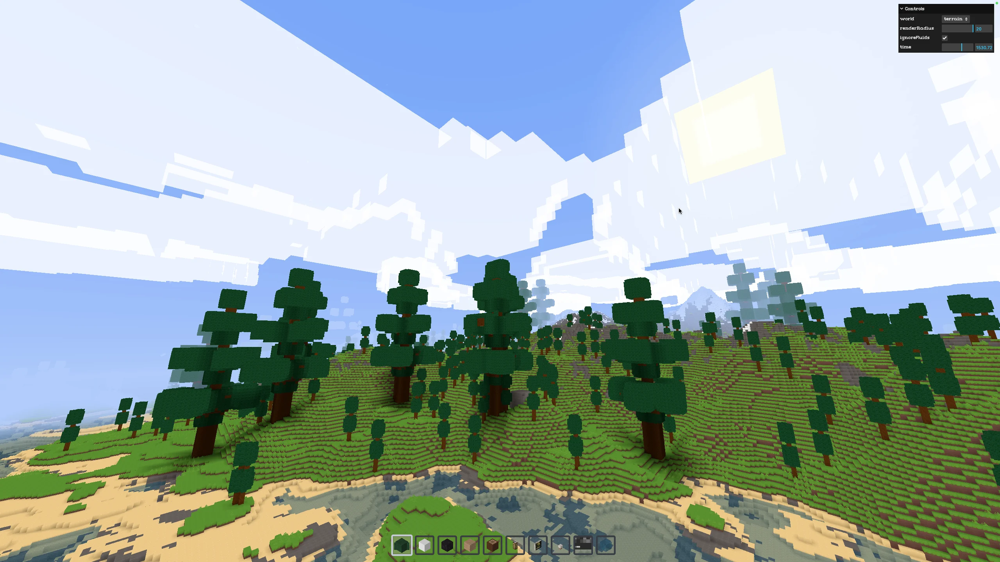
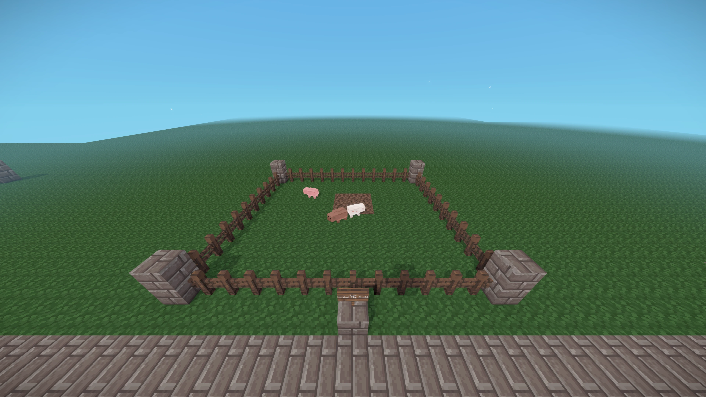

<div align="center">


<h1>Voxelize</h1>

<p><b>A full-stack Rust + TypeScript multiplayer voxel engine for the browser.</b></p>

<a href="https://discord.gg/9483RZtWVU">
  
</a>
<a href="https://www.npmjs.com/package/@voxelize/core">
  
</a>
<a href="https://crates.io/crates/voxelize">
  
</a>

<p>
  <a href="https://docs.voxelize.io">Documentation</a>
  ·
  <a href="https://docs.rs/voxelize/latest/voxelize/">Rust API</a>
  ·
  <a href="https://create.town">Live Showcase</a>
</p>

</div>



<p align="center"><i><a href="https://create.town">Town</a> — a live multiplayer world running on Voxelize in production.</i></p>

## Why Voxelize

Voxelize powers persistent, multiplayer voxel worlds that run in any modern browser — no install, no plugins. The server is authoritative Rust; the client is TypeScript on Three.js; both sides share one protocol and the same meshing core, keeping authoritative state and rendered geometry aligned.

- **Realtime multiplayer built in** — authoritative server with entity, chat, and event synchronization out of the box.
- **Fast, multithreaded chunk meshing** — the same Rust mesher runs natively on the server and as WebAssembly on the client.
- **Custom blocks with custom geometry** — static or dynamic meshes with flexible combinational rendering logic.
- **Multi-stage world generation with chunk overflow** — structures that spill into neighboring chunks (trees, buildings) are handled automatically.
- **Voxel-aware AABB physics** — auto-stepping, raycasting, and entity-to-entity collision detection and resolution against any static or dynamic blocks.
- **Periodic world persistence** — worlds save and reload without ceremony.
- **Configurable chat and command registry** — wire up game commands declaratively.
- **Headless agent SDK** — drive real clients programmatically for bots, smoke tests, and automation.
- **Developer tooling** — debug panels and a robust event system for custom game logic.

<p align="center">
  
</p>

<p align="center"><i>Terrain generation, lighting, chunk streaming, and live debug tooling in the browser.</i></p>

## Architecture

```text
┌───────────────────────────────┐                      ┌───────────────────────────────┐
│   Browser client (TS)         │      WebSocket       │   Authoritative server (Rust) │
│                               │◄────────────────────►│                               │
│   @voxelize/core (Three.js)   │  @voxelize/protocol  │   voxelize (ECS worlds)       │
│   physics-engine · raycast    │  @voxelize/transport │   voxelize-mesher (meshing)   │
│   voxelize-wasm-mesher (WASM) │  (shared protobuf)   │   voxelize-core (voxel data)  │
└───────────────────────────────┘                      └───────────────────────────────┘
```

- **Rust authoritative server** — `voxelize` runs ECS-driven worlds: chunk generation, physics, entities, and events all live server-side.
- **TypeScript / Three.js client** — `@voxelize/core` renders worlds in the browser and stays in sync over WebSocket.
- **Shared protocol and transport** — `@voxelize/protocol` defines the protobuf messages; `@voxelize/transport` moves them.
- **WASM meshing** — `voxelize-wasm-mesher` compiles the server's mesher to WebAssembly, so client-side remeshing follows the same geometry rules as server-side meshing.
- **Headless agents** — `@voxelize/agent` drives real browser clients headlessly for testing, measurement, and bots.

## In Production

[**Town**](https://create.town) is a live, persistent multiplayer building world built on Voxelize — the engine's full stack (authoritative Rust server, Three.js client, WASM meshing, headless agents for smoke testing) running as a real production application.

<p align="center">
  
  
</p>

<p align="center">
  
</p>

<p align="center"><i>Production worlds, custom entities, and engine tooling — more gallery frames landing as they pass capture gates.</i></p>


## Quick Start

Prerequisites: [Rust](https://www.rust-lang.org/tools/install), [Node.js](https://nodejs.org/en/download/), [pnpm](https://pnpm.io/installation), [cargo-watch](https://crates.io/crates/cargo-watch), [wasm-pack](https://rustwasm.github.io/wasm-pack/installer/), and [protoc](https://grpc.io/docs/protoc-installation/).

```bash
git clone https://github.com/voxelize/voxelize.git
cd voxelize

pnpm install   # install dependencies
pnpm proto     # generate protocol buffers
pnpm build     # build WASM mesher + all packages
pnpm demo      # run the demo server and client
```

Then open http://localhost:3000.

## Packages

### npm

| Package | Description |
| --- | --- |
| [`@voxelize/core`](packages/core) | The client engine: rendering, world sync, inputs, and utilities on Three.js |
| [`@voxelize/agent`](packages/agent) | Headless puppeteer-backed agent SDK for Voxelize worlds |
| [`@voxelize/transport`](packages/transport) | WebSocket transport for Voxelize protocol messages |
| [`@voxelize/protocol`](packages/protocol) | Shared protobuf message definitions |
| [`@voxelize/physics-engine`](packages/physics-engine) | Voxel-aware AABB physics with auto-stepping |
| [`@voxelize/raycast`](packages/raycast) | Voxel raycasting |
| [`@voxelize/debug`](packages/debug) | In-game debug panels |
| [`@voxelize/aabb`](packages/aabb) | Axis-aligned bounding box math |

### Rust crates

| Crate | Description |
| --- | --- |
| [`voxelize`](server) | The authoritative multiplayer server engine |
| [`voxelize-core`](crates/core) | Core types and utilities — the single source of truth for voxel data encoding |
| [`voxelize-mesher`](crates/mesher) | Chunk meshing logic |
| [`voxelize-wasm-mesher`](crates/wasm-mesher) | WebAssembly wrapper around the mesher for client-side use |

## Documentation

- [Guides and tutorials](https://docs.voxelize.io) — client-side concepts, world building, and API walkthroughs
- [Rust API reference](https://docs.rs/voxelize/latest/voxelize/) — server-side engine documentation

## Development

Useful workspace commands:

```bash
pnpm watch        # rebuild TS packages and WASM mesher on change
pnpm test         # TypeScript tests (vitest)
pnpm test:rust    # Rust mesher and lighting tests
pnpm bench        # criterion benchmarks (mesher, lights)
pnpm check        # cargo check across all targets
pnpm lint         # eslint with autofix
```

Notes on faster local builds:

- The server watch loop (`pnpm demo:rs`) builds with the `release-dev` profile: the same `opt-level = 3` runtime performance as `release`, but with incremental compilation and minimal debug info for much faster edit-rebuild cycles. Published builds should keep using `--release`.
- If you consume Voxelize as a submodule of a parent cargo workspace, cargo takes profiles from the parent's root `Cargo.toml` — copy the `[profile.release-dev]` block there to get the same fast iteration.
- Rust >= 1.90 links with the fast bundled `rust-lld` on x86_64 Linux out of the box; see `.cargo/config.toml` for opt-in lld linking on other platforms and an opt-in `sccache` shared cache.

## Community

Questions, showcases, and engine discussion happen on [Discord](https://discord.gg/9483RZtWVU). Issues and pull requests are welcome on [GitHub](https://github.com/voxelize/voxelize).

<p align="center">
  
</p>

## License

[MIT](LICENSE)

## Assets Used

- [Connection Serif Font (SIL Open Font)](https://fonts2u.com/connection-serif.font)
- [Pixel Perfection by XSSheep (CC BY-SA 4.0)](https://www.planetminecraft.com/texture-pack/131pixel-perfection/)

---

<sub>Voxelize is an independent open-source project. It is not affiliated with, endorsed by, or connected to any commercial voxel game or its publishers.</sub>
