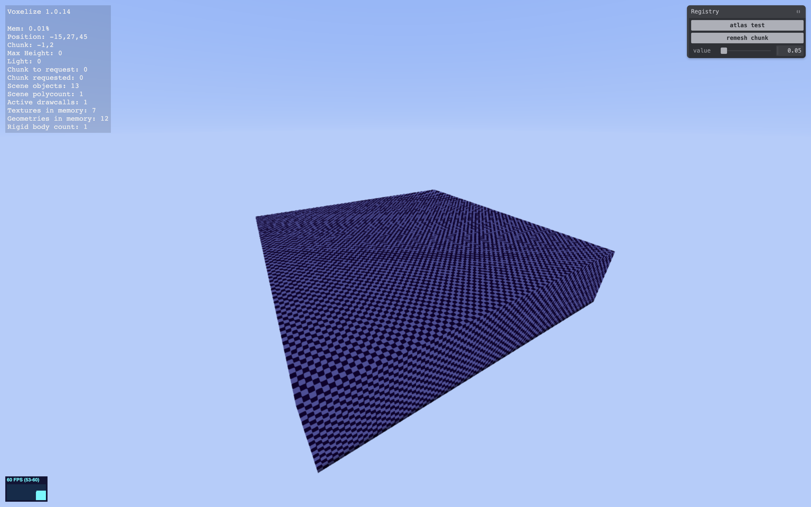

# Create a Client

Now that we have a world and a landscape, it's time for us to join the world on the browser and play!

## The Setup

The template provides a webpack-based frontend project, with main source code located in the [`client`](https://github.com/shaoruu/voxelize-example/tree/master/client) folder.

In order to create a Voxelize client, we need somewhere to render our game. Therefore, let's make a `div` in the `index.html` and try to get things going.

```html title="client/index.html" {3-15}
<body>
  <!-- ... -->
  <div id="main"></div>

  <style>
    * {
      margin: 0;
      padding: 0;
    }

    #main {
      width: 100vw;
      height: 100vh;
    }
  </style>

  <script src="./index.js"></script>
</body>
```

## Creating the Client

With the dom element setup, we can go ahead and initialize our client:

```js title="client/index.js"
import { Client } from "@voxelize/client";

const domElement = document.getElementById("main");

const client = new Client({ container: { domElement } });

// Connect to our backend at port 4000 as configured
client.connect({ serverURL: "http://localhost:4000" }).then(() => {
  // Join the world once a connection is made
  client.join("Test");
});
```

You can now run `npm run start` and visit [`http://localhost:8080`](http://localhost:8080). Click on the canvas, look around and move around with <kbd>WASD</kbd> + <kbd>space</kbd> + <kbd>shift</kbd>, and you'll most likely see something like this:



This is perfectly normal! The purple/dark purple texture you see is actually just the default texture Voxelize applies, so let's apply our own texture next.

## Applying Textures to Blocks

The Voxelize example has set up [webpack file-loader](https://v4.webpack.js.org/loaders/file-loader/) to load in images. We can then apply these image sources to our defined blocks on the server:

```js title="client/index.js" {6-9}
import DirtImage from "./assets/dirt.png";
import StoneImage from "./assets/stone.png";

// ...

client.registry.applyTexturesByNames([
  { name: "Dirt", side: "all", data: DirtImage },
  { name: "Stone", side: "all", data: StoneImage },
]);

client.connect({ serverURL: "http://localhost:4000" }).then(() => {
  client.join("Test");
});
```

You should see something like this:


You now have a fully functional, editable, and FAST voxel game running in your browser!
