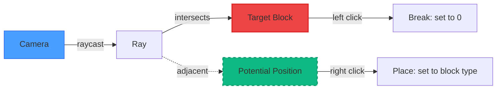
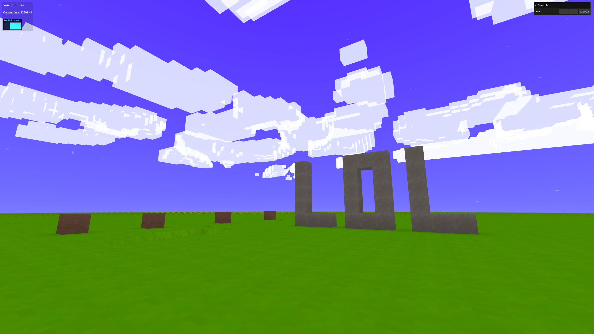

# Update Voxels

Modify voxels by raycasting to find which block the player is looking at.



Voxelize uses a fast ray-voxel intersection algorithm based on [this paper](http://www.cse.yorku.ca/~amana/research/grid.pdf).


## Setup Voxel Interaction

```javascript title="main.js"
const voxelInteract = new VOXELIZE.VoxelInteract(camera, world, {
  highlightType: "outline",
});

world.add(voxelInteract);

function animate() {
  requestAnimationFrame(animate);

  if (world.isInitialized) {
    world.update(
      camera.getWorldPosition(new THREE.Vector3()),
      camera.getWorldDirection(new THREE.Vector3())
    );

    rigidControls.update();
    voxelInteract.update();
  }

  renderer.render(world, camera);
}
```

## Add a Crosshair

Update `index.html`:

```html title="index.html"
<div id="app">
  <canvas id="canvas"></canvas>
  <div id="crosshair"></div>
</div>
```

Update `style.css`:

```css title="style.css"
#crosshair {
  width: 12px;
  height: 12px;
  border: 2px solid #fff3;
  border-radius: 6px;
  position: fixed;
  top: 50%;
  left: 50%;
  transform: translate(-50%, -50%);
}
```


## Break Blocks

```javascript title="main.js"
inputs.click("left", () => {
  if (!voxelInteract.target) return;

  const [x, y, z] = voxelInteract.target;
  world.updateVoxel(x, y, z, 0);
});
```

Block type `0` is air - setting a voxel to 0 removes it.

## Place Blocks

```javascript title="main.js"
let holdingBlockType = 1;

inputs.click("middle", () => {
  if (!voxelInteract.target) return;

  const [x, y, z] = voxelInteract.target;
  holdingBlockType = world.getVoxelAt(x, y, z);
});

inputs.click("right", () => {
  if (!voxelInteract.potential) return;

  const { voxel } = voxelInteract.potential;
  world.updateVoxel(...voxel, holdingBlockType);
});
```

- `voxelInteract.target` - The block you're looking at
- `voxelInteract.potential` - The adjacent block position (where a new block would be placed)



Controls:

- Left click: Break block
- Middle click: Pick block type
- Right click: Place block
