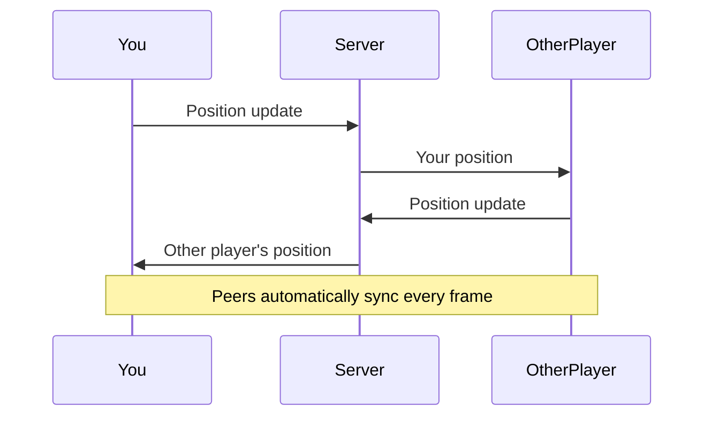

# Multiplayer

Add real-time multiplayer with the `Peers` class. It syncs player positions over WebSockets and renders their characters.



## Setup Peers

```javascript title="main.js"
const peers = new VOXELIZE.Peers(rigidControls.object);

network.register(peers);
world.add(peers);
```

`rigidControls.object` is the camera - this tells Peers what position to broadcast to other players.

## Create Peer Characters

```javascript title="main.js"
peers.createPeer = createCharacter;

peers.onPeerUpdate = (peer, data) => {
  peer.set(data.position, data.direction);
};
```

When another player joins, `createPeer` is called to make their character. When they move, `onPeerUpdate` receives their position.

The `set` method smoothly interpolates the character to the new position.

## Add Peer Updates

```javascript title="main.js"
function animate() {
  requestAnimationFrame(animate);

  if (world.isInitialized) {
    world.update(
      camera.getWorldPosition(new THREE.Vector3()),
      camera.getWorldDirection(new THREE.Vector3())
    );

    rigidControls.update();
    voxelInteract.update();
    perspectives.update();
    lightShined.update();
    shadows.update();
    peers.update();
  }

  renderer.render(world, camera);
}
```


Open multiple browser tabs and you'll see other players moving around.

## Full Implementation

The complete tutorial code with multiplayer:

```javascript title="main.js"
import * as VOXELIZE from "@voxelize/core";
import * as THREE from "three";

const canvas = document.getElementById("canvas");

const world = new VOXELIZE.World({
  textureUnitDimension: 16,
});

const camera = new THREE.PerspectiveCamera(
  75,
  window.innerWidth / window.innerHeight,
  0.1,
  3000
);

const renderer = new THREE.WebGLRenderer({
  antialias: true,
  powerPreference: "high-performance",
  canvas,
});
renderer.setSize(window.innerWidth, window.innerHeight);
renderer.setPixelRatio(window.devicePixelRatio || 1);
renderer.outputColorSpace = THREE.SRGBColorSpace;

window.addEventListener("resize", () => {
  camera.aspect = window.innerWidth / window.innerHeight;
  camera.updateProjectionMatrix();
  renderer.setSize(window.innerWidth, window.innerHeight);
});

const network = new VOXELIZE.Network();
network.register(world);

const inputs = new VOXELIZE.Inputs();

const rigidControls = new VOXELIZE.RigidControls(
  camera,
  renderer.domElement,
  world,
  {
    initialPosition: [0, 40, 0],
  }
);

rigidControls.connect(inputs);

inputs.bind("g", rigidControls.toggleGhostMode);
inputs.bind("f", rigidControls.toggleFly);

const voxelInteract = new VOXELIZE.VoxelInteract(camera, world, {
  highlightType: "outline",
});

world.add(voxelInteract);

const perspectives = new VOXELIZE.Perspective(rigidControls, world);
perspectives.connect(inputs);

const shadows = new VOXELIZE.Shadows(world);
const lightShined = new VOXELIZE.LightShined(world);

function createCharacter() {
  const character = new VOXELIZE.Character();
  world.add(character);
  lightShined.add(character);
  shadows.add(character);
  return character;
}

const mainCharacter = createCharacter();
rigidControls.attachCharacter(mainCharacter);

const peers = new VOXELIZE.Peers(rigidControls.object);

peers.createPeer = createCharacter;

peers.onPeerUpdate = (peer, data) => {
  peer.set(data.position, data.direction);
};

network.register(peers);
world.add(peers);

let holdingBlockType = 1;

inputs.click("left", () => {
  if (!voxelInteract.target) return;
  const [x, y, z] = voxelInteract.target;
  world.updateVoxel(x, y, z, 0);
});

inputs.click("middle", () => {
  if (!voxelInteract.target) return;
  const [x, y, z] = voxelInteract.target;
  holdingBlockType = world.getVoxelAt(x, y, z);
});

inputs.click("right", () => {
  if (!voxelInteract.potential) return;
  const { voxel } = voxelInteract.potential;
  world.updateVoxel(...voxel, holdingBlockType);
});

function animate() {
  requestAnimationFrame(animate);

  if (world.isInitialized) {
    world.update(
      camera.getWorldPosition(new THREE.Vector3()),
      camera.getWorldDirection(new THREE.Vector3())
    );

    rigidControls.update();
    voxelInteract.update();
    perspectives.update();
    lightShined.update();
    shadows.update();
    peers.update();
  }

  renderer.render(world, camera);
}

async function start() {
  animate();

  await network.connect("http://localhost:4000");
  await network.join("tutorial");

  await world.initialize();

  world.sky.setShadingPhases([
    {
      name: "sunrise",
      color: {
        top: new THREE.Color("#7694CF"),
        middle: new THREE.Color("#B0483A"),
        bottom: new THREE.Color("#222"),
      },
      skyOffset: 0.05,
      voidOffset: 0.6,
      start: 0.2,
    },
    {
      name: "daylight",
      color: {
        top: new THREE.Color("#73A3FB"),
        middle: new THREE.Color("#B1CCFD"),
        bottom: new THREE.Color("#222"),
      },
      skyOffset: 0,
      voidOffset: 0.6,
      start: 0.25,
    },
    {
      name: "sunset",
      color: {
        top: new THREE.Color("#A57A59"),
        middle: new THREE.Color("#FC5935"),
        bottom: new THREE.Color("#222"),
      },
      skyOffset: 0.05,
      voidOffset: 0.6,
      start: 0.7,
    },
    {
      name: "night",
      color: {
        top: new THREE.Color("#000"),
        middle: new THREE.Color("#000"),
        bottom: new THREE.Color("#000"),
      },
      skyOffset: 0.1,
      voidOffset: 0.6,
      start: 0.75,
    },
  ]);

  world.sky.paint("bottom", VOXELIZE.artFunctions.drawSun());
  world.sky.paint("top", VOXELIZE.artFunctions.drawStars());
  world.sky.paint("top", VOXELIZE.artFunctions.drawMoon());
  world.sky.paint("sides", VOXELIZE.artFunctions.drawStars());

  const allFaces = ["px", "nx", "py", "ny", "pz", "nz"];
  await world.applyBlockTexture("Dirt", allFaces, "/blocks/dirt.png");
  await world.applyBlockTexture("Stone", allFaces, "/blocks/stone.png");
  await world.applyBlockTexture(
    "Grass Block",
    ["px", "pz", "nx", "nz"],
    "/blocks/grass_side.png"
  );
  await world.applyBlockTexture("Grass Block", "py", "/blocks/grass_top.png");
  await world.applyBlockTexture("Grass Block", "ny", "/blocks/dirt.png");
}

start();
```

This matches the final tutorial repository code. For custom peer metadata (like held items, roles, health), see the [Custom Peers](/wiki/entities/custom-peers) wiki page.
