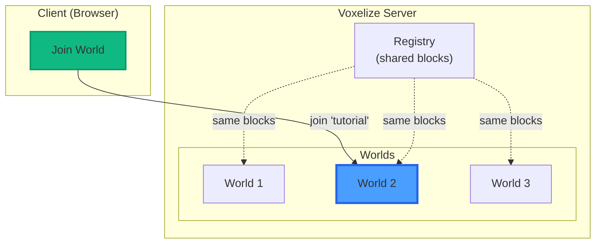
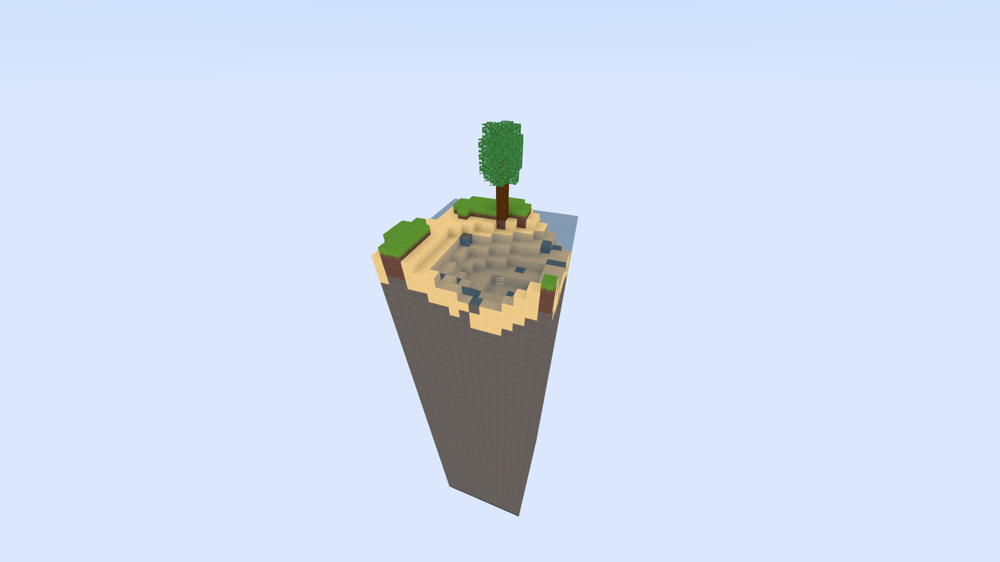

# Create a World

A server can have multiple worlds. This tutorial creates one world called "tutorial".



## What is a World?

A world stores voxel data, entities, and player information. Each world has its own chunk generation pipeline.

## What are Chunks?



Chunks are columns of blocks. By default, a chunk is 16x256x16 blocks.

The world only generates chunks around players. As players move, new chunks generate and far ones unload. This makes infinite worlds possible.


Chunks have 2D coordinates (x, z). Voxels have 3D coordinates (x, y, z). With 16-block chunks:

- Voxel `(1, 1, 1)` is in chunk `(0, 0)`
- Voxel `(17, 1, 1)` is in chunk `(1, 0)`

:::tip
Chunks let Voxelize process terrain in parallel on both server and client.
:::

## Create the World

```rust title="src/main.rs"
use voxelize::{Block, Registry, Server, Voxelize, World, WorldConfig};

#[actix_web::main]
async fn main() -> std::io::Result<()> {
    let dirt = Block::new("Dirt").id(1).build();
    let stone = Block::new("Stone").id(2).build();
    let grass_block = Block::new("Grass Block").id(3).build();

    let config = WorldConfig::new().build();
    let mut world = World::new("tutorial", &config);

    let mut registry = Registry::new();
    registry.register_blocks(&[dirt, stone, grass_block]);

    let mut server = Server::new()
        .port(4000)
        .registry(&registry)
        .build();

    server
        .add_world(world)
        .expect("Failed to add world to server");

    Voxelize::run(server).await
}
```

The world is created but still empty - no terrain yet.
