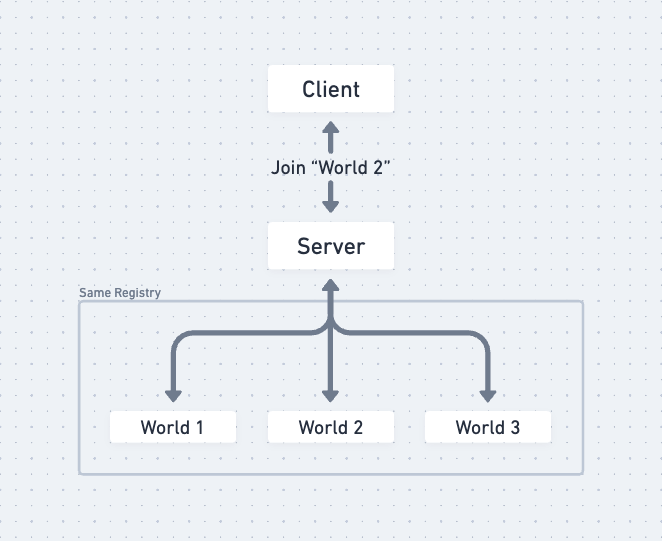

# Create a World

With a server and two blocks, we are ready to create our first world.

A server can contain multiple worlds. For demonstration purposes, we will only be creating one world for this tutorial called **tutorial**.




## What is a Voxelize World?

A Voxelize world is a voxel world registered under a Voxelize server. It contains its own set of data, such as block data, entity data, player information, and all that.

Voxel worlds are made up of chunks, so let's dive into what chunks are next.


## What are Chunks?


Chunks are columns of blocks that make up an entire Voxelize world. By default, a chunk is 16x256x16 in dimension. A Voxelize world can be infinite because the world only generates the chunks around the clients, and as the client moves, more chunks are generated.


Chunks have their own coordinate system, separate from the voxel coordinate system. Voxel coordinates are 3D in the x/y/z space, and chunk coordinates are 2D in the x/z plane. For example, if the chunk size is 16 blocks wide, the voxel `(1, 1, 1)` would reside in the chunk `(0, 0)`, and the voxel `(17, 1, 1)` would reside in chunk `(1, 0)`. If chunk has a max height of 256, a voxel coordinate such as `(17, 256, 1)` would be invalid since the valid y-coordinate range would be `0` - `255`.

:::tip
The concept of chunk allows Voxelize to organize data and run things in parallel on both the client side and server side.
:::

## World Configuration

Now that we have an understanding of how Voxelize worlds work, let's talk about configuring the voxel world.

Voxelize worlds are configured through `WorldConfig`s. It defines how the world should be run.

```rust title="server/main.rs"
// highlight-next-line
use voxelize::{Block, Registry, Server, Voxelize, WorldConfig};

#[actix_web::main]
async fn main() -> std::io::Result<()> {
    // ... Creating the server

    // highlight-start
    let config = WorldConfig::new().build();
    // highlight-end

    // ... Running the server
}
```

## World Creation

Now that we have a world configuration, we can use it to create a Voxelize world.

There are two ways of doing so:

```rust title="server/main.rs"
// Method 1
use voxelize::World;

let world = World::new("tutorial", &config);
server.add_world(world).expect("Could not add world!");

// Method 2
let world = server.create_world("tutorial", &config).unwrap();
```

Both ways add a new world called `"example"` to the Voxelize server.

## Progress Check

The code so far on `server/main.rs` should look like this:

```rust title="server/main.rs"
use voxelize::{Block, FlatlandStage, Registry, Server, Voxelize, World, WorldConfig};

#[actix_web::main]
async fn main() -> std::io::Result<()> {
    let dirt = Block::new("Dirt").id(1).build();
    let stone = Block::new("Stone").id(2).build();
    let grass_block = Block::new("Grass Block").id(3).build();

    let config = WorldConfig::new().build();

    let mut world = World::new("tutorial", &config);

    let mut registry = Registry::new();
    registry.register_blocks(&[dirt, stone, grass_block]);

    let mut server = Server::new().port(4000).registry(&registry).build();

    server
        .add_world(world)
        .expect("Failed to add world to server");

    Voxelize::run(server).await
}
```
