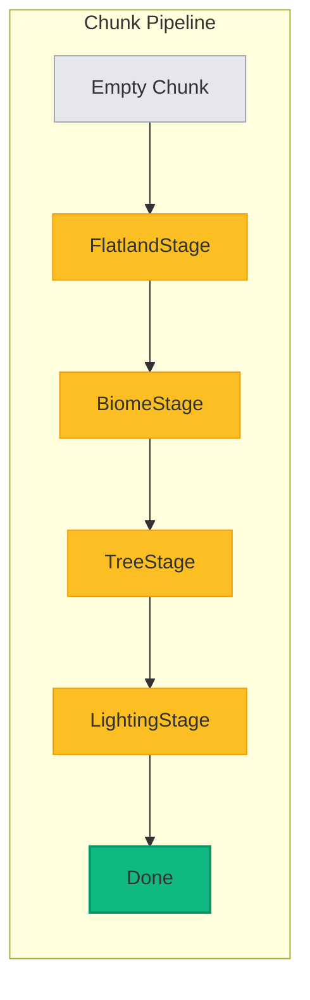

# Chunk Generation


Populate empty chunks with terrain using chunk stages. Each chunk goes through all stages in sequence.

## Using FlatlandStage

Voxelize includes a built-in `FlatlandStage` for flat terrain. Add it to the world's pipeline:

```rust title="src/main.rs"
use voxelize::{Block, FlatlandStage, Registry, Server, Voxelize, World, WorldConfig};

#[actix_web::main]
async fn main() -> std::io::Result<()> {
    let dirt = Block::new("Dirt").id(1).build();
    let stone = Block::new("Stone").id(2).build();
    let grass_block = Block::new("Grass Block").id(3).build();

    let config = WorldConfig::new()
        .min_chunk([-10, -10])
        .max_chunk([10, 10])
        .build();

    let mut world = World::new("tutorial", &config);

    {
        let mut pipeline = world.pipeline_mut();
        pipeline.add_stage(
            FlatlandStage::new()
                .add_soiling(stone.id, 10)
                .add_soiling(dirt.id, 2)
                .add_soiling(grass_block.id, 1),
        )
    }

    let mut registry = Registry::new();
    registry.register_blocks(&[dirt, stone, grass_block]);

    let mut server = Server::new()
        .port(4000)
        .registry(&registry)
        .build();

    server
        .add_world(world)
        .expect("Failed to add world to server");

    Voxelize::run(server).await
}
```

This creates layers from bottom-up:

- 10 layers of stone
- 2 layers of dirt
- 1 layer of grass block

:::tip
The curly braces around `pipeline_mut()` drop the pipeline reference automatically after use.
:::

## How Chunk Stages Work

Each stage implements the `ChunkStage` trait. The `process` method receives:

- `chunk` - The chunk to populate
- `resources` - Access to registry and world config
- `space` - Optional neighboring chunk data

Stages run in parallel across multiple threads.



## Custom Stages

Here's a simplified version of how `FlatlandStage` works internally:

```rust title="Custom Flatland Stage"
use voxelize::{ChunkStage, Chunk, ResourceResults, Space, VoxelAccess, Vec3};

pub struct MyFlatlandStage {
    height: i32,
    top: u32,
    middle: u32,
    bottom: u32,
}

impl ChunkStage for MyFlatlandStage {
    fn name(&self) -> String {
        "MyFlatland".to_owned()
    }

    fn process(&self, mut chunk: Chunk, _: ResourceResults, _: Option<Space>) -> Chunk {
        let Vec3(min_x, _, min_z) = chunk.min;
        let Vec3(max_x, _, max_z) = chunk.max;

        for vx in min_x..max_x {
            for vz in min_z..max_z {
                for vy in 0..self.height {
                    if vy == 0 {
                        chunk.set_voxel(vx, vy, vz, self.bottom);
                    } else if vy == self.height - 1 {
                        chunk.set_voxel(vx, vy, vz, self.top);
                    } else {
                        chunk.set_voxel(vx, vy, vz, self.middle);
                    }
                }
            }
        }

        chunk
    }
}
```

## Using Space for Neighboring Chunks

When a stage needs data from surrounding chunks (for trees, caves, etc), use `Space`:

```rust title="Stage with Neighbors"
impl ChunkStage for MyStage {
    fn neighbors(&self, _: &WorldConfig) -> usize {
        3
    }

    fn needs_space() -> Option<SpaceData> {
        Some(SpaceData {
            needs_lights: true,
            ..Default::default()
        })
    }

    fn process(&self, chunk: Chunk, _: ResourceResults, space: Option<Space>) -> Chunk {
        let space = space.unwrap();
        space.get_sunlight(...);
        chunk
    }
}
```

:::info
Using `Space` slows generation since neighboring chunks must be processed first.
:::
