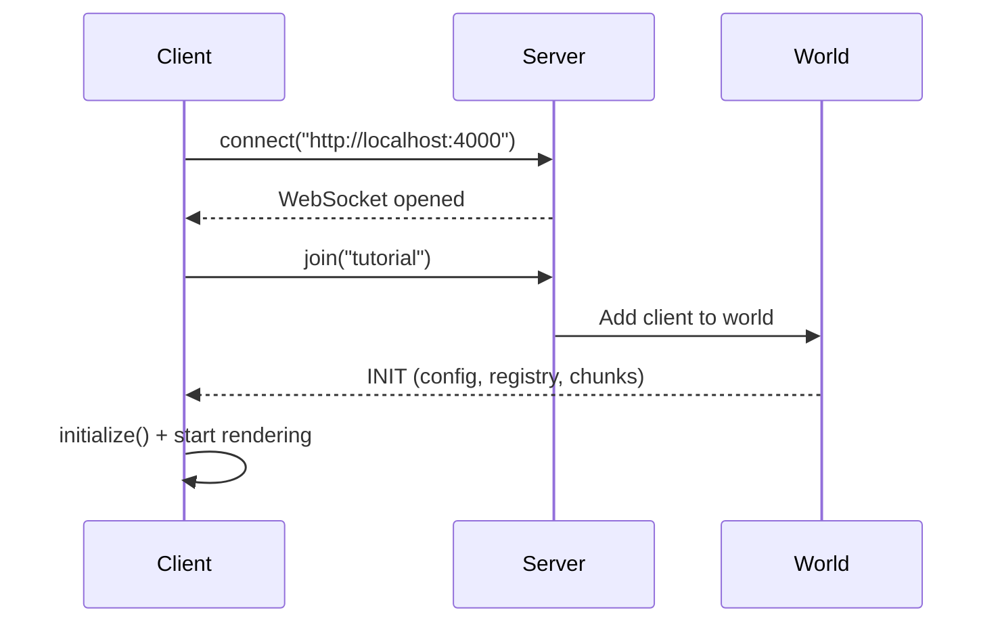

# Create the Client

The client connects to the server, joins a world, and renders it with ThreeJS.



## Voxelize and ThreeJS

Voxelize is built on ThreeJS. The `World` extends `Scene`, and controls move the `Camera`.

Resources to learn ThreeJS:

- [ThreeJS Journey](https://threejs-journey.com/)
- [Official ThreeJS Docs](https://threejs.org/manual/#en/fundamentals)

## Setup the Canvas

The HTML is already in `index.html`:

```html title="index.html"
<body>
  <div id="app">
    <canvas id="canvas"></canvas>
  </div>
  <script type="module" src="/main.js"></script>
</body>
```

The CSS in `style.css` makes it fullscreen:

```css title="style.css"
html,
body {
  height: 100%;
  overflow: hidden;
}

#canvas {
  width: 100%;
  height: 100%;
}
```

## Create the World

Open `main.js` and add:

```javascript title="main.js"
import * as VOXELIZE from "@voxelize/core";
import * as THREE from "three";

const canvas = document.getElementById("canvas");

const world = new VOXELIZE.World({
  textureUnitDimension: 16,
});
```

`textureUnitDimension: 16` sets higher resolution textures (default is 8).

## Setup ThreeJS

```javascript title="main.js"
const camera = new THREE.PerspectiveCamera(
  75,
  window.innerWidth / window.innerHeight,
  0.1,
  3000
);

const renderer = new THREE.WebGLRenderer({
  antialias: true,
  powerPreference: "high-performance",
  canvas,
});
renderer.setSize(window.innerWidth, window.innerHeight);
renderer.setPixelRatio(window.devicePixelRatio || 1);
renderer.outputColorSpace = THREE.SRGBColorSpace;

window.addEventListener("resize", () => {
  camera.aspect = window.innerWidth / window.innerHeight;
  camera.updateProjectionMatrix();
  renderer.setSize(window.innerWidth, window.innerHeight);
});
```

Voxelize uses SRGB color space, so set `outputColorSpace` to match.
