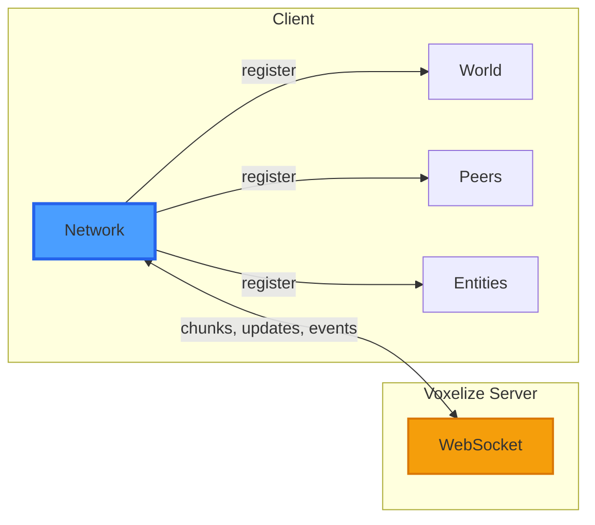

# Handle the Network

The network manager connects to the server over WebSockets and handles all game data.



## Create the Network

```javascript title="main.js"
const network = new VOXELIZE.Network();
network.register(world);
```

Registering the world lets it receive chunk data and world updates.

## Connect to the Server

```javascript title="main.js"
async function start() {
  await network.connect("http://localhost:4000");
  await network.join("tutorial");

  await world.initialize();
}

start();
```

- `connect` - Establishes WebSocket connection
- `join` - Enters the "tutorial" world
- `initialize` - Processes world config and starts chunk loading

:::tip
`network.connect` automatically converts `http://` to `ws://` (or `wss://` for HTTPS).
:::

## Add the Render Loop

```javascript title="main.js"
function animate() {
  requestAnimationFrame(animate);
  renderer.render(world, camera);
}

async function start() {
  animate();

  await network.connect("http://localhost:4000");
  await network.join("tutorial");
  await world.initialize();
}

start();
```

## Full Code So Far

```javascript title="main.js"
import * as VOXELIZE from "@voxelize/core";
import * as THREE from "three";

const canvas = document.getElementById("canvas");

const world = new VOXELIZE.World({
  textureUnitDimension: 16,
});

const camera = new THREE.PerspectiveCamera(
  75,
  window.innerWidth / window.innerHeight,
  0.1,
  3000
);

const renderer = new THREE.WebGLRenderer({
  antialias: true,
  powerPreference: "high-performance",
  canvas,
});
renderer.setSize(window.innerWidth, window.innerHeight);
renderer.setPixelRatio(window.devicePixelRatio || 1);
renderer.outputColorSpace = THREE.SRGBColorSpace;

window.addEventListener("resize", () => {
  camera.aspect = window.innerWidth / window.innerHeight;
  camera.updateProjectionMatrix();
  renderer.setSize(window.innerWidth, window.innerHeight);
});

const network = new VOXELIZE.Network();
network.register(world);

function animate() {
  requestAnimationFrame(animate);
  renderer.render(world, camera);
}

async function start() {
  animate();

  await network.connect("http://localhost:4000");
  await network.join("tutorial");

  await world.initialize();
}

start();
```

Run the client:

```bash
npm run dev
```

You should see an empty sky with clouds. The world is initialized but we haven't told it what to render yet.
