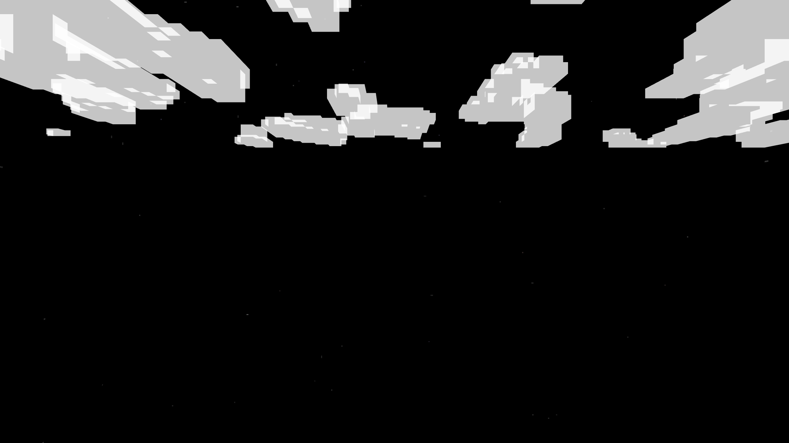
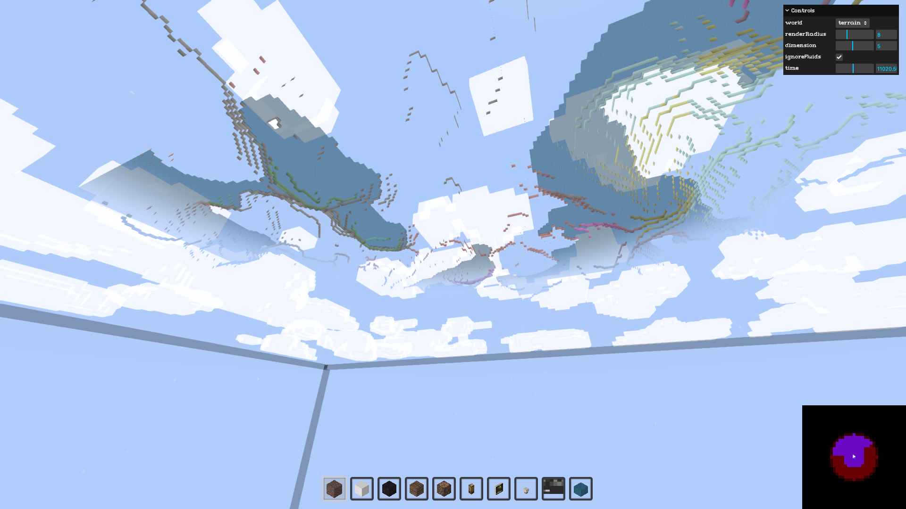

# Initialize the World

After connecting, the world receives an `INIT` packet with server config. Call `world.initialize()` to process it.

```javascript title="main.js"
async function start() {
  animate();

  await network.connect("http://localhost:4000");
  await network.join("tutorial");

  await world.initialize();
}
```

Initialization loads the registry, sets up chunk materials, and starts meshing workers.

Run `npm run dev` and you should see clouds but no terrain yet:



## Update the World

Add chunk loading to the animation loop:

```javascript title="main.js"
function animate() {
  requestAnimationFrame(animate);

  if (world.isInitialized) {
    world.update(
      camera.getWorldPosition(new THREE.Vector3()),
      camera.getWorldDirection(new THREE.Vector3())
    );
  }

  renderer.render(world, camera);
}
```

`world.update` requests chunks around the camera position. The second argument (camera direction) enables frustum culling - only loading chunks the camera is facing.



Purple cells = loaded chunks. Red cells = within radius but behind camera (not loaded).

## Paint the Sky

Add day/night cycle colors and celestial objects:

```javascript title="main.js"
async function start() {
  animate();

  await network.connect("http://localhost:4000");
  await network.join("tutorial");

  await world.initialize();

  world.sky.setShadingPhases([
    {
      name: "sunrise",
      color: {
        top: new THREE.Color("#7694CF"),
        middle: new THREE.Color("#B0483A"),
        bottom: new THREE.Color("#222"),
      },
      skyOffset: 0.05,
      voidOffset: 0.6,
      start: 0.2,
    },
    {
      name: "daylight",
      color: {
        top: new THREE.Color("#73A3FB"),
        middle: new THREE.Color("#B1CCFD"),
        bottom: new THREE.Color("#222"),
      },
      skyOffset: 0,
      voidOffset: 0.6,
      start: 0.25,
    },
    {
      name: "sunset",
      color: {
        top: new THREE.Color("#A57A59"),
        middle: new THREE.Color("#FC5935"),
        bottom: new THREE.Color("#222"),
      },
      skyOffset: 0.05,
      voidOffset: 0.6,
      start: 0.7,
    },
    {
      name: "night",
      color: {
        top: new THREE.Color("#000"),
        middle: new THREE.Color("#000"),
        bottom: new THREE.Color("#000"),
      },
      skyOffset: 0.1,
      voidOffset: 0.6,
      start: 0.75,
    },
  ]);

  world.sky.paint("bottom", VOXELIZE.artFunctions.drawSun());
  world.sky.paint("top", VOXELIZE.artFunctions.drawStars());
  world.sky.paint("top", VOXELIZE.artFunctions.drawMoon());
  world.sky.paint("sides", VOXELIZE.artFunctions.drawStars());
}
```

`setShadingPhases` defines color transitions throughout the day. The sky interpolates between phases as time progresses.

The sky is a `CanvasBox` - you can paint on it with the built-in art functions or custom canvas drawing.
