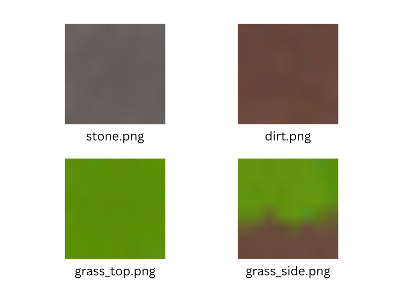
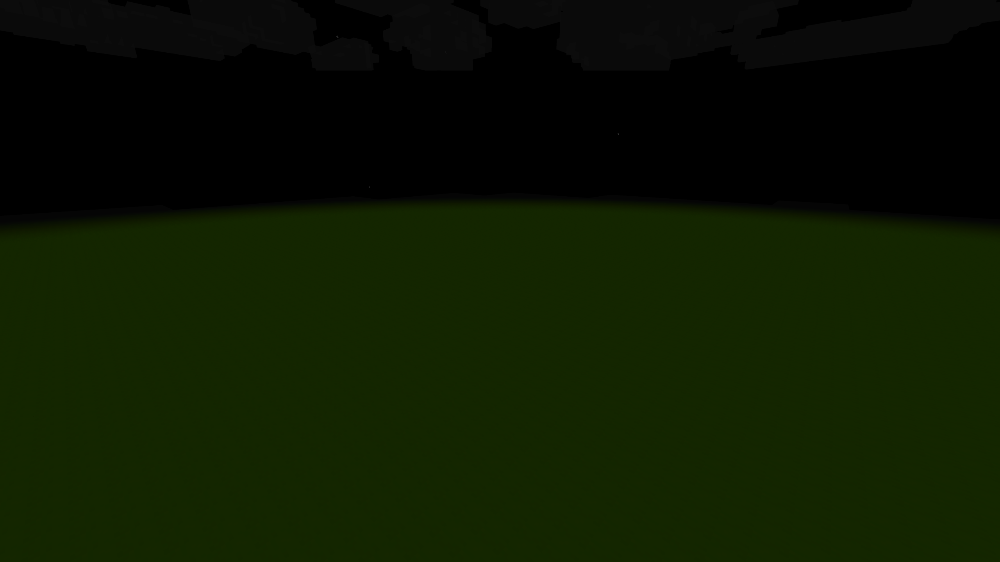

# Apply Textures

Right now blocks show question marks because we haven't applied textures yet.



The tutorial repo includes textures in `public/blocks/`.

:::info
Apply textures **after** `world.initialize()`. The texture atlas is created during initialization.
:::

```javascript title="main.js"
async function start() {
  animate();

  await network.connect("http://localhost:4000");
  await network.join("tutorial");

  await world.initialize();

  world.sky.setShadingPhases([...]);
  world.sky.paint("bottom", VOXELIZE.artFunctions.drawSun());
  world.sky.paint("top", VOXELIZE.artFunctions.drawStars());
  world.sky.paint("top", VOXELIZE.artFunctions.drawMoon());
  world.sky.paint("sides", VOXELIZE.artFunctions.drawStars());

  const allFaces = ["px", "nx", "py", "ny", "pz", "nz"];
  await world.applyBlockTexture("Dirt", allFaces, "/blocks/dirt.png");
  await world.applyBlockTexture("Stone", allFaces, "/blocks/stone.png");
  await world.applyBlockTexture(
    "Grass Block",
    ["px", "pz", "nx", "nz"],
    "/blocks/grass_side.png"
  );
  await world.applyBlockTexture("Grass Block", "py", "/blocks/grass_top.png");
  await world.applyBlockTexture("Grass Block", "ny", "/blocks/dirt.png");
}
```

Face names:

- `px` - Positive X (right)
- `nx` - Negative X (left)
- `py` - Positive Y (top)
- `ny` - Negative Y (bottom)
- `pz` - Positive Z (front)
- `nz` - Negative Z (back)

Grass Block has different textures per face - grass on top, dirt on bottom, grass side texture on the sides.


