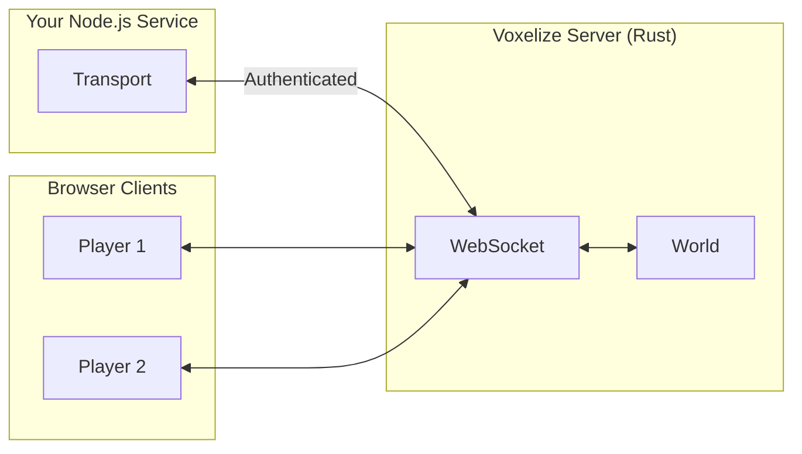
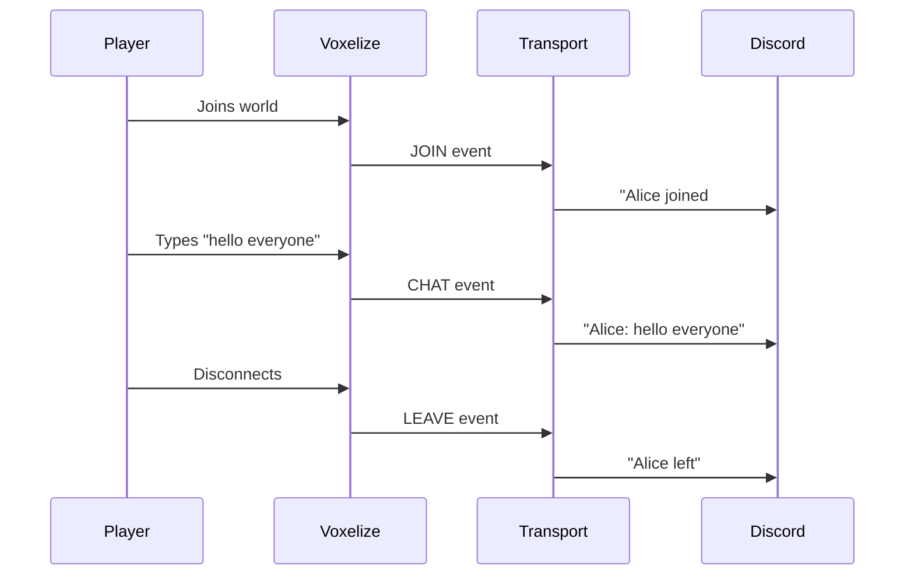
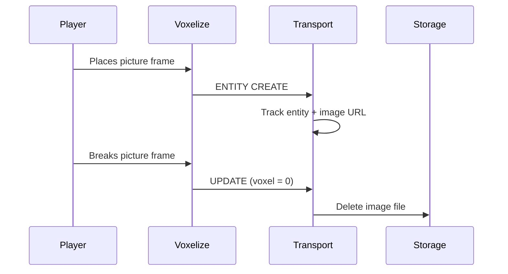
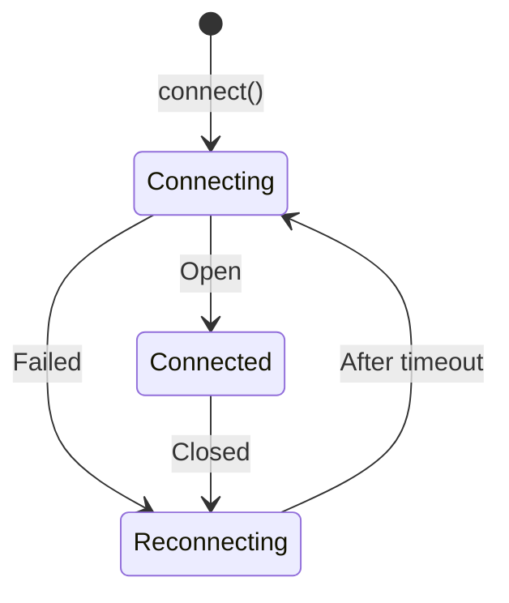

# TypeScript Transport

The Transport class is a server-side WebSocket client that connects to the Voxelize game server from an external Node.js process. It receives the same real-time events that browser clients receive (player joins, chat messages, entity updates), enabling you to build services that react to game activity.

For a quick reference on Transport concepts, see the [Transport wiki page](/wiki/networking/transport).



## Why Use Transport?

Transport connects external services to your game world. Some examples:

| External Service  | What It Does                                                             |
| ----------------- | ------------------------------------------------------------------------ |
| Discord bot       | Posts "Player joined" messages to a channel when someone enters the game |
| Express API       | Tracks entity positions so a REST endpoint can query game state          |
| Analytics service | Logs player activity, chat messages, block placements to a database      |
| Asset manager     | Deletes uploaded images when picture-frame blocks are destroyed          |

The key insight: **Transport runs outside the browser**. It's for backend services that need game data, not for game clients.

## Basic Setup

```ts title="Connecting to Voxelize"
import { Transport } from "@voxelize/protocol";

const transport = new Transport(5000);

await transport.connect("http://localhost:4000", "your-secret-key");
```

The secret authenticates the Transport as a trusted listener. Configure it on your Voxelize server.

## Event Handlers

Assign callbacks to react to game events:

```ts title="Available Handlers"
transport.onInit; // World initialized with existing state
transport.onJoin; // Player connected
transport.onLeave; // Player disconnected
transport.onPeer; // Player position/metadata changed
transport.onEntity; // Entity created/updated/deleted
transport.onChat; // Chat message sent
transport.onUpdate; // Voxel changed
transport.onMethod; // RPC call received
transport.onEvent; // Custom event fired
```

---

## Example: Discord Bot Bridge

This example builds a Discord bot that announces when players join, leave, or chat in your Voxelize world.



### Step 1: Track Player Info

The `onPeer` event provides player metadata. Cache it so we can look up usernames later:

```ts title="Player Cache"
const playerCache = new Map<string, { username: string }>();

transport.onPeer = (event) => {
  event.peers?.forEach((peer) => {
    playerCache.set(peer.id, { username: peer.username });
  });
};
```

### Step 2: Handle Join/Leave

```ts title="Join and Leave Events"
transport.onJoin = async (event) => {
  const peerId = event.text;
  const worldName = event.worldName;
  const player = playerCache.get(peerId);

  await discord.send(`**${player?.username}** joined *${worldName}*`);
};

transport.onLeave = async (event) => {
  const peerId = event.text;
  const player = playerCache.get(peerId);

  await discord.send(`**${player?.username}** left`);
  playerCache.delete(peerId);
};
```

### Step 3: Forward Chat Messages

```ts title="Chat Forwarding"
transport.onChat = async (event) => {
  const { chat, worldName } = event;
  const username = chat.sender;
  const message = chat.body;

  await discord.send(`**${username}** (${worldName}): ${message}`);
};
```

### Full Implementation

```ts title="discord-bridge.ts"
import { Transport } from "@voxelize/protocol";
import { Client, GatewayIntentBits, TextChannel } from "discord.js";

const discord = new Client({ intents: [GatewayIntentBits.Guilds] });
const transport = new Transport(5000);
const playerCache = new Map<string, { username: string }>();

let channel: TextChannel;

async function main() {
  await discord.login(process.env.DISCORD_TOKEN);
  channel = (await discord.channels.fetch(
    process.env.CHANNEL_ID
  )) as TextChannel;

  await transport.connect(
    process.env.VOXELIZE_URL,
    process.env.VOXELIZE_SECRET
  );

  transport.onPeer = (event) => {
    event.peers?.forEach((peer) => {
      playerCache.set(peer.id, { username: peer.username });
    });
  };

  transport.onJoin = async (event) => {
    const player = playerCache.get(event.text);
    await channel.send(`**${player?.username}** joined *${event.worldName}*`);
  };

  transport.onLeave = async (event) => {
    const player = playerCache.get(event.text);
    await channel.send(`**${player?.username}** left`);
    playerCache.delete(event.text);
  };

  transport.onChat = async (event) => {
    const { chat, worldName } = event;
    await channel.send(`**${chat.sender}** (${worldName}): ${chat.body}`);
  };

  console.log("Discord bridge running");
}

main();
```

---

## Example: Asset Cleanup Service

When players place "picture frame" blocks, they upload images. When those blocks are destroyed, the images become orphaned. This service watches for block deletions and cleans up the associated files.



### Step 1: Track Block Entities

Build a mapping from voxel positions to entity metadata:

```ts title="Entity Tracking"
type BlockMetadata = {
  type: string;
  imageSource?: string;
};

const entityMap = new Map<string, BlockMetadata>();
const voxelToEntity = new Map<string, string>();

transport.onEntity = (event) => {
  event.entities?.forEach((entity) => {
    if (!entity.type.startsWith("block::")) return;

    const { id, operation, metadata } = entity;
    const voxelKey = metadata.voxel.join(",");

    if (operation === "CREATE" || operation === "UPDATE") {
      entityMap.set(id, metadata);
      voxelToEntity.set(voxelKey, id);
    } else if (operation === "DELETE") {
      entityMap.delete(id);
    }
  });
};
```

### Step 2: Clean Up on Block Destruction

```ts title="Image Cleanup"
transport.onUpdate = async (event) => {
  for (const update of event.updates) {
    if (update.voxel !== 0) continue;

    const voxelKey = `${update.vx},${update.vy},${update.vz}`;
    const entityId = voxelToEntity.get(voxelKey);
    if (!entityId) continue;

    const metadata = entityMap.get(entityId);
    if (metadata?.type === "picture-frame" && metadata.imageSource) {
      await deleteFromStorage(metadata.imageSource);
      console.log(`Cleaned up: ${metadata.imageSource}`);
    }

    voxelToEntity.delete(voxelKey);
    entityMap.delete(entityId);
  }
};
```

---

## Connection Lifecycle

Transport auto-reconnects when the connection drops:



```ts title="Reconnection"
const transport = new Transport(5000); // Retry every 5 seconds
```

---

## When to Use Transport vs Other Patterns

| Need                             | Use                                         |
| -------------------------------- | ------------------------------------------- |
| External service needs game data | **Transport**                               |
| Client triggers server action    | [Methods](/wiki/networking/calling-methods) |
| Server broadcasts to clients     | [Events](/wiki/networking/handling-events)  |
| Sync entity state to clients     | Entity metadata                             |

Transport is for **out-of-game services**. For in-game client-server communication, use Methods and Events instead.
