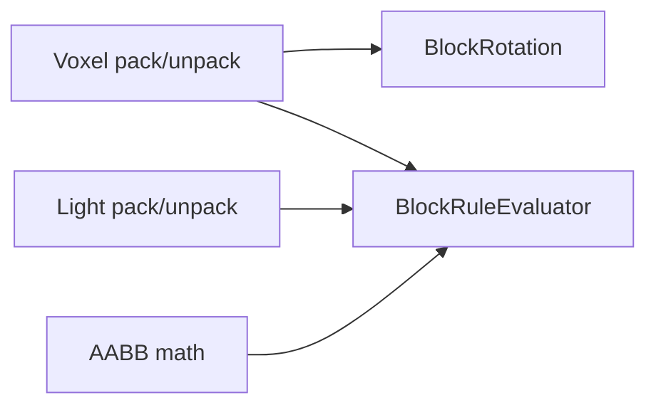

# TypeScript Core (Rust-free voxel primitives)

`@voxelize/ts-core` provides the core voxel data model from Voxelize as a standalone TypeScript library.

Use it when you want to:

- build tools in Node.js without Rust
- author voxel/light data in services or pipelines
- share deterministic packing rules across server-side TS code

## Install

```bash
pnpm add @voxelize/ts-core
```

## What it includes



- `Voxel` / `BlockUtils`: voxel id + rotation + stage bit encoding
- `Light` / `LightUtils`: sunlight + RGB torch channels
- `BlockRotation`: axis/y-rotation encoding and transforms
- `AABB`: geometry math helpers
- `BlockRuleEvaluator`: dynamic rule matching
- `createBlockRule`: rule clone/sanitization helper
- `createBlockConditionalPart`: defensive rule/face/AABB/array copy helper for
  dynamic block-part definitions
- `createBlockDynamicPattern`: defensive dynamic-pattern helper that clones part
  inputs via `createBlockConditionalPart` and skips malformed part entries
- `createBlockFace`: ergonomic constructor helper for `BlockFaceInit` or
  `BlockFace` input (plain/null-prototype/readonly/frozen init support) with
  deterministic default fallback for malformed values (including malformed
  `BlockFace` instances)
- `createAABB`: ergonomic constructor helper for `AABB` or plain `AABB` init
  input (including readonly/frozen literals) with deterministic empty fallback
  for malformed values (including non-finite `AABB` instances)
- `createBlockRotation`: ergonomic constructor helper for `BlockRotation` or
  plain/readonly/frozen rotation literals with deterministic identity fallback
  (including malformed getter/proxy-trap rotation inputs)
- `createFaceTransparency`: helper for normalized 6-face transparency tuples
- `VoxelAccess`: shared access contract

Both helper constructors use deterministic defaults when optional fields are
omitted or the top-level helper input is `null`/non-plain.
Plain frozen helper input objects are also accepted.
`createBlockConditionalPart` accepts either `BlockFace` instances or
plain/null-prototype `BlockFaceInit` objects in `faces`.
`createBlockConditionalPart` accepts either `AABB` instances or
plain/readonly `AABB` init objects in `aabbs`.
`createAABB` exposes this AABB normalization directly.
Both helpers also accept readonly input arrays/tuples.
Invalid face/AABB entries (including `null`/`undefined`/non-plain objects,
malformed `BlockFace`/`AABB` instances, or malformed/non-finite AABB init
values) are skipped during helper cloning.
Iterator-trapped face/AABB collections can still recover readable indexed
entries via bounded fallback scans (up to 1024 indexed reads);
irrecoverable trap combinations sanitize to deterministic empty
collections.
When bounded length recovery already fills the scan window, helper
key-enumeration fallback is skipped to avoid redundant overhead.
When bounded prefixes contain only malformed/noisy entries, key-fallback
scans can still supplement readable high-index face/AABB entries.
Fallback scans ignore inherited numeric prototype entries while recovering
readable indexed face/AABB values.
Malformed dynamic-pattern part entries (including `null`/`undefined`) are
skipped during helper cloning.
Non-plain object part entries are also skipped during helper cloning.
Iterator-trapped dynamic-pattern `parts` collections can still recover
readable indexed entries via bounded fallback scans (up to 1024 indexed
reads); irrecoverable trap combinations sanitize to deterministic empty
collections.
When bounded length recovery already fills the scan window, helper
key-enumeration fallback is skipped to avoid redundant overhead.
When bounded prefixes contain only malformed/noisy entries, key-fallback
scans can still supplement readable high-index part entries.
Fallback scans ignore inherited numeric prototype entries while recovering
readable indexed part entries.
Malformed optional face fields fall back to default face values.
Malformed rules fall back to `BLOCK_RULE_NONE`, and malformed transparency
inputs (including `null`/non-array values) fall back to `false` defaults.
Prototype/getter-trap failures in malformed helper inputs are sanitized to
deterministic defaults instead of throwing.
`createFaceTransparency` exposes this transparency normalization directly.
Readonly/frozen transparency arrays are accepted during helper sanitization.
Malformed transparency index accessors are sanitized to `false` defaults.
Extra transparency entries beyond six face slots are ignored.
`createBlockRule` normalizes `null` simple-rule optional fields (`id`,
`rotation`, `stage`) to omitted constraints.
Nullable combination sub-rules are normalized to deterministic `none` entries.
Iterator-trapped combination-rule collections can recover readable indexed
entries via bounded fallback scans; irrecoverable trap combinations normalize
to deterministic `none` rules.
When bounded length recovery already fills the scan window, key-scan
enumeration is skipped to avoid redundant fallback overhead.
Length-fallback recovery skips sparse-hole placeholders and inherited numeric
prototype entries before logical evaluation.
If bounded length recovery yields only `none` entries, bounded key-scan
recovery can still supplement readable high-index rules before evaluation.
When bounded length recovery preserves readable prefix rules but does not
fill the scan window, key-scan recovery can still supplement readable
high-index rules.
Throwing bounded direct reads are skipped during fallback scans so key
recovery can still salvage readable high-index rules.
Optional simple-rule `id`/`stage` values are kept only when they match voxel
ranges (`id`: 0..65535, `stage`: 0..15).
Plain rotation-like values are kept only when `value` is an encoded
non-negative nibble (`0..15`) and `yRotation` is finite.
`BlockRotation` instances are revalidated to the same nibble/finiteness
constraints during helper sanitization.
Readonly rotation-like literals are also accepted during helper sanitization.
Frozen rotation-like literals are also accepted during helper sanitization.
`createBlockRotation` exposes this rotation sanitization directly.
`createBlockRule` also accepts readonly rule-tree arrays/tuples for literal
authoring ergonomics.
Frozen rule-tree literals are also accepted during helper sanitization.
Non-plain rule nodes/rotation-like objects are normalized away during
sanitization.
Malformed `worldSpace` values fall back to `false`.
`BlockRuleEvaluator` evaluation options accept either `BlockRotation`
instances or plain `{ yRotation }` objects, with nullable
`yRotatable`/`worldSpace` flags.
Malformed `BlockRuleEvaluator` option payloads (including getter/proxy traps)
sanitize to deterministic defaults (`rotation.yRotation=0`,
`yRotatable=false`, `worldSpace=false`).
Option normalization is computed once per rule evaluation and reused across
nested combination traversal.
Malformed voxel-access reads/comparisons (including throwing `getVoxel*`
accessors and rotation equality traps) now resolve to deterministic
non-matches instead of throwing.
Non-finite resolved coordinates with active simple-rule constraints
(`id`/`rotation`/`stage`) are treated as deterministic non-matches.
Cyclic combination edges are guarded during evaluation to avoid recursion
overflow and follow deterministic `none`-edge semantics.
Malformed combination-rule child collections sanitize to empty-list logic
semantics (`AND` => `true`, `OR` => `false`, `NOT` => `true`).
Iterator-trapped combination-rule child collections can still recover
readable indexed entries through bounded length fallback (up to 1024
entries).
When `length` access also traps, combination-rule child recovery can fall
back to bounded numeric-key scans for deterministic salvage.
Key-based recovery keeps the smallest bounded numeric index set in
ascending order to avoid full-list sorting overhead under sparse trap
inputs.
Cyclic rule graphs are sanitized by replacing recursive edges with `none`.

## Basic usage

```ts title="Packing voxel and light data"
import { BlockRotation, Light, Voxel } from "@voxelize/ts-core";

const rotation = BlockRotation.encode(0, 4);

const voxel = Voxel.pack({
  id: 42,
  rotation,
  stage: 7,
});

const light = Light.pack({
  sunlight: 15,
  red: 10,
  green: 5,
  blue: 3,
});

const unpackedVoxel = Voxel.unpack(voxel);
const unpackedLight = Light.unpack(light);
```

`BlockRotation` supports both `encode` and axis constructors:

```ts title="Axis constructors"
import { BlockRotation } from "@voxelize/ts-core";

const up = BlockRotation.PY(0);
const side = BlockRotation.PX(Math.PI / 2);
```

Y-rotation values that are full turns (`±2π` multiples) are normalized to
identity for node/transparency transforms.
Non-finite y-rotation values (`NaN`, `Infinity`, `-Infinity`) are also
normalized to identity for safer runtime behavior.
Finite y-rotation values are normalized modulo full turns before decode
segment quantization, which keeps large-angle decoding stable.
The same normalization semantics are applied when `BlockRuleEvaluator` rotates
rule offsets in y-rotatable matching mode, including stabilization of
large-angle precision drift near segment boundaries with bounded snap
tolerance.

You can also pass plain rotation-like objects when packing voxels:

```ts title="Rotation-like input"
const voxel = Voxel.pack({
  id: 7,
  rotation: { value: 0, yRotation: Math.PI / 2 },
  stage: 1,
});
```

## Evaluating rules with your own data source

```ts title="Rule evaluation"
import {
  BlockRotation,
  BlockRuleEvaluator,
  BlockRuleLogic,
  Voxel,
} from "@voxelize/ts-core";

const stored = Voxel.pack({
  id: 12,
  rotation: BlockRotation.py(0),
  stage: 3,
});

const access = {
  getVoxel: () => Voxel.id(stored),
  getVoxelRotation: () => Voxel.rotation(stored),
  getVoxelStage: () => Voxel.stage(stored),
};

const rule = {
  type: "combination",
  logic: BlockRuleLogic.And,
  rules: [
    { type: "simple", offset: [0, 0, 0], id: 12 },
    { type: "simple", offset: [0, 0, 0], stage: 3 },
  ],
} as const;

const matched = BlockRuleEvaluator.evaluate(rule, [0, 0, 0], access);
```

You can build cloned dynamic part definitions with helper constructors:

```ts title="Dynamic pattern helper"
import {
  BlockRuleLogic,
  createAABB,
  createBlockRule,
  createBlockDynamicPattern,
  createFaceTransparency,
} from "@voxelize/ts-core";

const pattern = createBlockDynamicPattern({
  parts: [
    {
      rule: createBlockRule({
        type: "combination",
        logic: BlockRuleLogic.And,
        rules: [{ type: "simple", offset: [0, 0, 0], id: 12 }],
      }),
      faces: [{ name: "Top", dir: [0, 1, 0] }],
      aabbs: [createAABB({ minX: 0, minY: 0, minZ: 0, maxX: 1, maxY: 1, maxZ: 1 })],
      isTransparent: createFaceTransparency([true]),
      worldSpace: false,
    },
  ],
});
```

## End-to-end runnable example

The package includes a full end-to-end script that:

1. Packs voxel and light values
2. Stores and reads values from an in-memory space
3. Rotates an AABB
4. Evaluates block rules
5. Builds/evaluates a cloned dynamic pattern
6. Verifies JSON serialization roundtrip

Run it with:

```bash
pnpm --filter @voxelize/ts-core example:end-to-end
```

If artifacts are already built and you only want to rerun the example:

```bash
pnpm --filter @voxelize/ts-core example:end-to-end:no-build
```

## Build artifact preflight (root workspace)

From the repository root you can validate `@voxelize/ts-core` artifacts with:

```bash
# auto-builds missing artifacts when needed
pnpm run check:ts-core:json

# verify-only mode (no auto-build)
pnpm run check:ts-core:verify:json

# full ts-core release readiness workflow
pnpm run check:ts-core:release

# aggregate ts-core release readiness workflow
pnpm run check:preflight:ts-core:release
```

The checker validates:

- `packages/ts-core/dist/index.js`
- `packages/ts-core/dist/index.mjs`
- `packages/ts-core/dist/index.d.ts`

Use `--output <path>` for machine-readable report files in CI.
The JSON report includes artifact/build diagnostics such as `checkedPackage`,
`checkedPackageCount`, `checkedPackagePath`, `checkedPackagePathCount`,
`availablePackages`, `availablePackageCount`, `availablePackagePaths`,
`availablePackagePathCount`, `availablePackageIndices`,
`availablePackageIndexCount`, `availablePackageIndexMap`,
`availablePackageIndexMapCount`, `availablePackagePathMap`,
`availablePackagePathMapCount`, `availablePackageCheckCommandMap`,
`availablePackageCheckCommandMapCount`, `availablePackageCheckArgsMap`,
`availablePackageCheckArgsMapCount`, `availablePackageCheckArgCountMap`,
`availablePackageCheckArgCountMapCount`, `availablePackageMetadata`,
`availablePackageMetadataCount`,
`checkedPackageIndices`, `checkedPackageIndexCount`,
`checkedPackageIndexMap`, `checkedPackageIndexMapCount`,
`checkedPackagePathMap`, `checkedPackagePathMapCount`,
`presentPackages`, `missingPackages`, `presentPackageIndices`,
`missingPackageIndices`, `presentPackageIndexMap`,
`presentPackageIndexMapCount`, `presentPackageCheckCommandMap`,
`presentPackageCheckCommandMapCount`, `presentPackageCheckArgsMap`,
`presentPackageCheckArgsMapCount`, `presentPackageCheckArgCountMap`,
`presentPackageCheckArgCountMapCount`, `presentPackageMetadata`,
`presentPackageMetadataCount`, `missingPackageIndexMap`,
`missingPackageIndexMapCount`, `missingPackageCheckCommandMap`,
`missingPackageCheckCommandMapCount`, `missingPackageCheckArgsMap`,
`missingPackageCheckArgsMapCount`, `missingPackageCheckArgCountMap`,
`missingPackageCheckArgCountMapCount`, `missingPackageMetadata`,
`missingPackageMetadataCount`, `presentPackagePaths`,
`missingPackagePaths`, `presentPackagePathMap`,
`presentPackagePathMapCount`, `missingPackagePathMap`,
`missingPackagePathMapCount`, `requiredPackageCount`, `presentPackageCount`,
`missingPackageCount`, `presentPackageIndexCount`,
`missingPackageIndexCount`, `presentPackagePathCount`,
`missingPackagePathCount`, `packageReport`, `packageReportCount`,
`packageReportMap`, `packageReportMapCount`, `packageCheckCommandMap`,
`packageCheckCommandMapCount`, `packageCheckArgsMap`,
`packageCheckArgsMapCount`, `packageCheckArgCountMap`,
`packageCheckArgCountMapCount`, `packageStatusMap`,
`packageStatusMapCount`, `packageStatusCountMap`,
`packageStatusCountMapCount`, `requiredArtifacts`,
`requiredArtifactsByPackage`, `requiredArtifactsByPackageCount`,
`requiredArtifactCountByPackage`, `requiredArtifactCountByPackageCount`,
`artifactsPresentByPackage`, `artifactsPresentByPackageCount`,
`presentArtifactsByPackage`, `presentArtifactsByPackageCount`,
`presentArtifacts`, `presentArtifactCountByPackage`,
`presentArtifactCountByPackageCount`,
`presentPackageArtifactsByPackage`,
`presentPackageArtifactsByPackageCount`,
`presentPackageArtifactCountByPackage`,
`presentPackageArtifactCountByPackageCount`,
`missingArtifacts`, `requiredArtifactCount`, `presentArtifactCount`,
`missingArtifactsByPackage`, `missingArtifactsByPackageCount`,
`missingArtifactCountByPackage`, `missingArtifactCountByPackageCount`,
`missingPackageArtifactsByPackage`,
`missingPackageArtifactsByPackageCount`,
`missingPackageArtifactCountByPackage`,
`missingPackageArtifactCountByPackageCount`,
`missingArtifactCount`, `failureSummaries`, `failureSummaryCount`,
`missingArtifactSummary`, `buildCommand`, `buildArgs`, `buildExitCode`,
`buildDurationMs`, `attemptedBuild`, `buildSkipped`, and
`buildSkippedReason`, `exampleCommand`, `exampleArgs`, `exampleArgCount`,
`exampleAttempted`, `exampleStatus`, `exampleRuleMatched`,
`examplePayloadValid`, `examplePayloadIssues`,
`examplePayloadIssueCount`, `exampleExitCode`, `exampleDurationMs`, and
`exampleOutputLine`.
Each ts-core `failureSummaries` entry includes `kind`, `packageIndex`,
`checkCommand`, `checkArgs`, and `checkArgCount` for deterministic
failure-to-check correlation. ts-core uses `kind: "artifacts"` for missing
artifact failures and `kind: "example"` for end-to-end example failures
(including `exitCode`, `ruleMatched`, `payloadValid`, `payloadIssues`,
`payloadIssueCount`, and `outputLine`).
`examplePayloadValid` is `true` only when the end-to-end example emits the
expected payload shape (`voxel.id`, `voxel.stage`, `voxel.rotation.value`,
`voxel.rotation.yRotation`, `light`, `rotatedAabb`) with valid value domains
(`voxel.id` in `0..65535`, `voxel.stage`/light channels in `0..15`, rotation
axis in `0..5`) and ordered AABB bounds (`min <= max` on each axis). If the
payload includes `patternMatched`, it must be `true`.
Payload validation requires object-shaped JSON output; array/primitive JSON
outputs are treated as invalid example output.
When `examplePayloadValid` is `false`, `examplePayloadIssues` and
`examplePayloadIssueCount` identify the failing payload paths. Issue paths are
normalized (trimmed + deduplicated) before reporting.
If `ruleMatched=false` and payload issues are both present, ts-core failure
messages include both conditions for faster debugging. If payload fields are
valid, diagnostics remain a pure `ruleMatched=false` message.
If `ruleMatched` is missing/invalid and payload validation also fails,
diagnostics include payload issue paths with the invalid-output signal.
If the example exits with code `0` but emits no parseable JSON object payload,
diagnostics report a dedicated "produced no parseable JSON output" failure.
When fallback non-JSON output is reported, `exampleOutputLine` is normalized to
a readable line by stripping ANSI/control escape sequences.
Example JSON parsing also tolerates UTF-8 BOM-prefixed output lines.

Example `kind: "example"` failure payload (truncated):

```json
{
  "kind": "example",
  "ruleMatched": false,
  "payloadValid": false,
  "payloadIssues": ["light.red"],
  "payloadIssueCount": 1,
  "outputLine": "ruleMatched=false"
}
```

If your project also depends on runtime utility packages (`@voxelize/aabb`,
`@voxelize/raycast`, and `@voxelize/physics-engine`), you can validate all of
their artifacts together from the root workspace:

```bash
# validate all runtime utility artifacts
pnpm run check:runtime-libraries:json

# verify-only mode (no auto-build)
pnpm run check:runtime-libraries:verify:json

# full runtime-library release readiness workflow
pnpm run check:runtime-libraries:release

# aggregate runtime-library release readiness workflow
pnpm run check:preflight:runtime-libraries:release

# combined library release readiness workflow
pnpm run check:libraries:release
pnpm run check:preflight:libraries:release
```

Runtime-library JSON reports include package/build diagnostics such as
`packagesPresent`, `checkedPackages`, `checkedPackagePaths`,
`checkedPackageIndices`, `checkedPackageIndexMap`, `checkedPackagePathMap`,
`checkedPackageCount`, `checkedPackagePathCount`, `checkedPackageIndexCount`,
`checkedPackageIndexMapCount`, `checkedPackagePathMapCount`,
`availablePackages`, `availablePackageCount`, `availablePackagePaths`,
`availablePackagePathCount`, `availablePackageIndices`,
`availablePackageIndexCount`, `availablePackageIndexMap`,
`availablePackageIndexMapCount`, `availablePackagePathMap`,
`availablePackagePathMapCount`, `availablePackageCheckCommandMap`,
`availablePackageCheckCommandMapCount`, `availablePackageCheckArgsMap`,
`availablePackageCheckArgsMapCount`, `availablePackageCheckArgCountMap`,
`availablePackageCheckArgCountMapCount`, `availablePackageMetadata`,
`availablePackageMetadataCount`, `packageReports`,
`presentPackages`, `presentPackagePaths`, `presentPackagePathMap`,
`presentPackageIndices`, `presentPackageIndexMap`,
`presentPackageIndexMapCount`, `presentPackageCheckCommandMap`,
`presentPackageCheckCommandMapCount`, `presentPackageCheckArgsMap`,
`presentPackageCheckArgsMapCount`, `presentPackageCheckArgCountMap`,
`presentPackageCheckArgCountMapCount`, `presentPackageMetadata`,
`presentPackageMetadataCount`,
`missingPackages`, `missingPackagePaths`, `missingPackagePathMap`,
`missingPackageIndices`, `missingPackageIndexMap`,
`missingPackageIndexMapCount`, `missingPackageCheckCommandMap`,
`missingPackageCheckCommandMapCount`, `missingPackageCheckArgsMap`,
`missingPackageCheckArgsMapCount`, `missingPackageCheckArgCountMap`,
`missingPackageCheckArgCountMapCount`, `missingPackageMetadata`,
`missingPackageMetadataCount`,
`requiredPackageCount`, `presentPackageCount`,
`presentPackagePathCount`, `presentPackagePathMapCount`,
`presentPackageIndexCount`, `packageReportCount`,
`packageReportMap`, `packageReportMapCount`, `packageCheckCommandMap`,
`packageCheckCommandMapCount`, `packageCheckArgsMap`,
`packageCheckArgsMapCount`, `packageCheckArgCountMap`,
`packageCheckArgCountMapCount`, `packageStatusMap`,
`packageStatusMapCount`, `packageStatusCountMap`,
`packageStatusCountMapCount`,
`requiredArtifactsByPackage`, `requiredArtifacts`,
`requiredArtifactsByPackageCount`,
`requiredArtifactCountByPackage`, `requiredArtifactCount`,
`requiredArtifactCountByPackageCount`, `presentArtifactsByPackage`,
`artifactsPresentByPackage`, `artifactsPresentByPackageCount`,
`presentArtifacts`,
`presentArtifactCountByPackage`, `presentArtifactCount`,
`presentArtifactsByPackageCount`,
`presentArtifactCountByPackageCount`,
`presentPackageArtifactsByPackage`,
`presentPackageArtifactsByPackageCount`,
`presentPackageArtifactCountByPackage`,
`presentPackageArtifactCountByPackageCount`, `missingPackageCount`,
`missingPackagePathCount`, `missingPackagePathMapCount`,
`missingPackageIndexCount`,
`missingArtifactsByPackage`, `missingArtifacts`,
`missingArtifactCountByPackage`, `missingArtifactCount`,
`missingArtifactsByPackageCount`,
`missingArtifactCountByPackageCount`,
`missingPackageArtifactsByPackage`,
`missingPackageArtifactsByPackageCount`,
`missingPackageArtifactCountByPackage`,
`missingPackageArtifactCountByPackageCount`, `failureSummaries`,
`failureSummaryCount`, `missingArtifactSummary`,
`buildCommand`, `buildArgs`, `buildExitCode`, `buildDurationMs`,
`attemptedBuild`, `buildSkipped`, and `buildSkippedReason`.
Each `packageReports` entry includes `packageIndex`, `checkCommand`,
`checkArgs`, `checkArgCount`, `requiredArtifacts`, `presentArtifacts`, and
`missingArtifacts` for package-level artifact diagnostics.
Each runtime-library `failureSummaries` entry includes `kind`,
`packageIndex`, `checkCommand`, `checkArgs`, and `checkArgCount` for deterministic
failure-to-check correlation.

## Aggregate preflight report metadata

For release automation and CI routing, aggregate preflight JSON reports include:

- check-selection diagnostics: `selectionMode`, `requestedChecks`,
  `requestedCheckResolutions`, `requestedCheckResolutionCount`,
  `requestedCheckResolutionCounts`,
  `requestedCheckResolutionKinds`, `requestedCheckResolutionKindCount`,
  `requestedCheckResolvedChecks`, `requestedCheckResolvedScripts`,
  `requestedCheckResolvedScriptMap`,
  `requestedCheckResolvedSupportsNoBuildMap`,
  `requestedCheckResolvedScriptMapCount`,
  `requestedCheckResolvedSupportsNoBuildMapCount`,
  `requestedCheckResolvedIndices`,
  `requestedCheckResolvedIndexMap`,
  `requestedCheckResolvedIndexMapCount`,
  `requestedCheckResolvedCommandMap`,
  `requestedCheckResolvedCommandMapCount`,
  `requestedCheckResolvedArgsMap`,
  `requestedCheckResolvedArgsMapCount`,
  `requestedCheckResolvedArgCountMap`,
  `requestedCheckResolvedArgCountMapCount`,
  `requestedCheckResolvedMetadata`,
  `requestedCheckResolvedMetadataCount`,
  `selectedChecks`, `skippedChecks`
- script/index projections: `selectedCheckMetadata`,
  `selectedCheckMetadataCount`, `selectedCheckScripts`,
  `selectedCheckScriptMap`, `selectedCheckScriptMapCount`,
  `selectedCheckCommandMap`, `selectedCheckCommandMapCount`,
  `selectedCheckArgsMap`, `selectedCheckArgsMapCount`,
  `selectedCheckArgCountMap`, `selectedCheckArgCountMapCount`,
  `skippedCheckMetadata`, `skippedCheckMetadataCount`,
  `skippedCheckScripts`, `skippedCheckScriptMap`,
  `skippedCheckScriptMapCount`, `skippedCheckCommandMap`,
  `skippedCheckCommandMapCount`, `skippedCheckArgsMap`,
  `skippedCheckArgsMapCount`, `skippedCheckArgCountMap`,
  `skippedCheckArgCountMapCount`, `passedCheckMetadata`,
  `passedCheckMetadataCount`, `passedCheckScripts`,
  `passedCheckScriptMap`, `passedCheckScriptMapCount`,
  `passedCheckCommandMap`, `passedCheckCommandMapCount`,
  `passedCheckArgsMap`, `passedCheckArgsMapCount`,
  `passedCheckArgCountMap`, `passedCheckArgCountMapCount`,
  `failedCheckMetadata`, `failedCheckMetadataCount`,
  `failedCheckScripts`, `failedCheckScriptMap`,
  `failedCheckScriptMapCount`, `failedCheckCommandMap`,
  `failedCheckCommandMapCount`, `failedCheckArgsMap`,
  `failedCheckArgsMapCount`, `failedCheckArgCountMap`,
  `failedCheckArgCountMapCount`, `selectedCheckIndices`,
  `selectedCheckIndexMap`, `selectedCheckIndexMapCount`,
  `skippedCheckIndices`, `skippedCheckIndexMap`,
  `skippedCheckIndexMapCount`, `passedCheckIndices`,
  `passedCheckIndexMap`, `passedCheckIndexMapCount`,
  `failedCheckIndices`, `failedCheckIndexMap`,
  `failedCheckIndexMapCount`
- execution partitions: `passedChecks`, `failedChecks`,
  `checkStatusMap`, `checkStatusCountMap`,
  `checkCommandMap`, `checkCommandMapCount`,
  `checkArgsMap`, `checkArgsMapCount`,
  `checkArgCountMap`, `checkArgCountMapCount`,
  `failureSummaries`, `failureSummaryCount`
- nested ts-core example summary fields:
  `tsCoreExampleCommand`, `tsCoreExampleArgs`,
  `tsCoreExampleArgCount`, `tsCoreExampleAttempted`,
  `tsCoreExampleStatus`, `tsCoreExampleRuleMatched`,
  `tsCoreExamplePayloadValid`,
  `tsCoreExamplePayloadIssues`,
  `tsCoreExamplePayloadIssueCount`,
  `tsCoreExampleExitCode`,
  `tsCoreExampleDurationMs`, `tsCoreExampleOutputLine`
- nested client wasm summary fields:
  `clientWasmPackCheckStatus`, `clientWasmPackCheckCommand`,
  `clientWasmPackCheckArgs`, `clientWasmPackCheckArgCount`,
  `clientWasmPackCheckExitCode`, `clientWasmPackCheckOutputLine`
- executable inventory: `availableChecks`, `availableCheckScripts`,
  `availableCheckScriptMap`, `availableCheckCommandMap`,
  `availableCheckArgsMap`, `availableCheckArgCountMap`,
  `availableCheckSupportsNoBuildMap`,
  `availableCheckScriptMapCount`, `availableCheckCommandMapCount`,
  `availableCheckArgsMapCount`, `availableCheckArgCountMapCount`,
  `availableCheckSupportsNoBuildMapCount`,
  `availableCheckIndices`,
  `availableCheckIndexMap`, `availableCheckIndexMapCount`,
  `availableCheckMetadata`, `availableCheckMetadataCount`,
  `availableCheckAliases`, `availableCheckAliasCountMap`,
  `availableCheckAliasGroupCount`, `availableCheckAliasCountMapCount`,
  `availableCheckAliasTokenCount`, `availableSpecialCheckSelectors`,
  `availableSpecialCheckSelectorCount`, `availableSpecialCheckAliases`,
  `availableSpecialCheckAliasCountMap`,
  `availableSpecialCheckAliasGroupCount`,
  `availableSpecialCheckAliasCountMapCount`,
  `availableSpecialCheckAliasTokenCount`,
  `availableSpecialSelectorResolvedChecks`,
  `availableSpecialSelectorResolvedChecksCount`,
  `availableSpecialSelectorResolvedCheckCountMap`,
  `availableSpecialSelectorResolvedCheckCountMapCount`

Each aggregate `checks[]` entry also includes `scriptName`,
`supportsNoBuild`, `checkIndex`, `checkCommand`, `checkArgs`, and
`checkArgCount`.

Each aggregate `failureSummaries[]` entry includes `name`, `scriptName`,
`supportsNoBuild`, `checkIndex`, `checkCommand`, `checkArgs`,
`checkArgCount`, `exitCode`, and `message`.

Client/onboarding aggregate JSON reports additionally include step-level
partitions such as `availableSteps`, `passedSteps`, `failedSteps`,
`skippedSteps`, `availableStepScripts`, `availableStepScriptMap`,
`availableStepCheckCommandMap`, `availableStepCheckArgsMap`,
`availableStepCheckArgCountMap`,
`availableStepSupportsNoBuildMap`,
`availableStepIndices`,
`availableStepIndexMap`,
`availableStepScriptMapCount`, `availableStepCheckCommandMapCount`,
`availableStepCheckArgsMapCount`, `availableStepCheckArgCountMapCount`,
`availableStepSupportsNoBuildMapCount`, `availableStepIndexMapCount`,
`availableStepMetadata`, `availableStepMetadataCount`,
`passedStepScripts`, `passedStepScriptMap`,
`passedStepScriptMapCount`, `passedStepCheckCommandMap`,
`passedStepCheckArgsMap`, `passedStepCheckArgCountMap`,
`passedStepCheckCommandMapCount`, `passedStepCheckArgsMapCount`,
`passedStepCheckArgCountMapCount`, `failedStepScripts`,
`failedStepScriptMap`, `failedStepScriptMapCount`,
`failedStepCheckCommandMap`, `failedStepCheckArgsMap`,
`failedStepCheckArgCountMap`, `failedStepCheckCommandMapCount`,
`failedStepCheckArgsMapCount`, `failedStepCheckArgCountMapCount`,
`skippedStepScripts`, `skippedStepScriptMap`,
`skippedStepScriptMapCount`, `skippedStepCheckCommandMap`,
`skippedStepCheckArgsMap`, `skippedStepCheckArgCountMap`,
`skippedStepCheckCommandMapCount`, `skippedStepCheckArgsMapCount`,
`skippedStepCheckArgCountMapCount`, `passedStepIndices`, `passedStepIndexMap`,
`passedStepIndexMapCount`, `failedStepIndices`, `failedStepIndexMap`,
`failedStepIndexMapCount`,
`skippedStepIndices`, `skippedStepIndexMap`, `skippedStepIndexMapCount`,
`stepCheckCommandMap`, `stepCheckArgsMap`, `stepCheckArgCountMap`,
`stepCheckCommandMapCount`, `stepCheckArgsMapCount`,
`stepCheckArgCountMapCount`,
`stepStatusMap`, `stepStatusMapCount`,
`stepStatusCountMap`, `stepStatusCountMapCount`,
`passedStepMetadata`, `passedStepMetadataCount`,
`failedStepMetadata`, `failedStepMetadataCount`,
`skippedStepMetadata`, `skippedStepMetadataCount`,
`failureSummaries`, and `failureSummaryCount`.
Each step entry in `steps[]` includes `scriptName`, `supportsNoBuild`,
`checkCommand`, `checkArgs`, `checkArgCount`, and `stepIndex`.
Each step failure summary in `failureSummaries[]` includes `checkCommand`,
`checkArgs`, and `checkArgCount` for deterministic command diagnostics.
Arg-array summary fields (`checkArgs`, `wasmPackCheckArgs`,
`tsCoreExampleArgs`) are normalized to string arrays; malformed/trap
inputs salvage readable indexed entries when possible and otherwise fall
back to deterministic null/empty defaults.
CLI option token/arg arrays also salvage readable indexed entries when
iterator access traps.
Iterator-trapped step/check collections and ts-core payload-issue arrays
also salvage readable indexed entries for deterministic diagnostics.
When key enumeration traps, fallback index scans salvage a bounded prefix
of present entries to avoid pathological loops.
Bounded fallback salvage remains active even when proxy has-check traps
throw.
When length reads trap, fallback key scans still salvage readable
entries.
If bounded prefix scans find no entries, bounded key scans can still
recover sparse high-index entries.
Key-scan fallback keeps the lowest bounded index set in ascending order
for deterministic output.
Malformed `requiredFailures` counters are sanitized before fallback
failure messages are derived.
Fallback required-failure messages are emitted only for positive integer
counts.
Sparse trap fallbacks can recover high-index entries even when bounded
prefix scans contain only `undefined` values.
Report count/index metadata is accepted only when values are
non-negative safe integers before fallback coercion is applied.
Wasm status extraction accepts only known status values
(`ok`/`missing`/`unavailable`/`skipped`) before fallback derivation is
applied.
String-array extraction can fall through to bounded key scans when
trapped bounded prefixes contain only non-string noise.
Ts-core example status extraction accepts only known status values
(`ok`/`failed`/`skipped`) before fallback derivation is applied.
Status token extraction trims surrounding whitespace before known-status
validation.
Canonical alias keys and alias token lists are whitespace-normalized
before CLI catalog/diagnostic resolution.
Known status token extraction is case-insensitive and normalizes to
lowercase canonical values.
Wasm status-map key lookup normalizes key tokens (trim + lowercase)
before known-status extraction.
Command metadata fields sanitize whitespace-only strings to `null`
before summary emission.
Failure-message derivation trims whitespace-only
message/name/reason fields before fallback composition.
Summary helper name/command fields trim whitespace and skip
empty-name entries before count/list aggregation.
`exampleDurationMs` metadata accepts only non-negative finite numbers
before fallback coercion.
Report output-line metadata strips ANSI/control escapes, normalizes to
the first non-empty trimmed line, and sanitizes blank values to `null`
before summary emission.
Timed report builders clamp regressed clock durations to zero before
emission.
Failure-summary output-message fallbacks normalize ANSI/control-heavy
multiline output to the first non-empty sanitized line.
Wasm status derivation now treats malformed/non-integer exit-code
metadata as `skipped` before `ok`/`unavailable` fallbacks.
Failure-message derivation now normalizes top-level and nested
report/reason text via first-line ANSI/control sanitization.
Sparse trap fallbacks can supplement bounded-prefix entries with bounded
key-scan recovery when high-index readable entries exist.
Bounded fallback scans use own-property checks so inherited numeric
prototype entries are ignored.
When own-property descriptor probes trap, bounded fallback switches to
guarded direct reads without repeated probe failures.
String-array fallbacks can supplement dense non-string bounded prefixes
with bounded key-scan string recovery.
Client JSON reports additionally expose top-level wasm preflight summary
fields `wasmPackCheckStatus`, `wasmPackCheckCommand`,
`wasmPackCheckArgs`, `wasmPackCheckArgCount`, `wasmPackCheckExitCode`,
and `wasmPackCheckOutputLine`.
Onboarding JSON reports additionally expose ts-core example summary
fields `tsCoreExampleCommand`, `tsCoreExampleArgs`,
`tsCoreExampleArgCount`, `tsCoreExampleAttempted`,
`tsCoreExampleStatus`, `tsCoreExampleRuleMatched`,
`tsCoreExamplePayloadValid`,
`tsCoreExamplePayloadIssues`,
`tsCoreExamplePayloadIssueCount`,
`tsCoreExampleExitCode`,
`tsCoreExampleDurationMs`, `tsCoreExampleOutputLine`, plus
client-step wasm preflight summary fields `clientWasmPackCheckStatus`,
`clientWasmPackCheckCommand`, `clientWasmPackCheckArgs`,
`clientWasmPackCheckArgCount`, `clientWasmPackCheckExitCode`, and
`clientWasmPackCheckOutputLine`.
Nested client wasm artifact reports include `wasmPackCheckCommand`,
`wasmPackCheckArgs`, `wasmPackCheckArgCount`, `wasmPackCheckExitCode`,
`wasmPackCheckStatus`, and `wasmPackCheckOutputLine` for deterministic
wasm-pack invocation tracing.
Developer-environment JSON reports include check inventory and partition
metadata such as `availableChecks`, `availableCheckIndexMap`,
`availableCheckCommandMap`, `availableCheckArgsMap`,
`availableCheckArgCountMap`, `availableCheckRequiredMap`,
`availableCheckHintMap`,
`availableCheckMinimumVersionMap`, `checkLabels`, `checkIndices`,
`checkIndexMap`, `checkCommandMap`, `checkArgsMap`,
`checkArgCountMap`, `checkStatusMap`, `checkStatusCountMap`, `passedChecks`,
`passedCheckIndices`, `passedCheckIndexMap`, `passedCheckCommandMap`,
`passedCheckArgsMap`, `passedCheckArgCountMap`, `failedChecks`,
`failedCheckIndices`, `failedCheckIndexMap`, `failedCheckCommandMap`,
`failedCheckArgsMap`, `failedCheckArgCountMap`, `requiredCheckLabels`,
`requiredCheckIndices`, `requiredCheckIndexMap`, `requiredCheckCommandMap`,
`requiredCheckArgsMap`, `requiredCheckArgCountMap`, `optionalCheckLabels`,
`optionalCheckIndices`, `optionalCheckIndexMap`, `optionalCheckCommandMap`,
`optionalCheckArgsMap`, `optionalCheckArgCountMap`, `requiredFailureLabels`,
`requiredFailureIndices`, `requiredFailureIndexMap`,
`requiredFailureCommandMap`, `requiredFailureArgsMap`,
`requiredFailureArgCountMap`, `optionalFailureLabels`,
`optionalFailureIndices`, `optionalFailureIndexMap`,
`optionalFailureCommandMap`, `optionalFailureArgsMap`,
`optionalFailureArgCountMap`, `failureSummaries`, and associated `*Count`
fields.
Developer-environment `checks[]` and `failureSummaries[]` entries include
`checkIndex`, `checkCommand`, `checkArgs`, and `checkArgCount` for stable
correlation with `availableChecks` and deterministic command diagnostics.
WASM-pack JSON reports similarly expose single-check inventory and execution
metadata such as `availableCheckCommandMap`, `availableCheckArgsMap`,
`availableCheckArgCountMap`, `availableCheckIndices`,
`availableCheckIndexCount`, `availableCheckMetadata`, `checkIndices`,
`checkIndexMap`, `checkCommandMap`, `checkArgsMap`, `checkArgCountMap`,
`checkMetadata`,
`checkStatusMap`, `checkStatusCountMap`, `checkVersionMap`,
`checkExitCodeMap`, `checkOutputLineMap`, `passedChecks`,
`passedCheckIndices`, `passedCheckIndexMap`, `passedCheckCommandMap`,
`passedCheckArgsMap`, `passedCheckArgCountMap`, `passedCheckMetadata`,
`failedChecks`,
`failedCheckIndices`, `failedCheckIndexMap`, `failedCheckCommandMap`,
`failedCheckArgsMap`, `failedCheckArgCountMap`, `failedCheckMetadata`,
`failureSummaries`, and companion `*Count` fields.
WASM-pack metadata entries in `availableCheckMetadata`, `checkMetadata`,
`passedCheckMetadata`, and `failedCheckMetadata` include `checkIndex`,
`command`, `args`, `argCount`, `checkCommand`, `checkArgs`, and
`checkArgCount`.
WASM-pack `failureSummaries[]` entries include `checkIndex`, `command`,
`args`, `argCount`, `checkCommand`, `checkArgs`, and `checkArgCount`
for stable correlation with `availableChecks`.

## API reference

Typed API docs are generated under:

- `API` → `TS Core API`
