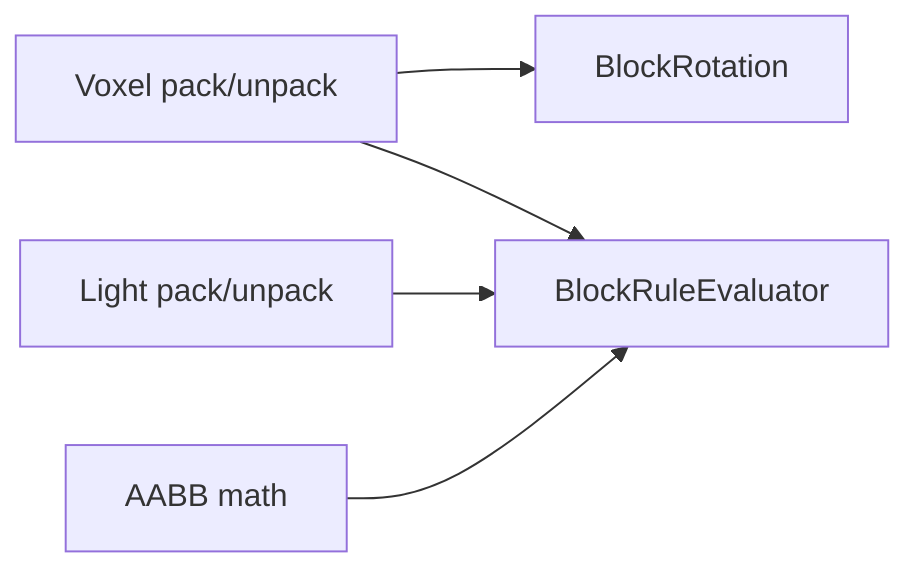

# TypeScript Core (Rust-free voxel primitives)

`@voxelize/ts-core` provides the core voxel data model from Voxelize as a standalone TypeScript library.

Use it when you want to:

- build tools in Node.js without Rust
- author voxel/light data in services or pipelines
- share deterministic packing rules across server-side TS code

## Install

```bash
pnpm add @voxelize/ts-core
```

## What it includes



- `Voxel` / `BlockUtils`: voxel id + rotation + stage bit encoding
- `Light` / `LightUtils`: sunlight + RGB torch channels
- `BlockRotation`: axis/y-rotation encoding and transforms
- `AABB`: geometry math helpers
- `BlockRuleEvaluator`: dynamic rule matching
- `VoxelAccess`: shared access contract

## Basic usage

```ts title="Packing voxel and light data"
import { BlockRotation, Light, Voxel } from "@voxelize/ts-core";

const rotation = BlockRotation.encode(0, 4);

const voxel = Voxel.pack({
  id: 42,
  rotation,
  stage: 7,
});

const light = Light.pack({
  sunlight: 15,
  red: 10,
  green: 5,
  blue: 3,
});

const unpackedVoxel = Voxel.unpack(voxel);
const unpackedLight = Light.unpack(light);
```

`BlockRotation` supports both `encode` and axis constructors:

```ts title="Axis constructors"
import { BlockRotation } from "@voxelize/ts-core";

const up = BlockRotation.PY(0);
const side = BlockRotation.PX(Math.PI / 2);
```

You can also pass plain rotation-like objects when packing voxels:

```ts title="Rotation-like input"
const voxel = Voxel.pack({
  id: 7,
  rotation: { value: 0, yRotation: Math.PI / 2 },
  stage: 1,
});
```

## Evaluating rules with your own data source

```ts title="Rule evaluation"
import {
  BlockRotation,
  BlockRuleEvaluator,
  BlockRuleLogic,
  Voxel,
} from "@voxelize/ts-core";

const stored = Voxel.pack({
  id: 12,
  rotation: BlockRotation.py(0),
  stage: 3,
});

const access = {
  getVoxel: () => Voxel.id(stored),
  getVoxelRotation: () => Voxel.rotation(stored),
  getVoxelStage: () => Voxel.stage(stored),
};

const rule = {
  type: "combination",
  logic: BlockRuleLogic.And,
  rules: [
    { type: "simple", offset: [0, 0, 0], id: 12 },
    { type: "simple", offset: [0, 0, 0], stage: 3 },
  ],
} as const;

const matched = BlockRuleEvaluator.evaluate(rule, [0, 0, 0], access);
```

## End-to-end runnable example

The package includes a full end-to-end script that:

1. Packs voxel and light values
2. Stores and reads values from an in-memory space
3. Rotates an AABB
4. Evaluates block rules
5. Verifies JSON serialization roundtrip

Run it with:

```bash
pnpm --filter @voxelize/ts-core example:end-to-end
```

## Build artifact preflight (root workspace)

From the repository root you can validate `@voxelize/ts-core` artifacts with:

```bash
# auto-builds missing artifacts when needed
pnpm run check:ts-core:json

# verify-only mode (no auto-build)
pnpm run check:ts-core:verify:json

# full ts-core release readiness workflow
pnpm run check:ts-core:release

# aggregate ts-core release readiness workflow
pnpm run check:preflight:ts-core:release
```

The checker validates:

- `packages/ts-core/dist/index.js`
- `packages/ts-core/dist/index.mjs`
- `packages/ts-core/dist/index.d.ts`

Use `--output <path>` for machine-readable report files in CI.
The JSON report includes artifact/build diagnostics such as `checkedPackage`,
`checkedPackageCount`, `checkedPackagePath`, `checkedPackagePathCount`,
`checkedPackageIndices`, `checkedPackageIndexCount`,
`checkedPackageIndexMap`, `checkedPackageIndexMapCount`,
`checkedPackagePathMap`, `checkedPackagePathMapCount`,
`presentPackages`, `missingPackages`, `presentPackageIndices`,
`missingPackageIndices`, `presentPackageIndexMap`,
`presentPackageIndexMapCount`, `missingPackageIndexMap`,
`missingPackageIndexMapCount`, `presentPackagePaths`,
`missingPackagePaths`, `presentPackagePathMap`,
`presentPackagePathMapCount`, `missingPackagePathMap`,
`missingPackagePathMapCount`, `requiredPackageCount`, `presentPackageCount`,
`missingPackageCount`, `presentPackageIndexCount`,
`missingPackageIndexCount`, `presentPackagePathCount`,
`missingPackagePathCount`, `packageReport`, `packageReportCount`,
`packageReportMap`, `packageReportMapCount`, `requiredArtifacts`,
`requiredArtifactCountByPackage`, `requiredArtifactCountByPackageCount`,
`artifactsPresentByPackage`, `artifactsPresentByPackageCount`,
`presentArtifacts`, `presentArtifactCountByPackage`,
`presentArtifactCountByPackageCount`,
`missingArtifacts`, `requiredArtifactCount`, `presentArtifactCount`,
`missingArtifactCountByPackage`, `missingArtifactCountByPackageCount`,
`missingArtifactCount`, `missingArtifactSummary`, `buildCommand`, `buildArgs`, `buildExitCode`,
`buildDurationMs`, `attemptedBuild`, `buildSkipped`, and
`buildSkippedReason`.

If your project also depends on runtime utility packages (`@voxelize/aabb`,
`@voxelize/raycast`, and `@voxelize/physics-engine`), you can validate all of
their artifacts together from the root workspace:

```bash
# validate all runtime utility artifacts
pnpm run check:runtime-libraries:json

# verify-only mode (no auto-build)
pnpm run check:runtime-libraries:verify:json

# full runtime-library release readiness workflow
pnpm run check:runtime-libraries:release

# aggregate runtime-library release readiness workflow
pnpm run check:preflight:runtime-libraries:release

# combined library release readiness workflow
pnpm run check:libraries:release
pnpm run check:preflight:libraries:release
```

Runtime-library JSON reports include package/build diagnostics such as
`packagesPresent`, `checkedPackages`, `checkedPackagePaths`,
`checkedPackageIndices`, `checkedPackageIndexMap`, `checkedPackagePathMap`,
`checkedPackageCount`, `checkedPackagePathCount`, `checkedPackageIndexCount`,
`checkedPackageIndexMapCount`, `checkedPackagePathMapCount`, `packageReports`,
`presentPackages`, `presentPackagePaths`, `presentPackagePathMap`,
`presentPackageIndices`,
`missingPackages`, `missingPackagePaths`, `missingPackagePathMap`,
`missingPackageIndices`,
`requiredPackageCount`, `presentPackageCount`,
`presentPackagePathCount`, `presentPackagePathMapCount`,
`presentPackageIndexCount`, `packageReportCount`,
`packageReportMap`, `packageReportMapCount`,
`requiredArtifactsByPackage`, `requiredArtifacts`,
`requiredArtifactsByPackageCount`,
`requiredArtifactCountByPackage`, `requiredArtifactCount`,
`requiredArtifactCountByPackageCount`, `presentArtifactsByPackage`,
`artifactsPresentByPackage`, `artifactsPresentByPackageCount`,
`presentArtifacts`,
`presentArtifactCountByPackage`, `presentArtifactCount`,
`presentArtifactsByPackageCount`,
`presentArtifactCountByPackageCount`, `missingPackageCount`,
`missingPackagePathCount`, `missingPackagePathMapCount`,
`missingPackageIndexCount`,
`missingArtifactsByPackage`, `missingArtifacts`,
`missingArtifactCountByPackage`, `missingArtifactCount`,
`missingArtifactsByPackageCount`,
`missingArtifactCountByPackageCount`, `missingArtifactSummary`,
`buildCommand`, `buildArgs`, `buildExitCode`, `buildDurationMs`,
`attemptedBuild`, `buildSkipped`, and `buildSkippedReason`.
Each `packageReports` entry includes `requiredArtifacts`, `presentArtifacts`,
and `missingArtifacts` for package-level artifact diagnostics.

## Aggregate preflight report metadata

For release automation and CI routing, aggregate preflight JSON reports include:

- check-selection diagnostics: `selectionMode`, `requestedChecks`,
  `requestedCheckResolutions`, `requestedCheckResolutionCount`,
  `requestedCheckResolutionCounts`,
  `requestedCheckResolutionKinds`, `requestedCheckResolutionKindCount`,
  `requestedCheckResolvedChecks`, `requestedCheckResolvedScripts`,
  `requestedCheckResolvedScriptMap`,
  `requestedCheckResolvedSupportsNoBuildMap`,
  `requestedCheckResolvedScriptMapCount`,
  `requestedCheckResolvedSupportsNoBuildMapCount`,
  `requestedCheckResolvedIndices`,
  `requestedCheckResolvedIndexMap`,
  `requestedCheckResolvedIndexMapCount`,
  `requestedCheckResolvedMetadata`,
  `requestedCheckResolvedMetadataCount`,
  `selectedChecks`, `skippedChecks`
- script/index projections: `selectedCheckMetadata`,
  `selectedCheckMetadataCount`, `selectedCheckScripts`,
  `selectedCheckScriptMap`, `selectedCheckScriptMapCount`,
  `skippedCheckMetadata`, `skippedCheckMetadataCount`,
  `skippedCheckScripts`, `skippedCheckScriptMap`,
  `skippedCheckScriptMapCount`, `passedCheckMetadata`,
  `passedCheckMetadataCount`, `passedCheckScripts`,
  `passedCheckScriptMap`, `passedCheckScriptMapCount`,
  `failedCheckMetadata`, `failedCheckMetadataCount`,
  `failedCheckScripts`, `failedCheckScriptMap`,
  `failedCheckScriptMapCount`, `selectedCheckIndices`,
  `selectedCheckIndexMap`, `selectedCheckIndexMapCount`,
  `skippedCheckIndices`, `skippedCheckIndexMap`,
  `skippedCheckIndexMapCount`, `passedCheckIndices`,
  `passedCheckIndexMap`, `passedCheckIndexMapCount`,
  `failedCheckIndices`, `failedCheckIndexMap`,
  `failedCheckIndexMapCount`
- execution partitions: `passedChecks`, `failedChecks`,
  `checkStatusMap`, `checkStatusCountMap`,
  `failureSummaries`, `failureSummaryCount`
- executable inventory: `availableChecks`, `availableCheckScripts`,
  `availableCheckScriptMap`, `availableCheckSupportsNoBuildMap`,
  `availableCheckScriptMapCount`, `availableCheckSupportsNoBuildMapCount`,
  `availableCheckIndices`,
  `availableCheckIndexMap`, `availableCheckIndexMapCount`,
  `availableCheckMetadata`, `availableCheckMetadataCount`,
  `availableCheckAliases`, `availableCheckAliasCountMap`,
  `availableCheckAliasGroupCount`, `availableCheckAliasCountMapCount`,
  `availableCheckAliasTokenCount`, `availableSpecialCheckSelectors`,
  `availableSpecialCheckSelectorCount`, `availableSpecialCheckAliases`,
  `availableSpecialCheckAliasCountMap`,
  `availableSpecialCheckAliasGroupCount`,
  `availableSpecialCheckAliasCountMapCount`,
  `availableSpecialCheckAliasTokenCount`,
  `availableSpecialSelectorResolvedChecks`,
  `availableSpecialSelectorResolvedChecksCount`,
  `availableSpecialSelectorResolvedCheckCountMap`,
  `availableSpecialSelectorResolvedCheckCountMapCount`

Each aggregate `checks[]` entry also includes `scriptName`,
`supportsNoBuild`, and `checkIndex`.

Each aggregate `failureSummaries[]` entry includes `name`, `scriptName`,
`supportsNoBuild`, `checkIndex`, `exitCode`, and `message`.

Client/onboarding aggregate JSON reports additionally include step-level
partitions such as `availableSteps`, `passedSteps`, `failedSteps`,
`skippedSteps`, `availableStepScripts`, `availableStepScriptMap`,
`availableStepSupportsNoBuildMap`,
`availableStepIndices`,
`availableStepIndexMap`,
`availableStepScriptMapCount`, `availableStepSupportsNoBuildMapCount`,
`availableStepIndexMapCount`,
`availableStepMetadata`, `availableStepMetadataCount`,
`passedStepScripts`, `passedStepScriptMap`,
`passedStepScriptMapCount`, `failedStepScripts`,
`failedStepScriptMap`, `failedStepScriptMapCount`,
`skippedStepScripts`, `skippedStepScriptMap`,
`skippedStepScriptMapCount`, `passedStepIndices`, `passedStepIndexMap`,
`passedStepIndexMapCount`, `failedStepIndices`, `failedStepIndexMap`,
`failedStepIndexMapCount`,
`skippedStepIndices`, `skippedStepIndexMap`, `skippedStepIndexMapCount`,
`stepStatusMap`, `stepStatusMapCount`,
`stepStatusCountMap`, `stepStatusCountMapCount`,
`passedStepMetadata`, `passedStepMetadataCount`,
`failedStepMetadata`, `failedStepMetadataCount`,
`skippedStepMetadata`, `skippedStepMetadataCount`,
`failureSummaries`, and `failureSummaryCount`.
Each step entry in `steps[]` includes `scriptName`, `supportsNoBuild`, and
`stepIndex`.
Developer-environment JSON reports include check inventory and partition
metadata such as `availableChecks`, `availableCheckIndexMap`,
`availableCheckRequiredMap`, `availableCheckHintMap`,
`availableCheckMinimumVersionMap`, `checkLabels`, `checkIndices`,
`checkIndexMap`, `checkStatusMap`, `checkStatusCountMap`, `passedChecks`,
`passedCheckIndices`, `passedCheckIndexMap`, `failedChecks`,
`failedCheckIndices`, `failedCheckIndexMap`, `requiredFailureLabels`,
`requiredFailureIndices`, `requiredFailureIndexMap`,
`optionalFailureLabels`, `optionalFailureIndices`,
`optionalFailureIndexMap`, `failureSummaries`, and associated `*Count`
fields.
WASM-pack JSON reports similarly expose single-check inventory and execution
metadata such as `availableCheckCommandMap`, `availableCheckArgsMap`,
`availableCheckArgCountMap`, `checkIndices`, `checkIndexMap`,
`checkStatusMap`, `checkStatusCountMap`, `checkVersionMap`,
`checkExitCodeMap`, `checkOutputLineMap`, `passedChecks`,
`passedCheckIndices`, `passedCheckIndexMap`, `failedChecks`,
`failedCheckIndices`, `failedCheckIndexMap`, `failureSummaries`, and
companion `*Count` fields.

## API reference

Typed API docs are generated under:

- `API` → `TS Core API`
