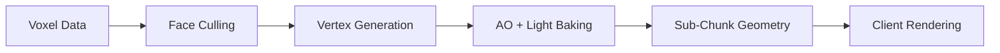

# Chunk Meshing

Chunk meshing transforms raw voxel data into renderable 3D geometry. Understanding how meshes are built helps you customize the visual appearance of your world.

## The Meshing Pipeline



The server handles steps A-E, sending compressed geometry to clients. The client reconstructs geometry and applies textures.

## Customizing Appearance

All visual properties are controlled through chunk uniforms. You can set them at initialization or modify them at runtime:

```ts title="Chunk Uniform Configuration"
import * as VOXELIZE from "@voxelize/core";
import { Vector4, Color } from "three";

const world = new VOXELIZE.World({
  chunkUniformsOverwrite: {
    ao: { value: new Vector4(100, 170, 210, 255) },
    sunlightIntensity: { value: 1.0 },
    minLightLevel: { value: 0.04 },
    lightIntensityAdjustment: { value: 0.8 },
    fogColor: { value: new Color("#B1CCFD") },
    fogNear: { value: 100 },
    fogFar: { value: 200 },
  },
});
```

### Ambient Occlusion

AO darkens corners where blocks meet, adding depth. Each vertex gets an AO level (0-3) based on neighboring blocks:

| Level | Neighbors Blocking  | Effect       |
| ----- | ------------------- | ------------ |
| 0     | Both sides + corner | Darkest      |
| 1     | Two neighbors       | Dark         |
| 2     | One neighbor        | Subtle       |
| 3     | None                | No darkening |

The `ao` uniform maps these levels to brightness values (0-255):

```ts title="AO Customization"
world.chunks.uniforms.ao.value.set(80, 150, 200, 255); // dramatic shadows
world.chunks.uniforms.ao.value.set(200, 220, 240, 255); // subtle shadows
world.chunks.uniforms.ao.value.set(255, 255, 255, 255); // disable AO
```

### Lighting

Three uniforms control light rendering:

| Uniform                    | Default | Purpose                              |
| -------------------------- | ------- | ------------------------------------ |
| `sunlightIntensity`        | 1.0     | Multiplier for sky light (0 = night) |
| `minLightLevel`            | 0.04    | Ambient brightness floor             |
| `lightIntensityAdjustment` | 0.8     | Overall light scaling                |

```ts title="Night Mode"
world.chunks.uniforms.sunlightIntensity.value = 0.1;
```

Day/night transitions happen automatically based on `sunlightStartTimeFrac`, `sunlightEndTimeFrac`, and `sunlightChangeSpan` world options.

### Fog

Fog blends distant chunks with the sky. Distance is calculated horizontally (XZ plane) for consistent depth perception:

```ts title="Fog Control"
world.chunks.uniforms.fogNear.value = 50; // start blending
world.chunks.uniforms.fogFar.value = 120; // fully fogged
world.chunks.uniforms.fogColor.value.set("#ff9966"); // sunset
```

Fog scales automatically with render radius: `fogNear = radius * 0.7 * chunkSize`, `fogFar = radius * chunkSize`.

## Example: Stylized Dungeon

This example creates a dark, dramatic dungeon aesthetic:

```ts title="Dungeon Style Configuration"
import * as VOXELIZE from "@voxelize/core";
import { Vector4, Color } from "three";

const world = new VOXELIZE.World({
  minLightLevel: 0.02,
  chunkUniformsOverwrite: {
    ao: { value: new Vector4(40, 100, 160, 255) },
    sunlightIntensity: { value: 0.3 },
    lightIntensityAdjustment: { value: 1.2 },
    fogColor: { value: new Color("#1a1a2e") },
    fogNear: { value: 30 },
    fogFar: { value: 80 },
  },
});
```

The strong AO values (starting at 40) create deep shadows in corners, while low sunlight and close fog create an oppressive atmosphere. Boosted `lightIntensityAdjustment` makes torches pop against the darkness.

## Server Configuration

The server controls mesh generation throughput:

```rust title="Mesher Configuration"
let config = WorldConfig::new()
    .max_chunks_per_tick(4)  // chunks meshed per tick
    .sub_chunks(8)           // vertical subdivisions
    .build();
```

More sub-chunks means better frustum culling but more draw calls. For 256-block tall chunks:

- `.sub_chunks(4)` - 64-block sections, fewer draws
- `.sub_chunks(8)` - 32-block sections, balanced
- `.sub_chunks(16)` - 16-block sections, aggressive culling

## Transparent Blocks

Blocks with `is_transparent` or `is_see_through` have special face generation rules:

- Faces render between different transparent types
- Same-type faces only render if `transparent_standalone` is true (useful for leaves)
- AABB intersection determines visibility for partial blocks

## Related Pages

- [Block Registry](./block-registry.md) - Server-side block configuration
- [Block Textures](./block-textures.md) - Client-side texture application
- [Custom Block Rendering](./custom-block-rendering.md) - Block entity rendering
