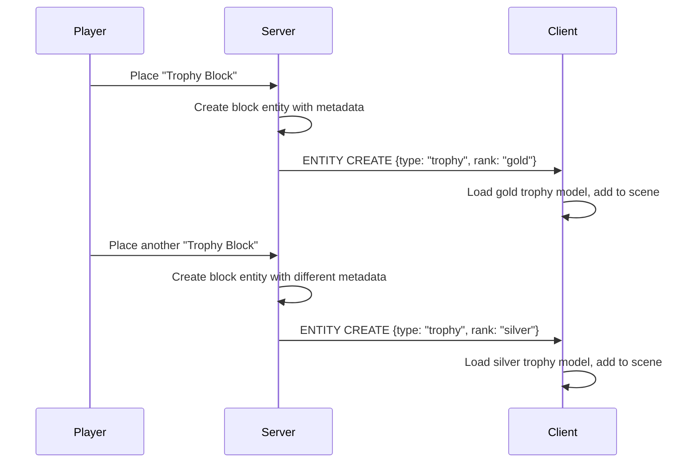

# Custom Block Rendering

Block entities let you render custom visuals for individual blocks based on per-block data. The same block type can display completely different content at each location.

## The Pattern

1. **Server** stores metadata for each block entity (text, image URL, model URL, colors, etc.)
2. **Client** listens for block entity updates via `world.addBlockEntityUpdateListener`
3. **Client** renders custom visuals (textures, 3D models, canvas drawings) based on the metadata



## Example: Trophy Display Block

A single "Trophy" block type that displays different 3D models based on stored rank data.

### Server: Register the Block Entity

```rust title="Server Block Entity"
use voxelize::*;
use serde::{Deserialize, Serialize};

#[derive(Serialize, Deserialize, Clone)]
struct TrophyData {
    rank: String,
}

let trophy_block = Block::new("Trophy")
    .id(100)
    .is_entity(true)
    .build();

registry.register_block(&trophy_block);

world.set_entity_loader("block::trophy", |world, metadata| {
    let data: TrophyData = serde_json::from_value(metadata).unwrap_or(TrophyData {
        rank: "bronze".to_string(),
    });

    world.create_entity(&nanoid!(), "block::trophy")
        .with(MetadataComp::from_json(&serde_json::json!({
            "type": "trophy",
            "rank": data.rank,
        })))
});
```

### Client: Listen for Block Entity Updates

```ts title="Client Block Entity Handler"
import * as VOXELIZE from "@voxelize/core";
import * as THREE from "three";
import { GLTFLoader } from "three/examples/jsm/loaders/GLTFLoader.js";

type TrophyMetadata = {
  type: "trophy";
  rank: "gold" | "silver" | "bronze";
};

const TROPHY_MODELS: Record<string, string> = {
  gold: "/models/trophy-gold.gltf",
  silver: "/models/trophy-silver.gltf",
  bronze: "/models/trophy-bronze.gltf",
};

class TrophyRenderer {
  private trophies = new Map<string, THREE.Group>();
  private loader = new GLTFLoader();

  constructor(private world: VOXELIZE.World) {
    world.addBlockEntityUpdateListener(this.handleUpdate);
  }

  handleUpdate = (args: VOXELIZE.BlockEntityUpdateData<TrophyMetadata>) => {
    const { id, operation, newValue, voxel } = args;

    if (newValue?.type !== "trophy") return;

    if (operation === "CREATE" || operation === "UPDATE") {
      this.loadTrophy(id, voxel, newValue.rank);
    } else if (operation === "DELETE") {
      this.removeTrophy(id);
    }
  };

  private async loadTrophy(id: string, voxel: number[], rank: string) {
    this.removeTrophy(id);

    const modelUrl = TROPHY_MODELS[rank] || TROPHY_MODELS.bronze;

    const gltf = await this.loader.loadAsync(modelUrl);
    const model = gltf.scene;

    model.scale.set(0.4, 0.4, 0.4);
    model.position.set(voxel[0] + 0.5, voxel[1] + 0.5, voxel[2] + 0.5);

    this.trophies.set(id, model);
    this.world.add(model);
  }

  private removeTrophy(id: string) {
    const existing = this.trophies.get(id);
    if (existing) {
      this.world.remove(existing);
      this.trophies.delete(id);
    }
  }
}
```

### Client: Initialize

```ts title="Setup"
const world = new VOXELIZE.World();
const trophyRenderer = new TrophyRenderer(world);
```

## Example: Sign Block with Custom Text

A sign block that renders text onto a canvas texture, applied per-block.

```ts title="Sign Renderer"
type SignMetadata = {
  type: "sign";
  text: string;
  color?: string;
};

class SignRenderer {
  private textures = new Map<string, THREE.CanvasTexture>();

  constructor(private world: VOXELIZE.World) {
    world.addBlockEntityUpdateListener(this.handleUpdate);
  }

  handleUpdate = (args: VOXELIZE.BlockEntityUpdateData<SignMetadata>) => {
    const { id, operation, newValue, voxel } = args;

    if (newValue?.type !== "sign") return;

    if (operation === "CREATE" || operation === "UPDATE") {
      this.renderSign(id, voxel, newValue);
    } else if (operation === "DELETE") {
      this.disposeTexture(id);
    }
  };

  private renderSign(id: string, voxel: number[], data: SignMetadata) {
    this.disposeTexture(id);

    const canvas = document.createElement("canvas");
    canvas.width = 256;
    canvas.height = 128;

    const ctx = canvas.getContext("2d")!;
    ctx.fillStyle = "#8B4513";
    ctx.fillRect(0, 0, 256, 128);

    ctx.fillStyle = data.color || "#FFFFFF";
    ctx.font = "24px monospace";
    ctx.textAlign = "center";
    ctx.textBaseline = "middle";

    const lines = data.text.split("\\n");
    const lineHeight = 28;
    const startY = 64 - ((lines.length - 1) * lineHeight) / 2;

    lines.forEach((line, i) => {
      ctx.fillText(line, 128, startY + i * lineHeight);
    });

    const texture = new THREE.CanvasTexture(canvas);
    texture.magFilter = THREE.NearestFilter;
    texture.minFilter = THREE.NearestFilter;
    texture.needsUpdate = true;

    this.textures.set(id, texture);

    this.world.applyBlockTextureAt(
      "Sign",
      "pz",
      texture,
      voxel as [number, number, number]
    );
  }

  private disposeTexture(id: string) {
    const texture = this.textures.get(id);
    if (texture) {
      texture.dispose();
      this.textures.delete(id);
    }
  }
}
```

## Example: Picture Frame with Uploaded Images

```ts title="Picture Frame Renderer"
type PictureFrameMetadata = {
  type: "picture-frame";
  imageSource: string;
  objectFit?: "cover" | "contain";
};

class PictureFrameRenderer {
  private textures = new Map<string, THREE.CanvasTexture>();

  constructor(private world: VOXELIZE.World) {
    world.addBlockEntityUpdateListener(this.handleUpdate);
  }

  handleUpdate = (
    args: VOXELIZE.BlockEntityUpdateData<PictureFrameMetadata>
  ) => {
    const { id, operation, newValue, voxel } = args;

    if (newValue?.type !== "picture-frame") return;

    if (operation === "CREATE" || operation === "UPDATE") {
      this.renderFrame(id, voxel, newValue);
    } else if (operation === "DELETE") {
      this.disposeTexture(id);
    }
  };

  private async renderFrame(
    id: string,
    voxel: number[],
    data: PictureFrameMetadata
  ) {
    if (!data.imageSource) return;

    this.disposeTexture(id);

    const image = await this.world.loader.loadImage(data.imageSource);

    const canvas = document.createElement("canvas");
    canvas.width = 256;
    canvas.height = 256;

    const ctx = canvas.getContext("2d")!;

    if (data.objectFit === "contain") {
      const scale = Math.min(256 / image.width, 256 / image.height);
      const w = image.width * scale;
      const h = image.height * scale;
      ctx.drawImage(image, (256 - w) / 2, (256 - h) / 2, w, h);
    } else {
      const scale = Math.max(256 / image.width, 256 / image.height);
      const w = image.width * scale;
      const h = image.height * scale;
      ctx.drawImage(image, (256 - w) / 2, (256 - h) / 2, w, h);
    }

    const texture = new THREE.CanvasTexture(canvas);
    texture.magFilter = THREE.NearestFilter;
    texture.needsUpdate = true;

    this.textures.set(id, texture);

    this.world.applyBlockTextureAt(
      "Picture Frame",
      "pz",
      texture,
      voxel as [number, number, number]
    );
  }

  private disposeTexture(id: string) {
    const texture = this.textures.get(id);
    if (texture) {
      texture.dispose();
      this.textures.delete(id);
    }
  }
}
```

## Key APIs

| Method                                                       | Purpose                                      |
| ------------------------------------------------------------ | -------------------------------------------- |
| `world.addBlockEntityUpdateListener(callback)`               | Listen for block entity changes              |
| `world.getBlockEntityDataAt(x, y, z)`                        | Read metadata at a voxel                     |
| `world.setBlockEntityDataAt(x, y, z, data)`                  | Write metadata at a voxel                    |
| `world.applyBlockTextureAt(blockName, face, texture, voxel)` | Apply a texture to a specific block instance |

## Tips

1. **Dispose resources** - Always clean up textures and models when blocks are deleted to prevent memory leaks
2. **Queue loading** - For many blocks loading models/images, use a queue to avoid overwhelming the browser
3. **Cache textures** - Reuse textures for identical content when possible
4. **Use `NearestFilter`** - For pixel-art style textures, prevents blurry scaling

See the town project's `client/src/core/block-entities.ts` for a production implementation handling signs, picture frames, screens, and 3D model spawners.

## Related Pages

- [Block Registry](./block-registry.md) - Server-side block configuration
- [Block Textures](./block-textures.md) - Client-side texture application
- [Chunk Meshing](./chunk-meshing.md) - How blocks become geometry
