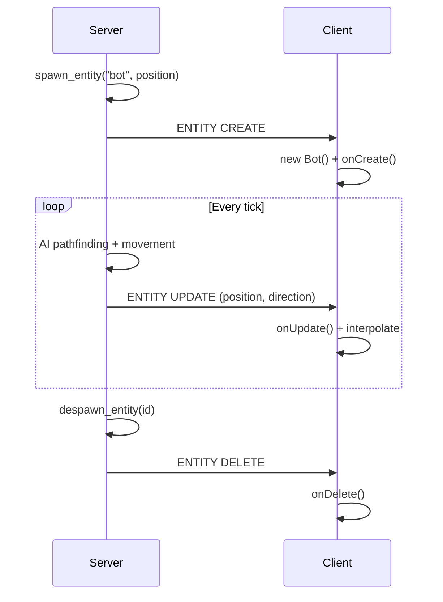

# Custom Entities

Entities are server-controlled objects that sync to clients - mobs, NPCs, projectiles, or any game object that needs authoritative state.

## Example: Bot Entity

This example creates a bot that follows players around the world.



### Server: Define the Entity Loader

```rust title="Server Entity Definition"
use voxelize::*;
use specs::Component;
use nanoid::nanoid;
use std::time::Duration;

#[derive(Component, Default)]
#[storage(NullStorage<BotFlag>)]
struct BotFlag;

world.set_entity_loader("bot", |world, metadata| {
    let body = RigidBody::new(
        &AABB::new().scale_x(0.6).scale_y(1.8).scale_z(0.6).build()
    );
    let interactor = world.physics_mut().register(&body);

    world
        .create_entity(&nanoid!(), "bot")
        .with(BotFlag)
        .with(PositionComp::default())
        .with(DirectionComp::default())
        .with(RigidBodyComp::new(&body))
        .with(InteractorComp::new(&interactor))
        .with(BrainComp::new(BrainOptions {
            max_speed: 4.0,
            jump_impulse: 8.0,
            ..Default::default()
        }))
        .with(TargetComp::players())
        .with(PathComp::new(
            100,
            24.0,
            10000,
            Duration::from_millis(50),
        ))
});
```

### Server: Spawn via Method

```rust title="Spawn Method Handler"
#[derive(Serialize, Deserialize)]
struct SpawnBotPayload {
    position: [f32; 3],
}

world.set_method_handle("spawn-bot", |world, _client_id, payload| {
    let data: SpawnBotPayload = serde_json::from_value(payload).unwrap();
    let [x, y, z] = data.position;

    world.spawn_entity_at("bot", &Vec3(x, y, z));
});
```

### Client: Define the Entity Class

```ts title="Client Entity Class"
import * as VOXELIZE from "@voxelize/core";
import * as THREE from "three";

type BotData = {
  position: VOXELIZE.Coords3;
  direction: number[];
};

class Bot extends VOXELIZE.Entity<BotData> {
  character: VOXELIZE.Character;

  constructor(id: string) {
    super(id);

    this.character = new VOXELIZE.Character({
      nameTagOptions: {
        fontFace: "monospace",
      },
    });
    this.character.username = "Bot";
    this.character.head.paint("all", new THREE.Color("#4a90d9"));

    this.add(this.character);
  }

  onCreate = (data: BotData) => {
    this.character.set(data.position, data.direction);
  };

  onUpdate = (data: BotData) => {
    this.character.set(data.position, data.direction);
  };

  onDelete = () => {
    this.character.dispose();
  };

  update = () => {
    this.character.update();
  };
}
```

### Client: Register and Use

```ts title="Client Entity Registration"
const entities = new VOXELIZE.Entities();
const method = new VOXELIZE.Method();

network.register(entities);
network.register(method);

entities.setClass("bot", Bot);
world.add(entities);

inputs.bind("KeyZ", () => {
  method.call("spawn-bot", {
    position: controls.object.position.toArray(),
  });
});

function animate() {
  if (world.isInitialized) {
    entities.update();
  }
}
```

## Entity Lifecycle

| Server                           | Client                             |
| -------------------------------- | ---------------------------------- |
| `set_entity_loader("type", ...)` | `entities.setClass("type", Class)` |
| `spawn_entity_at("type", pos)`   | `onCreate(data)` called            |
| ECS systems update components    | `onUpdate(data)` called            |
| `despawn_entity(id)`             | `onDelete()` called                |

## Full Client Implementation

```ts title="main.ts"
import * as VOXELIZE from "@voxelize/core";
import * as THREE from "three";

type BotData = {
  position: VOXELIZE.Coords3;
  direction: number[];
};

class Bot extends VOXELIZE.Entity<BotData> {
  character: VOXELIZE.Character;

  constructor(id: string) {
    super(id);
    this.character = new VOXELIZE.Character();
    this.character.username = "Bot";
    this.add(this.character);
  }

  onCreate = (data: BotData) => {
    this.character.set(data.position, data.direction);
  };

  onUpdate = (data: BotData) => {
    this.character.set(data.position, data.direction);
  };

  update = () => {
    this.character.update();
  };
}

const network = new VOXELIZE.Network();
const entities = new VOXELIZE.Entities();
const method = new VOXELIZE.Method();

network.register(entities);
network.register(method);

entities.setClass("bot", Bot);

async function start() {
  await network.connect("http://localhost:4000");
  await network.join("tutorial");

  method.call("spawn-bot", { position: [0, 50, 0] });
}

start();
```

See `examples/client/src/main.ts` for a complete implementation with path visualization and multiple entity types.
