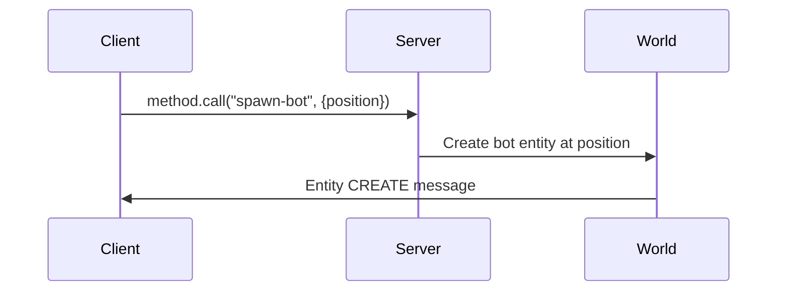

# Calling Methods

Methods are RPC calls from client to server. Use them when a client action needs to trigger server-side logic - spawning entities, changing world state, or validating game rules.

Unlike events, methods run world-wide and aren't location-based.

## Example: Spawning a Bot

This example shows a method that spawns a bot entity at a given position.



### Server Setup

```rust title="Server Method Handler"
use serde::{Deserialize, Serialize};

#[derive(Serialize, Deserialize)]
struct SpawnBotPayload {
    position: [f32; 3],
}

world.set_method_handle("spawn-bot", |world, client_id, payload| {
    let data: SpawnBotPayload = serde_json::from_value(payload)
        .expect("Failed to parse spawn-bot payload");

    let [x, y, z] = data.position;

    world.spawn_entity("bot", json!({
        "position": [x, y, z],
        "direction": [0.0, 0.0, 1.0],
    }));
});
```

### Client Usage

```ts title="Client Method Call"
import * as VOXELIZE from "@voxelize/core";

const method = new VOXELIZE.Method();
network.register(method);

inputs.bind("KeyZ", () => {
  method.call("spawn-bot", {
    position: controls.object.position.toArray(),
  });
});
```

## Example: Setting World Time

```rust title="Server Time Method"
#[derive(Serialize, Deserialize)]
struct TimePayload {
    time: f64,
}

world.set_method_handle("time", |world, _client_id, payload| {
    let data: TimePayload = serde_json::from_value(payload)
        .expect("Failed to parse time payload");

    world.stats_mut().set_time(data.time);
});
```

```ts title="Client Time Call"
method.call("time", {
  time: world.options.timePerDay / 2,
});
```

## Full Client Implementation

```ts title="main.ts"
import * as VOXELIZE from "@voxelize/core";

const network = new VOXELIZE.Network();
const method = new VOXELIZE.Method();

network.register(method);

async function start() {
  await network.connect("http://localhost:4000");
  await network.join("tutorial");

  method.call("spawn-bot", { position: [0, 50, 0] });
}

start();
```

## Methods vs Events

| Use Case                       | Use        |
| ------------------------------ | ---------- |
| Client triggers server action  | **Method** |
| Server notifies nearby clients | Event      |
| Location-based broadcasting    | Event      |
| World-wide state changes       | **Method** |

See [Handling Events](/wiki/networking/handling-events) for the event system.
