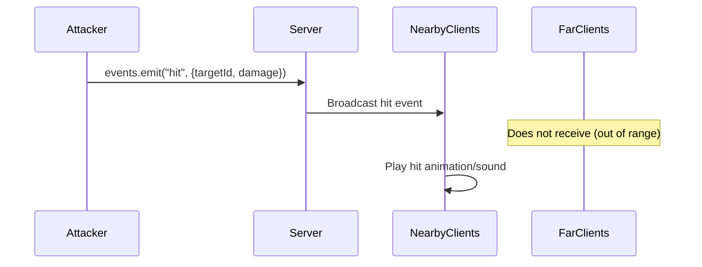

# Handling Events

Events broadcast messages to nearby clients. They're location-based - only players with the relevant chunk loaded receive the event. Use them for effects, notifications, and reactive game logic.

## Example: Hit Effect

When a player hits another player, broadcast a hit effect to nearby clients.



### Server Setup (Optional Handler)

Events without a server handler are automatically broadcast to nearby clients:

```rust title="Server Event Handler"
use serde::{Deserialize, Serialize};

#[derive(Serialize, Deserialize)]
struct HitPayload {
    target_id: String,
    damage: i32,
}

world.set_event_handle("hit", |world, client_id, payload| {
    let data: HitPayload = serde_json::from_value(payload)
        .expect("Failed to parse hit payload");

    println!("Player {} hit {} for {} damage",
        client_id, data.target_id, data.damage);
});
```

### Client Emitting

```ts title="Emitting Events"
import * as VOXELIZE from "@voxelize/core";

const events = new VOXELIZE.Events();
network.register(events);

function attackPlayer(targetId: string) {
  events.emit("hit", {
    targetId,
    damage: 10,
  });
}
```

### Client Listening

```ts title="Receiving Events"
events.on("hit", (payload) => {
  const { targetId, damage } = payload;

  if (targetId === myPlayerId) {
    playHitSound();
    showDamageNumber(damage);
  }
});
```

## Example: Chat Message Effect

Broadcast a visual effect when someone sends a chat message:

```ts title="Chat Effect"
events.on("chat-effect", (payload) => {
  const { position, message } = payload;
  showFloatingText(position, message);
});

function sendChatWithEffect(message: string) {
  events.emit("chat-effect", {
    position: controls.object.position.toArray(),
    message,
  });
}
```

## Full Client Implementation

```ts title="main.ts"
import * as VOXELIZE from "@voxelize/core";

const network = new VOXELIZE.Network();
const events = new VOXELIZE.Events();

network.register(events);

events.on("explosion", (payload) => {
  const { position, radius } = payload;
  createExplosionEffect(position, radius);
});

events.on("player-damaged", (payload) => {
  const { playerId, damage } = payload;
  if (playerId === myId) {
    flashScreen("red");
  }
});

async function start() {
  await network.connect("http://localhost:4000");
  await network.join("tutorial");
}

start();

function triggerExplosion(position: number[]) {
  events.emit("explosion", {
    position,
    radius: 5,
  });
}
```

## Events vs Methods

| Behavior         | Events                  | Methods                    |
| ---------------- | ----------------------- | -------------------------- |
| Direction        | Client → nearby clients | Client → server            |
| Scope            | Location-based (chunk)  | World-wide                 |
| Use case         | Effects, notifications  | Server actions, validation |
| Default behavior | Auto-broadcast          | Must define handler        |

See [Calling Methods](/wiki/networking/calling-methods) for server-side actions.
