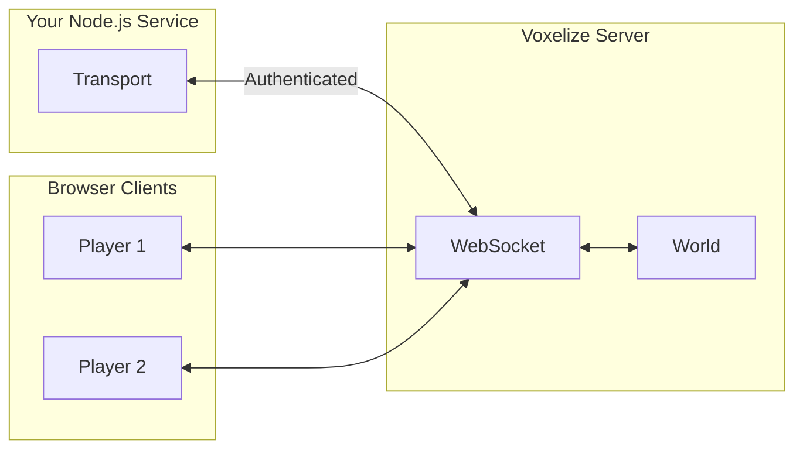
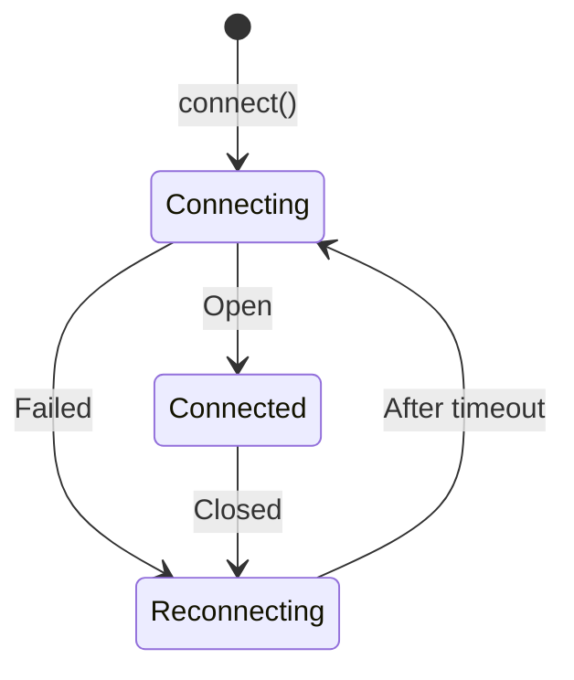

# Transport

Transport is a server-side WebSocket client that connects to Voxelize from external Node.js processes. It receives the same real-time events that browser clients receive, enabling backend services to react to game activity.

Unlike Methods and Events which handle in-game client-server communication, Transport is for **out-of-game services** that need to observe or interact with your world.



## Use Cases

| Service           | What It Does                                                  |
| ----------------- | ------------------------------------------------------------- |
| Discord bot       | Posts join/leave/chat messages to a channel                   |
| Analytics service | Logs player activity and game events to a database            |
| Asset manager     | Cleans up uploaded files when associated blocks are destroyed |
| REST API          | Exposes game state (player positions, entity counts) via HTTP |

## Basic Setup

```ts title="Connecting to Voxelize"
import { Transport } from "@voxelize/protocol";

const transport = new Transport(5000);

await transport.connect("http://localhost:4000", "your-secret-key");
```

The secret authenticates the Transport as a trusted listener. Configure it on your Voxelize server.

## Event Handlers

Assign callbacks to react to game events:

```ts title="Available Handlers"
transport.onInit; // World initialized with existing state
transport.onJoin; // Player connected
transport.onLeave; // Player disconnected
transport.onPeer; // Player position/metadata changed
transport.onEntity; // Entity created/updated/deleted
transport.onChat; // Chat message sent
transport.onUpdate; // Voxel changed
transport.onMethod; // RPC call received
transport.onEvent; // Custom event fired
```

## Example: Join/Leave Notifications

```ts title="Tracking Players"
const playerCache = new Map<string, { username: string }>();

transport.onPeer = (event) => {
  event.peers?.forEach((peer) => {
    playerCache.set(peer.id, { username: peer.username });
  });
};

transport.onJoin = async (event) => {
  const player = playerCache.get(event.text);
  console.log(`${player?.username} joined ${event.worldName}`);
};

transport.onLeave = async (event) => {
  const player = playerCache.get(event.text);
  console.log(`${player?.username} left`);
  playerCache.delete(event.text);
};
```

## Connection Lifecycle

Transport auto-reconnects when the connection drops:



The constructor argument sets the reconnection interval in milliseconds:

```ts title="Reconnection Interval"
const transport = new Transport(5000); // Retry every 5 seconds
```

## Transport vs Methods vs Events

| Need                             | Use                                         |
| -------------------------------- | ------------------------------------------- |
| External service needs game data | **Transport**                               |
| Client triggers server action    | [Methods](/wiki/networking/calling-methods) |
| Server broadcasts to clients     | [Events](/wiki/networking/handling-events)  |

See [TypeScript Transport Tutorial](/tutorials/intermediate/typescript-transport) for complete implementation examples including Discord bot integration and asset cleanup services.


