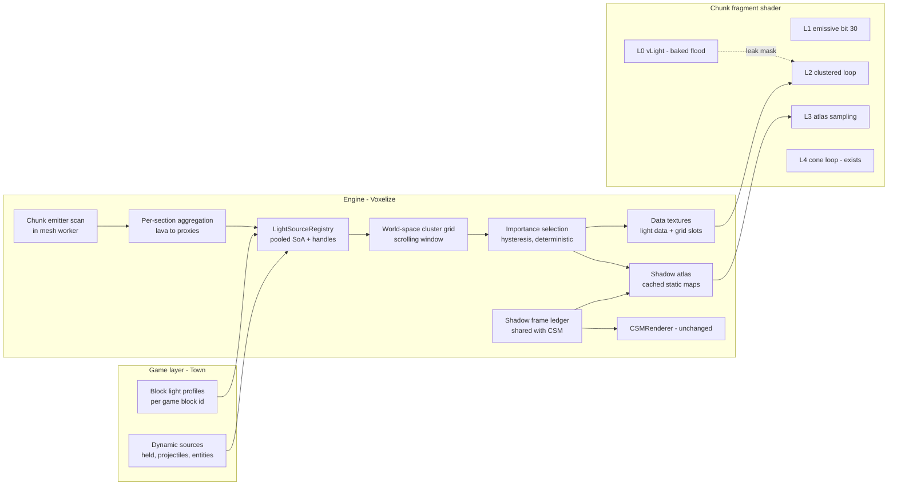

# Architecture: a layered hybrid for local lights

Design goal: thousands of registered emitters in loaded chunks; dozens visibly "analytic"
near the camera; a handful shadowed — at a cost that is bounded, budgeted, measured, and
degradable, on top of the pipeline audited in `01-baseline.md`.

## 0. Positioning against CSM

CSM answers exactly one question — "is this fragment lit by the *sun*?" — with orthographic
cascades that follow the camera. Local emitters are omnidirectional, plentiful, mostly
static, and mostly small. Forcing them into CSM-like machinery (per-light cameras chasing
the player) inverts every property that makes CSM work. So: **CSM stays the directional
sunlight system, untouched in behavior; local lights are a complementary system** that
shares only (a) the depth-caster/material rules and (b) a frame-level shadow budget with
CSM. That shared surface is specified in §6.

## 1. The layer model

Every local light is served by a stack of five layers, cheapest first. Lower layers are
universal; higher layers are selective.

```text
                         count      update cost        per-frame cost   role
L0 voxel flood light     unlimited  on block edit      0 (baked)        broad diffuse, far field,
   (exists)                          (workers)                           occlusion oracle
L1 emissive faces        unlimited  on remesh          ~0 (1 bit)       the source itself glows
   (new, bit 30)
L2 clustered analytic    ≤ 255      dirty cells only   bounded shader   near-field N·L, falloff,
   lights (new)          selected                      loop (≤ 8/cell)  specular, movement
L3 shadowed hero lights  ≤ 4        ledger-scheduled   ≤ K faces/frame  occlusion for the lights
   (new, atlas)                     cached when static                  that earn it
L4 hero cones (exists)   ≤ 8        game per frame     fixed loop       spots + volumetric scatter
```

The critical property: **L0 already solves the "thousands of emitters" problem for the far
field.** A torch 60 blocks away is a baked warm gradient; it needs no analytic light at
all. L2 is a *near-field detail layer* — its selection radius (default 64 blocks) is a
quality knob, not a correctness boundary, because L0 covers everything beyond it. This is
what lets budgets stay small without visible popping: an emitter leaving L2 doesn't go
dark, it falls back to its flood glow.



## 2. D1 — analytic representation (the load-bearing decision)

Requirement recap: shared materials (no per-mesh uniforms), heavy uniform budget (data must
live in textures), WebGL2 (`texelFetch` available), no recompiles, bounded fragment cost,
incremental CPU updates.

### Options compared

**(a) World-space clustered grid — recommended.** A camera-centered, world-axis-aligned 3D
grid (default: 8-block cells, 24×12×24 cells = 192×96×192 blocks — the vertical span is
deliberately half the horizontal, matching mostly-horizontal gameplay; `gridDims` is an
option for games with tall verticality, and selection culls against the window so the
shorter axis never wastes slots) holding, per cell, up to `maxLightsPerCell` light
indices. Fragment: `worldPos → cell → fixed-slot loop`. The window
scrolls with the camera in whole cells; light-to-cell assignment changes only when a light
moves/appears/dies or the window scrolls a row of cells — both incremental, both O(cells
touched). Camera *rotation* costs zero. The grid is the same shape as the world's own
chunk structure, so chunk load/unload maps directly onto cell dirtying. This is Olsson-
style clustered shading [1][2] with the cluster space moved from view-froxels to world
space — a simplification that voxel games specifically can afford because their lights are
world-anchored and mostly static (id Tech 6 keeps froxels because everything moves [3];
our L2 population is ~95 % static torches).

**(b) View-frustum froxels.** The standard for fully-dynamic scenes. Rejected here:
every camera rotation re-bins every light every frame (CPU cost ∝ lights × overlapped
froxels, unavoidable); log-depth slicing and near/far tuning add complexity; and it buys
nothing over (a) at our light counts, because (a)'s per-cell occupancy is already low and
bounded. Documented as the fallback if profiling ever shows world-grid cell occupancy
exploding (e.g. skyscraper density along one axis).

**(c) Uniform-array only (extend `LightCones` to points, cap ~16–32).** Simplest; zero new
textures. Rejected as the *primary* mechanism: every fragment pays O(N) for all N lights
regardless of proximity; 32 caps a torch tunnel; over-cap popping is exactly the artifact
this design exists to kill. Survives as L4 (hero cones) and as the internal shape of the
shadowed-light uniform block (≤ 4 lights whose extra parameters don't warrant texture
indirection).

**(d) Per-chunk light lists.** Natural-sounding for a chunked world, but per-mesh uniforms
break the shared-material architecture (one opaque material world-wide — `01-baseline.md`
§4), force per-draw uniform patching in `onBeforeRender` (CPU cost ∝ visible chunk count,
hundreds), and quantize light sets at chunk granularity (visible seams at chunk borders
where lists differ). Rejected.

**(e) Deferred / light-prepass.** Would decouple light count from geometry cost — and
require an MRT g-buffer, a rewritten transparency path (the water refraction capture,
sorted transparents, and sky/height fog are all forward and entangled in one shader),
double-shading of every custom material, and a mobile memory-bandwidth bill. Every current
feature would need re-proving. Clustered forward reaches the same light counts for this
scene profile without the upheaval [2][3]; rejected on evidence, per the task constraint.

### Grid + texture specification (reviewable detail)

- **Cell size 8 blocks.** Half a chunk; matches typical torch range (14) spanning ~2 cells
  per axis. A light with range r overlaps ⌈(2r)/8⌉³ cells ≈ 27 cells for r = 10 — cheap to
  re-bin on move.
- **Fixed slots per cell** (`maxLightsPerCell`, default 8, tier-scaled): a `R8UI`
  `DataTexture`; slot value = light rank + 1, `0` = empty — which caps the clustered set
  at **255** (the ultra tier's ceiling; a hypothetical larger tier promotes the texture
  to `R16UI` with no other design change). **[implemented]** The texture lays 32 cells
  of 8 slots per row (256×216 texels for the default dims), comfortably inside WebGL2's
  guaranteed 2048 `MAX_TEXTURE_SIZE`; a naive `(cellCount, slots)` layout would exceed
  it. The 55 KB texture uploads whole on change frames — cheaper than scattered
  sub-uploads, and free on idle frames.
- **Overflow policy:** when > 8 lights overlap a cell, keep the 8 highest-importance
  (deterministic; §4), drop the rest *for that cell only*, count it in
  `stats.overflowCells`. Visual effect is bounded because dropped lights keep L0 flood.
- **Light data texture:** `RGBA32F DataTexture`, 4 texels per record, 255 record rows
  (~16 KB): texel 0 `[x, y, z, range]`; texel 1 `[r·i·share, g·i·share, b·i·share, flags]`
  (flags: masked, flicker, shape); texel 2 spot `[dir.xyz, cosOuter]` or capsule end
  offset; texel 3 `[flickerSpeed, flickerAmplitude, flickerPhase, spotInvCosDelta]` —
  texels 2–3 fetched only when flags say so. **[implemented]** Shadow parameters join
  texel 3's layout in Engine PR B. Uploaded whole on change frames only; a static scene
  uploads nothing (flicker lives in the shader).
- **Fragment loop sketch** (final GLSL in Engine PR A, signatures in `03-api.md`):

```glsl
ivec3 cell = clampedCell(vWorldPosition.xyz);
for (int s = 0; s < MAX_LIGHTS_PER_CELL; s++) {          // compile-time max, tier caps at pack time
  uint idx = texelFetch(uLightGrid, gridCoord(cell, s), 0).r;
  if (idx == EMPTY) break;
  LightRec L = fetchLight(idx);                          // 2 texelFetch typical
  vec3 toL = L.pos - vWorldPosition.xyz; float d = length(toL);
  if (d >= L.range) continue;
  float fall = falloff(d, L.range);                      // squared-quadratic, exact zero at range
  float ndl  = wrapLambert(vWorldNormal, toL / d);       // same wrap constant as LightCones
  float occ  = occlusion(L, vLight.rgb);                 // §5: flood mask / shadow / 1.0
  local += L.color * (fall * ndl * occ) * waterTransmit(L, d);
}
```

Worst case per fragment: `8 × (~3 texelFetch + ALU)` — comparable to the existing 8-cone
loop plus one 25-tap PCF the shader already pays. Bounded, tier-scalable, zero when the
cell is empty (first fetch breaks).

> **Decision D1:** approve world-space clustered grid as L2, with uniform arrays surviving
> only for hero tiers. Approve the grid/texture parameters above as initial calibration.

## 3. Sources, registry, and aggregation

### One registry, two producers

`LightSourceRegistry` (engine) owns pooled SoA storage (`Float32Array`/`Uint32Array`;
capacity `maxRegisteredLights`, default 4096) and stable generation-checked handles
(`index:20 | generation:12` packed in a u32; see `03-api.md`). Producers:

1. **Chunk scan (static emitters).** The mesh worker already touches every voxel of a
   section; it additionally emits a compact `[localVoxel, blockId, rotation]` list of
   voxels whose block `isLight` (LUT lookup, zero extra traversal). On
   `chunk-data-loaded`/remesh the registry diffs the section's emitter list: adds become
   registrations carrying the game-declared `BlockLightProfile` for that block id (engine
   default profile derived from the block's RGB levels when the game declares nothing);
   removals release handles. Chunk unload bulk-releases by section key. Place/break flows
   through the same diff — no separate bookkeeping, and it is *the same event stream* that
   drives the flood relight, so L0 and L2 can never disagree about which emitters exist.
2. **Game API (dynamic sources).** `world.localLights.add(descriptor, position)` for held
   lights, projectiles, entity lights; `setPosition/setIntensity/...` mutate SoA fields in
   place. No allocation on any mutation path.

### Aggregation: the lava rule

Dense emitter fields must not become dense analytic-light fields. Per 16³ section and
profile, when a section's emitter count for a profile exceeds `aggregateThreshold`
(default 8), the scan's emitters collapse into ≤ `maxProxiesPerSection` (default 4) proxy
records: luminance-weighted centroid position, summed-then-capped intensity, range grown
to cover members (greedy 4³-subcell clustering — deterministic, order-independent). A
10 000-voxel lava lake in view becomes ~tens of proxies feeding L2, while L1 emissive faces
carry the surface glow and L0 carries the flood. Aggregation is per-profile opt-out
(`aggregation: "none"`) for blocks that must stay individually crisp (e.g. magic lamps).

## 4. Selection: stable, budgeted, deterministic

**[implemented]** The selection pass runs only when the registry revision or the camera's
grid cell changed — an idle frame does nothing at all (measured: zero work during a
12-minute soak). When it runs:

1. **Gather + score in one linear pass over the alive SoA** (O(registered), cache-friendly;
   measured 0.1 ms at 10 000 registered). The RFC sketched a cell-bucketed gather; the
   linear pass is simpler, allocation-free, and already far under budget, so the extra
   structure stays unbuilt until a gate says otherwise.
   `importance = intensityLuma × range² / max(d², 1) + priorityBias`, times the hysteresis
   factor (×1.2) for lights selected last pass. The RFC's `frustumFactor` was dropped:
   rotation-independent scoring is what lets selection skip entirely while the camera pans,
   and lights behind the camera still light visible geometry anyway.
2. **Select** top `maxClusteredLights` (tier) via a fixed min-heap; ties break on handle
   order — deterministic, unit-tested.
3. **Bin** the ranked selection into the grid, full rebuild (55 KB memset + ~27 cells per
   light): rank order makes per-cell overflow drop the least important, deterministically.
   Incremental cell diffing was designed but unnecessary — the full rebuild measures
   ≤ 0.3 ms at the 255-light cap and only runs on change frames.
4. **Pack** all selected rows and upload both textures whole (≤ 71 KB; cheaper than
   scattered sub-uploads).

Shadow-selection with eviction hysteresis (challenger must out-score an incumbent by
> 25 % for 30 frames) is Engine PR B, with the L3 shadows it gates.

Moving lights bump the registry revision, so a frame with a moving light re-selects and
re-bins — the measured full-pass cost at torch-village scale is ~0.3 ms. Flicker
(`03-api.md` §1.2) is evaluated **in the shader** from `uTime` and per-light parameters
packed once — it never touches selection, never dirties anything, never re-uploads
(invariant 5), and a fully static scene uploads nothing even while every torch flickers.

## 5. Occlusion without shadow maps: the flood mask (D6)

For **static** emitters, the L0 flood field already encodes "can light from around here
reach this voxel" — BFS stopped at walls. L2 therefore multiplies static-light
contribution by a mask derived from the interpolated flood nibbles the fragment already
has:

```glsl
float occ = smoothstep(0.0, MASK_KNEE, dot(vLight.rgb, LUMA));  // MASK_KNEE ≈ 2/15
```

Properties: an isolated torch behind a wall contributes *zero* analytic light on the far
side (the flood is zero there); no shadow camera, no map, no invalidation — occlusion
updates ride the existing relight on block edits. Limitations, stated honestly:

- **Voxel-resolution edges** (vertex-interpolated): a soft ~1-block penumbra at wall
  boundaries rather than a crisp line.
- **The mask is shared, not per-light.** The flood field is the sum of every emitter, so
  where some *other* light legitimately reaches a fragment, the mask is open and an
  occluded light's analytic falloff can bleed there too. The leak is bounded — it only
  appears where the area is already lit by the unoccluded source, scaled by the occluded
  light's distance falloff — and vanishes in the isolated case (the one that reads as a
  glaring bug). Per-light occlusion is exactly what the L3 shadow maps buy; profiles that
  cannot tolerate the bleed request `shadowPolicy: "shadowMap"`.
- **No occlusion from entities** (a player in front of a torch blocks nothing).
- Works only where a flood exists, i.e. static block emitters.

**Dynamic** sources have no flood. Policy per descriptor:

- `"none"` (default for projectiles/entity lights): unmasked analytic light; leaks through
  thin walls are accepted for short-range, short-lived, fast-moving sources — the
  precedent every shipped voxel game with handheld light sets (Optifine/Iris handheld
  torches leak and players do not notice [5]).
- `"shadowMap"`: eligible for an L3 slot; the held torch is the intended customer.
- `"voxelMask"` on a dynamic source is rejected at `add()` (there is no flood to mask by).

> **Decision D6:** approve — static: `voxelMask` default; dynamic: `none` default; held
> light: `shadowMap` request. Flood-injection for moving lights stays rejected (remesh
> storm; `01-baseline.md` §1).

## 6. L3 shadows: atlas, caching, and the shared ledger

### Representation (D2)

One shared **shadow atlas**: a single `WebGLRenderTarget` with a `DepthTexture` (default
2048², tier-scaled), subdivided into slots (256²–512²), rendered with viewport+scissor per
face, sampled manually exactly like CSM samples its maps today (`texture().r` compare with
bias — same code family as `shadow-sampling.ts`).

Point-light projection options:

| Option | Faces | Verdict |
| --- | --- | --- |
| Cube faces into atlas | 6 (fewer with face culling) | **Recommended.** Linear projections — safe on greedy meshes; standard bias behavior; face count is the budget unit. Mount-aware skipping (below) cuts real cost to 2–5. |
| Dual-paraboloid | 2 | Rejected: per-vertex nonlinear warp breaks on greedy meshing's huge triangles (`01-baseline.md` §4). |
| Tetrahedral | 4 | Viable (linear per face) but nonstandard lookup math and wide-FOV bias headaches; deferred as an experiment behind the same atlas API. |
| Per-light cube RTs (`PointLightShadowRenderer` prototype) | 6 | Rejected: unpoolable memory, no atlas residency control; the prototype file gets deleted in Engine PR B. |

**Mount-aware face skipping:** placed emitters are voxel-anchored, and the scan knows the
mount (wall torch: side face; ceiling lantern: hanging). Faces looking *into* the mount
surface are never allocated or rendered — a wall torch needs ≤ 5, usually 3–4 after
frustum-of-influence culling. Spots (`shape: "spot"`) always use exactly 1 face.

### Caching (D4)

Slot record: `{handle, faceMask, resolution, staticCasterRev, state}` with states
`empty → allocated → rendered(cached) → invalid`. For a **static light**: render its faces
once; thereafter the map is reused every frame at zero cost. Invalidation triggers, and the
only ones:

- a block edit whose AABB intersects the light's range (the registry already sees the
  block-update stream for L0 diffing — same source of truth, per-face AABB test);
- atlas eviction (shadow-selection change, §4 hysteresis);
- quality-tier change that resizes slots;
- GPU context restore.

**Entities do not render into and do not invalidate cached static maps.** A walking NPC
casting a moving torch shadow requires re-rendering every intersected light's faces every
frame — exactly the cost explosion this design forbids; the visual payoff is marginal at
torch ranges. Dynamic hero lights (held torch) *do* include entities — they re-render
anyway. This asymmetry is Unreal's stationary-light cache rule [4] and Unity HDRP's
non-updating cached shadows [6]; it is proven shippable.

### The shadow frame ledger (shared budget with CSM)

Both systems draw depth from the same GPU in the same frame, so they share one explicit
budget: `ShadowFrameLedger`, charged in **face units** (the near 4096² cascade ≈ 4 units;
a far 2048² cascade ≈ 6 — smaller target but a far wider caster set, which is what the
one-far-cascade-per-frame rule exists to bound today; one 256² local face = 1; calibration
in `04-benchmarks.md`). Per-frame default budget: 12 units desktop, 4 low-tier. Grant
order:

```text
1. CSM near cascade        (gameplay-critical, cheap to skip only when camera still)
2. Dynamic hero faces      (held light follows the player; staleness is visible)
3. CSM far cascades        (already deferred one-per-frame today; ledger formalizes it)
4. Invalidated static local faces, FIFO  (drain over frames; a TNT blast re-renders
                                          torch shadows over ~10 frames, not 1)
```

CSM's only change is consulting the ledger where it currently uses the hard-coded
"one far cascade per frame" rule — same behavior when no locals exist (invariant 6).
Everything CSM already skips (camera-still, strength floor, swing skip) it still skips
*before* asking the ledger, so grants are never wasted.

Depth-pass coherence (the shared caster/material rules): local faces render with the same
`scene.overrideMaterial` depth material, the same `skipShadow` skip-list, the same
`customDepthMaterial` handling for instanced pools, and the same cutout policy (solid
quads today) as CSM — one rule set, two consumers. If alpha-tested depth is ever added, it
is added for both in one place.

> **Decisions D2, D4:** approve cube-faces-in-atlas + mount-aware skipping; approve
> static-cache semantics with entity exclusion and the ledger priorities above.

## 7. Light combination model (explicit)

Order in the chunk fragment shader (all layers pre-fog, matching today's torch path):

```glsl
// existing: sunTotal (CSM-shadowed sun + sky ambient + bounce + underwater fill)
// [implemented] L2 computes, alongside its lit response, the fraction of the
// baked flood term this fragment keeps (the "flood remainder"): selected
// lights claim their coverage with falloff/cone shaping only, the claim is
// scaled by uLocalOwnership (0..1, tier-driven) and a grid-window edge fade,
// and the L0 term yields in proportion.
float remainder;                                                     // 1 → legacy
vec3 localLight = localLightSurface(worldPos, N, vLight.rgb, remainder); // L2 (+L3)
vec3 torchLight = shapedFlood * remainder;                           // L0 yields
vec3 coneLight  = lightConeSurface(worldPos, N);                     // L4 (existing)

totalLight = 1.0 - (1.0-sunTotal)*(1.0-torchLight)*(1.0-localLight)*(1.0-coneLight);
// then: temperature tint, AO, face shade, tonemap — unchanged
```

- **Screen blend** keeps every layer ≤ 1 and order-independent, and is what torch + cones
  already do — locals slot in rather than redefining the model.
- **L0/L2 ownership `[implemented — supersedes the original "L2 atop L0" plan]`:**
  the RFC originally layered L2 additively on L0's base, which double-lit near sources
  (Town #162). Implemented behavior: where selected lights *claim* a fragment (falloff ×
  cone shaping, no Lambert/flicker/occlusion — so an analytic light's dark sides and
  shadowed regions stay owned rather than flood-refilled), the flood term fades out in
  proportion and the per-pixel model is the sole visible block light. Where no selected
  light reaches — beyond falloff, past the selection cap (dense fields keep their flood),
  outside the grid window (edge-faded over two cells), or with ownership 0 (`off`/
  `potato` tiers) — the remainder returns to 1 and the legacy flood look is untouched.
  Sunlight/skylight compose separately and are never touched by either model.
  `analyticShare` still scales L2's energy per profile.
- **Specular:** L2 adds Blinn-Phong specular **on fluids only** in v1 (the only surfaces
  with any specular today), sharing the water path's half-vector math. Glossy solids are
  a later material feature, not a lighting feature.
- **Water:** per-light submersion (origin below `uWaterLevel`) is computed CPU-side into
  the record flags; contribution applies the same Beer-Lambert view extinction the cones
  use. Underwater lanterns glow correctly; dry torches don't tint the sea.
- **Transparency/see-through:** the see-through and fluid shader variants include the same
  cluster code (they share the composed fragment source — `shaders.ts` string pipeline).
- **Particles/entities/items:** CPU query `queryLocalLights(pos, radius, out)` over the
  same SoA (a few grid taps, zero alloc) feeds `LightShined`, the particles tint, and the
  item renderer's arm lighting — entities see the same lights the world does.
- **Custom-shaped blocks** mesh into chunk geometry → they receive L2 for free; block
  *entities* go through the `LightShined` path.
- **Day/night:** locals ignore `uShadowStrength` (that is a *sun*-shadow fade); at noon the
  tonemap naturally crushes a torch's relative contribution, at night it dominates — no
  special-casing, matching how L0 behaves today.
- **Emissive (L1):** a fragment whose vertex carries bit 30 outputs
  `albedo × emissiveStrength` bypassing the lighting model (still fogged, still
  water-shaded). Declared per block (`03-api.md`); the mesher sets the bit per face.
  **[implemented]** The 4-entry strength table is a fixed engine constant mirrored in
  `vertex_light.rs` and the `uEmissiveLevels` uniform; making it configurable is a
  data-only change deferred until a game needs different anchors.

## 8. Quality tiers, capability, degradation

One shader permutation; every tier difference is data (uniforms, texture contents, CPU
budgets). Tier table and thresholds in `04-benchmarks.md`; the shape:

| | ultra | high | medium | low | potato |
| --- | --- | --- | --- | --- | --- |
| clustered lights | 255 | 192 | 128 | 64 | 0 (L2 off) |
| lights/cell | 8 | 8 | 6 | 4 | — |
| analytic radius | 96 | 64 | 48 | 32 | — |
| shadowed locals | 4 | 3 | 2 | 0 | 0 |
| atlas | 4096² | 2048² | 2048² | — | — |
| ledger units/frame | 16 | 12 | 8 | 4 | 4 (CSM only) |
| local specular | on | on | off | off | — |

Degradation order under sustained over-budget (auto-tier, opt-in):
specular → analytic radius → shadowed count → clustered count → lights/cell → L2 off.
Each step is a uniform/CPU change; none recompiles or reallocates. `potato` renders
exactly today's frame plus emissive faces (invariant 7). Capability requirements: WebGL2
core only — no float render targets, no extensions; `EXT_disjoint_timer_query_webgl2` is
used *by the benchmark harness when present*, never by the runtime.

## 9. Integration boundary (D5)

**Game (Town) declares meaning; engine owns machinery.**

- Town: `setBlockProfile(blockId, profile)` for its torch/lantern/campfire/lava IDs;
  `add()/remove()/set*()` for held lights, projectiles, entity lights; tier selection;
  nothing else. No Town block IDs, names, or heuristics enter the engine (invariant 10).
- Engine: scan, registry, aggregation, grid, selection, packing, atlas, ledger, shader
  code, stats, debug views. Defaults make an unconfigured emitter block Just Work (profile
  derived from its flood RGB levels).
- Server: **zero protocol changes** for v1; the only server-side change is the additive
  emissive block declaration (`03-api.md` §2) — placed emitters are already declared
  server-side (light levels), and dynamic lights are client-side render state. A
  documented protocol annex (optional, deferred): a conventional entity-metadata key so
  server-driven entities can carry an emitter descriptor — Town can achieve the same today
  by mapping entity types to profiles client-side.

## 10. Prior art consulted (patterns, not code)

1. Olsson, Billeter, Assarsson — *Clustered Deferred and Forward Shading*, HPG 2012.
2. Persson (Avalanche) — *Practical Clustered Shading*, SIGGRAPH 2013 course (world-aware
   cluster spaces, light caps per cluster).
3. id Software — *The Devil is in the Details: idTech 666*, SIGGRAPH 2016 (clustered
   forward at scale; froxel choice for fully-dynamic scenes).
4. Epic — Unreal Engine docs, stationary-light shadow caching (static caster maps cached,
   dynamics composited separately).
5. Iris/Optifine handheld light behavior (shipped voxel-game precedent for unmasked
   dynamic lights).
6. Unity — HDRP shadow atlas + cached shadow maps docs (atlas residency, on-demand
   updates).
7. Olsson et al. — *Efficient Virtual Shadow Maps for Many Lights*, I3D 2014 (why
   many-light shadows must be residency-managed, not per-light).
8. `notes/three_pass_lighting.md` (in-repo) — the flood invariants L2 piggybacks on.

No proprietary implementation was examined or copied; citations are to published talks,
papers, and public documentation.
