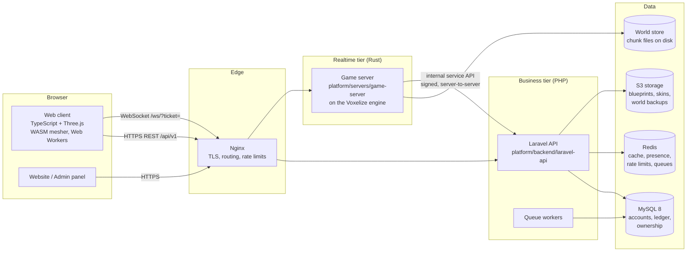

# Architecture

This is the architecture of the platform: a persistent, multiplayer, browser
voxel sandbox with survival gameplay and a player-run economy. It is the
document every later feature is designed against. When a feature needs to
break a rule written here, change this document first, in the same pull
request, and say why.

Decision priority, in order: **correctness, security, data integrity,
performance, scalability, maintainability, gameplay**. Server authority,
transaction safety, world persistence and module boundaries are never traded
for speed of delivery.

## 1. System context



Two tiers with different jobs, different failure modes and different
languages:

| | Realtime tier (Rust) | Business tier (Laravel) |
| --- | --- | --- |
| Owns | world simulation: players, movement, chunks, blocks, entities, mobs, combat, physics, mining, building, realtime events | accounts, authentication, profiles, friends, economy and ledger, marketplace, orders, ownership records, moderation, reports, administration, payments, notifications, statistics |
| State | in memory, chunk files on disk | MySQL (source of truth), Redis |
| Latency budget | one tick (16 ms) | one HTTP request (≤ 200 ms p99) |
| Consistency | authoritative per world, eventually persisted | ACID transactions |
| Scales by | one process per world / shard | stateless PHP workers behind Nginx |

**Laravel never runs the game loop. The game server never moves money.**
When gameplay causes an economic effect (selling to an NPC, a shop purchase,
a quest reward) the game server asks the API to post it, with an idempotency
key derived from the game event, and applies the in-world effect only after
the API confirms. Section 6 describes that contract.

## 2. Repository layout

The platform is housed in this fork of the Voxelize engine. The engine stays
at the repository root, unchanged in purpose; everything game-specific lives
under `platform/`. The dependency points one way: `platform/` depends on the
engine, engine code never imports from `platform/` (enforced by
`scripts/engine-boundary/check.mjs`).

```
/                         Voxelize engine (Rust server lib, TS client packages, WASM mesher)
  server/ crates/ packages/   engine sources — generic, game-agnostic
platform/
  Cargo.toml              Rust workspace of the game (consumer of the engine)
  apps/
    web-client/           browser game client (TS, @voxelize/core); also
                          serves the admin panel (/admin.html)
  backend/
    laravel-api/          business API (Laravel 13, PHP 8.3)
  servers/
    game-server/          authoritative world server (Rust)
  crates/
    content/              content schema, validation, mining & crafting rules
    worldgen/             seeded terrain / biome / cave / ore / vegetation generator
    ticket/               game ticket format and verifier
  game/                   data-driven content pack (JSON): blocks, items, recipes,
                          processing, biomes, ores — later mobs, structures, quests
  infrastructure/         Docker, Nginx, MySQL, Redis, object storage, backup, monitoring
  docs/                   this documentation
  tests/
    fixtures/             cross-language test vectors
    bots/                 protocol-level bots: smoke test and load generation
```

The specification's `engine/` tree (voxel, rendering, networking, physics,
world, terrain, lighting, fluids, entities, ai, audio) **is the Voxelize
engine at the repository root**; it already provides those subsystems.
Game-level work goes in `platform/`; work that every voxel game would want
goes into the engine as a generic extension point, following
`.cursor/rules/engine-boundary.mdc`.

## 3. Components

### 3.1 Engine (repository root)

Provides, generically: chunked voxel storage (16×256×16, 8 sub-chunks),
generation pipeline of chunk stages, incremental sunlight and RGB block light,
greedy meshing (Rust, also compiled to WASM for the client), fluids, ECS
worlds (specs), physics (rapier), entity replication with interest management,
chat, methods/events, per-world save directory with atomic chunk writes,
WebSocket transport with backpressure, a session-authenticator hook, and the
Three.js client (`@voxelize/core`) with worker-side meshing.

### 3.2 Content (`crates/content`, `game/`)

Every block, item, recipe, processing recipe, station, fuel, biome and ore is
data. `Content::load` validates the whole pack (unique ids and keys,
references resolve, recipe shapes are sound, ranges are sane) and reports
every problem at once. Nothing in the game server branches on a content key
except where the content itself names a role (`stone`, `water`, `lava`,
`bedrock` for world generation). Later content kinds (mobs, structures,
quests, achievements, shop catalogues, skills) follow the same pattern:
schema in `defs.rs`, validation in `registry.rs`, data in `game/<kind>/`.
Schema: [CONTENT.md](CONTENT.md).

### 3.3 World generation (`crates/worldgen`)

A pure function of `(seed, content, chunk coordinates)`; see
[WORLD_GENERATION.md](WORLD_GENERATION.md). Because it is deterministic, the
server persists only chunks players changed and regenerates the rest.

### 3.4 Game server (`servers/game-server`)

One process hosts one world; player-made worlds each get their own process,
and nginx routes `w-<id>.<domain>` to it (`infrastructure/worlds/host-worlds.sh`). Boots in a fixed order —
configuration, content, engine registry, generator, persistent world, ticket
authenticator — and refuses to start half-configured. Admits WebSocket
sessions only with a valid, unused game ticket. Gameplay systems (mining
validation, inventory, crafting, survival, mobs, farming, automation, land
permissions) are added as ECS systems and method handlers here, reading rules
from `crates/content`.

### 3.5 Business API (`backend/laravel-api`)

Versioned REST API under `/api/v1` ([API.md](API.md)). Implemented so far:
accounts and token auth, game tickets, the double-entry ledger with wallets,
transfers, mint and burn, audit log, and invariant verification. Domain
services live in `app/Services/<Domain>`; controllers stay thin; every
state-changing economic operation goes through `LedgerService`.

### 3.6 Web client (`apps/web-client`)

Built on `@voxelize/core`. Logs in against the API, requests a ticket,
connects to `/ws/?ticket=…`, renders with WebGL2 (WebGPU when the engine's
renderer supports it), meshes chunks in Web Workers via the WASM mesher, and
predicts local movement while the server stays authoritative.

## 4. Cross-cutting principles

1. **Server authority.** Every client packet is untrusted. The client never
   decides balance, inventory ownership, item creation, damage, trade or
   mining results. It sends intents; servers validate and decide.
2. **Data-driven content.** Game content is data validated at load time. Code
   implements *behaviours* once (falls, spreads, grows...); data enables them.
3. **Determinism where it pays.** World generation and (opt-in) simulation
   steps are pure functions of seeds, so they can be regenerated, replayed and
   tested.
4. **Fail loudly.** Work queues never drop entries silently, APIs never return
   plausible-but-meaningless values (`.cursor/rules/honest-failures.mdc`).
   Misconfiguration stops boot with a message.
5. **Money is integers in a ledger.** Never floats, never `UPDATE balance`.
   See [ECONOMY_LEDGER.md](ECONOMY_LEDGER.md).
6. **Separate realms.** Survival and creative economies never exchange value:
   different currencies, different item realms, enforced by the ledger and by
   tickets that carry the realm.
7. **Original identity.** No third-party game's assets, names or UI are
   copied. All textures, sounds, models and names are original.
8. **Every feature ships whole.** Specification, implementation, migration,
   API, tests and documentation in the same change. No permanent mocks, fake
   APIs or TODOs presented as features.

## 5. Scaling path

| Stage | Shape |
| --- | --- |
| Now | one game-server process per world; one Laravel deployment; one MySQL primary; Redis; S3-compatible object storage (SeaweedFS) |
| Done | the world address in each ticket routes players to the right world process (nginx per-world hosts); presence lives in the cache |
| Not built | one world sharded across processes, MySQL read replicas, Kubernetes manifests: about 50 players per world on 4 cores (docs/LOAD_TESTS.md) has not called for them |

Transport is abstracted behind the engine's `@voxelize/transport` and the
WebSocket route; a WebTransport/QUIC lane (not built) would go beside it, not instead of
it (the engine already carries a WebRTC data-channel lane).

## 6. Game server ↔ API contract

Server-to-server calls use an internal API (`/api/internal/v1`, not exposed
by Nginx) authenticated with a per-server HMAC key, distinct from ticket
secrets. Every economic call carries an idempotency key derived from the game
event (`world:<name>:event:<uuid>`), so a retry after a timeout can never pay
twice. The game server treats the API's answer as final; if the API is
unreachable the in-world action is refused, never applied optimistically.
This contract is implemented together with the first in-world economic action
(phase 13, player shops); until then no game-server code touches money.

## 7. Observability

- Structured JSON logs from both tiers, correlated by `trace_id` (the engine
  already stamps chat and perf traces).
- Metrics (Prometheus text format): the game server's `/platform/metrics`
  (behind `GAME_METRICS_TOKEN`) — players, creatures, lying items and voice
  members per world, tick rate and longest tick (worlds without players
  idle at about 2 ticks a second), intents by result, chat lines by
  channel, backend requests by kind, plugins switched off; the backend's
  `/api/internal/v1/metrics` (service token) — accounts by status, players
  online, players per world, money supply per currency, market listings,
  tickets and audited actions in the last hour. Prometheus, alert rules and
  a Grafana dashboard come with the compose profile `observability`
  (infrastructure/README.md).
- Not built: distributed tracing and an error-tracking service. Errors go
  to the logs of each service (`docker compose logs`), and the alerts above
  cover slow ticks, silent worlds, a frozen economy and piled-up reports.

## 8. Document index

| Document | Covers |
| --- | --- |
| [ERD.md](ERD.md) | full relational model |
| [NETWORK_PROTOCOL.md](NETWORK_PROTOCOL.md) | realtime protocol, handshake, AOI, versioning |
| [CHUNK_FORMAT.md](CHUNK_FORMAT.md) | voxel encoding, chunk layout, persistence |
| [GAME_TICK.md](GAME_TICK.md) | tick loop, system order, budgets |
| [ECONOMY_LEDGER.md](ECONOMY_LEDGER.md) | ledger design and invariants |
| [SECURITY.md](SECURITY.md) | trust boundaries, tickets, anti-cheat, audit |
| [WORLD_GENERATION.md](WORLD_GENERATION.md) | generation pipeline |
| [CONTENT.md](CONTENT.md) | content pack schema |
| [API.md](API.md) | REST API v1 |
| [ROADMAP.md](ROADMAP.md) | phases, status, definition of done |
