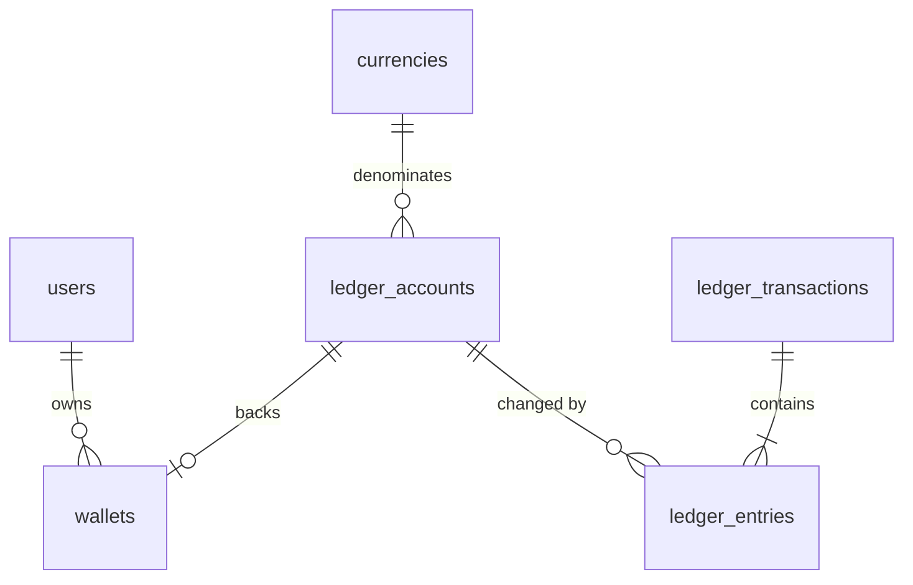

# Economy ledger

The economy is the product's spine: players earn, trade, sell blueprints and
run shops with currency that must never be duplicated, lost or silently
changed. This document is the contract every economic feature is built on.
The core is implemented in `backend/laravel-api/app/Services/Economy`.

## 1. Rules

1. **Integers only.** Amounts are signed 64-bit integers of a currency's
   minor unit. No floats anywhere in money paths, including JSON input (the
   API refuses `1.5`).
2. **Double entry.** Every movement is a *transaction* of two or more
   *entries*; the entries of a transaction sum to zero, in one currency.
   Value is never created or destroyed by a single write.
3. **No `UPDATE balance`.** A balance is the sum of an account's entries.
   `ledger_accounts.balance` is a cache written only by `LedgerService::post`
   under a row lock, in the same database transaction as the entries, and
   verified by `php artisan ledger:verify`.
4. **Append-only.** Entries and transactions are never updated or deleted
   (model guards throw; production DB user lacks `UPDATE`/`DELETE` grants on
   these tables — see [SECURITY.md](SECURITY.md)). A mistake is corrected by
   a new reversing transaction that references the original.
5. **Atomic.** One posting = one database transaction. Accounts are locked
   with `SELECT … FOR UPDATE` in ascending id order, so concurrent postings
   over overlapping accounts cannot deadlock.
6. **Idempotent.** Every posting has an idempotency key (unique). Repeating
   a request with the same key returns the original transaction and moves
   nothing; reusing a key for different content (different legs, type or
   reference — compared by `request_hash`) is refused with
   `idempotency_conflict`. A lost race on the unique key resolves to the
   winner's row.
7. **Auditable.** Each entry stores `balance_after`, so any account's history
   can be read as a statement without recomputation. Money creation (`mint`)
   always writes an `audit_logs` row naming the actor and reason, inside the
   same database transaction.
8. **Realms never mix.** A transaction has one currency; each currency
   belongs to one realm. Creative play money (`CRT`) cannot reach a survival
   wallet by construction.

## 2. Model

| Table | Role |
| --- | --- |
| `currencies` | `CRN` Crowns (survival soft currency, transferable), `GEM` Gems (premium, non-transferable, no purchase flow yet), `CRT` Creative Credits (creative realm, non-transferable) |
| `ledger_accounts` | a balance in one currency: player wallets, system accounts, escrow accounts |
| `wallets` | user ↔ ledger account mapping, one per user per currency |
| `ledger_transactions` | the posting: type, reason, reference, idempotency key, request hash, initiator, metadata |
| `ledger_entries` | signed amount per account with `balance_after` |

### System accounts

| Code | Meaning | Sign |
| --- | --- | --- |
| `system:mint:<CUR>` | source of all money; `-balance` = money ever created | may be negative (only account allowed to) |
| `system:burn:<CUR>` | money sink; `balance` = money destroyed | ≥ 0 |
| `system:fees:<CUR>` | marketplace and service fees (platform revenue in game currency) | ≥ 0 |
| `escrow:<ref>:<CUR>` | funds locked for a contract, auction bid or listing | ≥ 0 |
| `guild:<id>:<CUR>` | a guild's treasury: member deposits (`transfer`), payouts to members (`transfer`), guild land claims (`burn`) | ≥ 0 |

Hence, per currency: **money supply = Σ wallet balances = −mint − burn − fees − escrow − guild treasuries**,
and the sum of all account balances is exactly zero (checked by `verify()`).

## 3. Operations

| Operation | Legs | Notes |
| --- | --- | --- |
| `transfer` | payer wallet −a, payee wallet +a | transferable currencies, distinct players, key scoped per payer |
| `mint` | mint −a, wallet +a | gameplay rewards (game server, via internal API) and audited admin grants (`economy:grant`) only |
| `burn` | wallet −a, burn +a | repairs, fast travel, land upkeep, NPC services, cosmetics |
| `fee` *(phase 15)* | payer −a, fees +a | marketplace fees (today the fee is a leg of `sale`) |
| `escrow_lock` / `escrow_release` / `escrow_refund` ✅ auctions, contracts | wallet ↔ escrow | a bid locks the bidder's money in `escrow:listing:<id>`; an outbid is refunded in the same database transaction |
| `sale` ✅ market, stalls, blueprint licences | buyer (or escrow) −p, seller +(p−f−r−t), fees +f, creator +r, guild treasury +t (the sales tax of the guild whose land a stall stands on) | one transaction, so royalty and fee can never be skipped; the fee leg is left out when it rounds to 0 |

Example — a blueprint sale of 1 000 CRN with a 10 % platform share:

| account | amount | |
| --- | --- | --- |
| `wallet:buyer:CRN` | −1000 | |
| `wallet:creator:CRN` | +900 | creator share |
| `system:fees:CRN` | +100 | platform share |
| **sum** | **0** | |

## 4. Idempotency keys

Keys are namespaced by the operation and, for player-initiated operations,
by the player: `transfer:<payer public id>:<client key>`. The API requires
clients to send `Idempotency-Key` (8–64 URL-safe characters) on every
money-moving request; a retry after a timeout must reuse it. Game-server
originated postings derive keys from the game event id
(`world:<name>:event:<uuid>`), so replaying a game event never pays twice.

## 5. Invariants and verification

`LedgerService::verify()` / `php artisan ledger:verify` checks:

1. every transaction's entries sum to zero per currency;
2. every account's cached balance and entry count equal its entries;
3. no account other than mint is negative;
4. per currency, the sum of all balances is zero.

The test suites assert it after every economic scenario, and the scheduler
runs it hourly (`routes/console.php`);
any violation pages an operator and freezes economic endpoints (phase 9).

## 6. Tests

`tests/Feature/LedgerTest.php` covers balance state, insufficient funds
writing nothing, duplicate requests never paying twice, conflicting key
reuse, per-player key scoping, unbalanced/mixed-currency/degenerate postings,
non-transferable currencies, append-only guards, burn, tamper detection by
`verify()`, the HTTP API (idempotency header, floats, overdrafts, history),
and audited admin grants. `tests/Concurrency/LedgerConcurrencyTest.php` runs
six OS processes posting over the same wallets on MySQL and checks that no
value is created or destroyed, no wallet goes negative and shared keys pay
once.

## 7. Inflation control

Money sinks are designed in from the start and all go to `system:burn` (or
`system:fees`), so analytics can report money created vs destroyed per day:
repairs, marketplace fees, fast travel, land upkeep, cosmetics, NPC
services. Sinks never sell power: nothing bought with currency outperforms
what can be earned by play (no pay-to-win).

Admin analytics (phase 9) read: money supply, created (mint) and destroyed
(burn + fees) per period, trading volume, average prices per item, top
balances, marketplace volume, and a price-index inflation indicator.

## 8. Real money is a separate system

Real-money creator earnings are **not** game currency and never share these
tables. A future `Creator Wallet` has its own ledger (same rules), fed only by
an explicit, rate-limited conversion from earned in-game sales, and stays
**disabled** until KYC, age restrictions, fraud detection, chargeback
handling, tax handling, regional restrictions, AML checks and terms of
service are implemented and reviewed for each target country. Game currency
is never redeemable for money by default.

## 9. Items

Value also lives in items. Commodity stacks are counts in inventory slots;
items that matter individually (tools, rare drops, limited editions,
blueprint licences) are `item_instances` with a unique id, an owner and an
append-only provenance history ([ERD.md](ERD.md)). An item moves between
owners only inside the same database transaction as the ledger posting that
pays for it, so goods and money cannot be separated by a crash.
