# Entity-relationship model

The business database is MySQL 8 (InnoDB, `utf8mb4`). This is the full target
model. Tables marked **✅ implemented** exist as migrations in
`backend/laravel-api/database/migrations`; the others are designed here and
get their migration in the phase that implements them ([ROADMAP.md](ROADMAP.md)),
never earlier as empty shells.

Conventions:

- Primary keys are `BIGINT UNSIGNED AUTO_INCREMENT id`. Anything exposed
  outside the backend uses a separate `public_id` ULID; numeric ids never
  leave the API.
- Money is `BIGINT` minor units. Never `DECIMAL`/`FLOAT` for balances.
- Foreign keys are `ON DELETE RESTRICT` unless stated. Players are never
  hard-deleted; accounts are anonymised and their status set, so ledger and
  audit history keeps its references.
- Append-only tables (`ledger_*`, `audit_logs`, `*_history`, `game_tickets`,
  `item_provenance_events`) are never updated or deleted by application code.
- Every `status` column is a short string with an index; allowed values are
  documented per table and checked by the application.
- Timestamps are UTC.

## Overview

```mermaid
erDiagram
    users ||--o| profiles : has
    users ||--o{ characters : plays
    users ||--o{ wallets : owns
    users ||--o{ game_tickets : "is issued"
    users ||--o{ friends : "requests"
    users ||--o{ player_achievements : earns
    users ||--o{ reports : files
    users ||--o{ bans : receives
    users ||--o{ audit_logs : "acts in"

    worlds ||--o{ servers : "hosted by"
    worlds ||--o{ player_world_states : has
    characters ||--o{ player_world_states : "is in"
    worlds ||--o{ lands : "is divided into"

    lands ||--o{ land_members : grants
    lands ||--o{ properties : contains
    lands ||--o{ land_history : records
    guilds ||--o{ guild_lands : holds
    lands ||--o| guild_lands : "held by"

    items ||--o{ item_instances : "is instantiated as"
    inventories ||--o{ inventory_slots : has
    item_instances ||--o| inventory_slots : "sits in"
    item_instances ||--o{ item_provenance_events : "has history"

    currencies ||--o{ ledger_accounts : denominates
    ledger_accounts ||--o| wallets : "backs"
    ledger_transactions ||--|{ ledger_entries : "is made of"
    ledger_accounts ||--o{ ledger_entries : "is changed by"

    market_listings ||--o{ market_orders : "is bought by"
    auctions ||--o{ auction_bids : receives
    trades ||--|{ trade_items : contains

    blueprints ||--|{ blueprint_versions : "is versioned as"
    blueprint_versions ||--o{ blueprint_sales : "is sold as"

    guilds ||--|{ guild_members : has
    contracts ||--o{ contract_participants : has

    achievements ||--o{ player_achievements : "is earned as"
    reports ||--o{ moderation_actions : "leads to"
```

## Identity

### users ✅ implemented
| column | type | notes |
| --- | --- | --- |
| id | bigint PK | internal only |
| public_id | ulid UNIQUE | the identity game servers and clients see (ticket `sub`) |
| username | varchar(24) UNIQUE | `[A-Za-z0-9_]{3,24}` |
| email | varchar UNIQUE | never returned by public endpoints |
| status | varchar(16) INDEX | `active`, `suspended`, `banned`, `deleted` |
| password | varchar | bcrypt/argon hash |
| email_verified_at, remember_token, created_at, updated_at | | |

`personal_access_tokens` ✅ (Sanctum) and `sessions`, `password_reset_tokens` ✅ are framework tables.

### profiles
`id`, `user_id` UNIQUE FK, `bio` varchar(500), `avatar_object_key` (S3),
`locale`, `country` char(2) (used for regional rules), `birth_year`
(age gates), `visibility` (`public|friends|private`), timestamps.

### characters
One per user per realm in v1; designed for several.
`id`, `public_id` ulid UNIQUE, `user_id` FK INDEX, `realm`
(`survival|creative`), `name`, `skin_object_key`, `cosmetics` json,
timestamps. UNIQUE(`user_id`, `realm`, `name`).

### game_tickets ✅ implemented
`id`, `jti` UNIQUE, `user_id` FK, `world`, `realm`, `issued_at`,
`expires_at` INDEX, `ip_address`. INDEX(`user_id`, `issued_at`).
Append-only. The ticket string is never stored.

## Worlds

### worlds
`id`, `public_id`, `key` UNIQUE (`main`), `name`, `realm`, `dimension`
(`overworld|underworld|sky`), `seed` int unsigned, `visibility`
(`public|friends|invite|private`), `owner_user_id` FK NULL (private worlds),
`max_players`, `description`, `status` (`active|maintenance|archived`), timestamps.

### servers
`id`, `world_id` FK, `public_url`, `internal_url`, `region`, `version`,
`status` (`starting|online|draining|offline`), `last_heartbeat_at` INDEX,
`player_count`, `service_key_id` (rotating HMAC key reference). Heartbeats are
written to Redis every few seconds and summarised here.

### player_world_states
Where a character is and what the backend must know about it per world.
`id`, `character_id` FK, `world_id` FK, `position` json (x, y, z, yaw, pitch),
`game_mode` (`survival|creative|adventure|spectator`), `health`, `hunger`,
`experience`, `last_seen_at`, `version` int (optimistic lock), timestamps.
UNIQUE(`character_id`, `world_id`).
Inventory contents are not here: see `inventories`.

## Land and property

### lands ✅ implemented
A claim is an axis-aligned box in one world, in whole chunks horizontally
(simple, fast lookup by chunk) and full height. As implemented (migration
`2026_01_01_000400_create_land_tables`): `world` and `dimension` are keys
until a `worlds` table exists, the owner is `owner_id` → users (guild
ownership arrives with guilds), `status` (`active|released`), `claim_key`
(the claimant's Idempotency-Key, UNIQUE with the owner), and
`land_locks(world, dimension)` rows are what the claim service locks.
Sale fields arrive with the marketplace phase.
`id`, `public_id`, `world_id` FK, `owner_type` (`user|guild`), `owner_id`,
`min_chunk_x`, `min_chunk_z`, `max_chunk_x`, `max_chunk_z`, `name`,
`sale_status` (`not_for_sale|listed|auction`), `price` bigint NULL,
`price_currency` FK NULL, `permissions` json (defaults for non-members),
`version`, timestamps.
INDEX(`world_id`, `min_chunk_x`, `min_chunk_z`). Overlap is prevented by the
claim service under a world-level lock (`SELECT … FOR UPDATE` on the world
row) — MySQL has no exclusion constraints.

### land_members ✅ implemented (roles `manager|builder|visitor`; the owner is `lands.owner_id`)
`id`, `land_id` FK, `user_id` FK, `role` (`owner|manager|builder|visitor`),
`permissions` json (build, destroy, open_containers, use_machines, invite,
trade), timestamps. UNIQUE(`land_id`, `user_id`).

### land_history ✅ implemented (events `claimed|released|member_added|member_removed|updated`, `actor_id`, `details` json)
Append-only (also by MySQL grants). `id`, `land_id` FK, `event` (`claimed|sold|transferred|resized|released`),
`from_owner`, `to_owner`, `ledger_transaction_id` FK NULL, `created_at`.

### properties
A named, typed structure on a land: `id`, `public_id`, `land_id` FK, `type`
(`house|shop|farm|factory|castle|arena|gallery|park|other`), `name`,
`bounds` json (block box), `status`, timestamps.

### guild_lands
`guild_id` FK, `land_id` FK UNIQUE, `assigned_at`. A land belongs to at most one guild.

## Items and inventories

### items
Catalogue mirror of the content pack (`platform/game/items`), synced on
deploy so marketplace and analytics can join on it. `id` (= content item id),
`key` UNIQUE, `name`, `type`, `stack_size`, `rarity`, `reference_value`,
`is_unique` bool (tracked per instance), `content_version`.

### item_instances
Items the economy must track individually (tools with durability, rare and
limited items, blueprint copies). Commodity stacks (dirt, wood) are not
instanced; they live as counts in inventory slots.
`id`, `public_id` ulid UNIQUE (the item's **unique id**), `item_id` FK,
`realm`, `owner_type` (`user|guild|world_container|escrow`), `owner_id`,
`serial_number` NULL, `edition_id` FK NULL (limited editions), `durability`
NULL, `metadata` json, `created_by` FK NULL, `created_at`,
`destroyed_at` NULL, `version` int. INDEX(`owner_type`, `owner_id`).

### item_editions
Limited editions: `id`, `item_id` FK, `name`, `max_supply`, `minted` int,
`creator_user_id` FK NULL, `created_at`. `minted` increments under row lock;
`minted <= max_supply` is checked in the same transaction.

### item_provenance_events
Append-only history per instance: `id`, `item_instance_id` FK, `event`
(`created|traded|sold|auctioned|repaired|destroyed`), `from_owner`,
`to_owner`, `reference_type`, `reference_id`, `created_at`.

### inventories
`id`, `owner_type` (`character|container|guild_vault`), `owner_id`, `realm`,
`kind` (`main|hotbar|armor|offhand|storage`), `size`, `version`,
timestamps. UNIQUE(`owner_type`, `owner_id`, `kind`).

### inventory_slots
`inventory_id` FK, `slot` smallint, `item_id` FK, `count` int,
`item_instance_id` FK NULL UNIQUE. PRIMARY(`inventory_id`, `slot`).
CHECK(`count` > 0).

The live inventory of an online player is held by the game server and
checkpointed here (phase 5); transfers that cross the economy (trades,
marketplace, escrow) move rows here inside the same transaction as their
ledger posting.

## Economy ✅ (ledger core implemented)

Full design: [ECONOMY_LEDGER.md](ECONOMY_LEDGER.md).

### currencies ✅
`code` varchar(8) PK (`CRN`, `GEM`, `CRT`), `name`, `realm`, `scale`,
`is_premium`, `is_transferable`, timestamps.

### ledger_accounts ✅
`id`, `code` UNIQUE (`wallet:<public_id>:CRN`, `system:mint:CRN`), `type`
(`wallet|system|escrow`), `currency` FK, `owner_user_id` FK NULL,
`allow_negative` bool, `balance` bigint (cache, verified), `entry_count`,
timestamps. INDEX(`owner_user_id`, `currency`).

### wallets ✅
`id`, `user_id` FK, `currency` FK, `ledger_account_id` FK UNIQUE,
timestamps. UNIQUE(`user_id`, `currency`).

### ledger_transactions ✅
`id`, `public_id` UNIQUE, `type` INDEX, `reason`, `reference_type`,
`reference_id` (INDEX together), `idempotency_key` UNIQUE, `request_hash`
char(64), `initiated_by` FK NULL, `metadata` json, `created_at` INDEX.

### ledger_entries ✅
`id`, `transaction_id` FK, `account_id` FK, `currency`, `amount` bigint
(signed), `balance_after` bigint, `created_at`. INDEX(`account_id`, `id`).

### creator_wallets (separate, disabled)
Real-money creator earnings are **not** in the ledger above; see
ECONOMY_LEDGER.md §8. Own tables (`creator_accounts`, `creator_ledger_*`,
`payout_requests`, `kyc_checks`) are designed when that feature is approved.

## Contracts ✅ implemented (migration `2026_01_01_000800_create_contracts_table`)

`contracts`: `public_id`, `poster_id`, `world`, `title`, `item`, `count`,
`currency`, `reward`, `status` (`open|accepted|fulfilled|expired|cancelled`),
`contractor_id`, `accepted_at`, `deadline_at`, `post_key` (UNIQUE with the
poster), `fulfil_key` UNIQUE (the game server's outbox id), `version`,
timestamps. The reward sits in the ledger account `escrow:contract:<id>`.

## Blueprints ✅ implemented (migration `2026_01_01_000600_create_blueprint_tables`)

- `blueprints`: `public_id`, `creator_id`, `world`, `name`, `size_x/y/z`,
  `block_count`, `materials` json, `storage_disk`, `storage_path`,
  `sha256`, `bytes`, `status` (`draft|published|rejected`), `price`,
  `max_copies` (limited editions), `copies_sold`, `upload_key` UNIQUE,
  `version`, timestamps. The layout itself is in object storage.
- `blueprint_licenses`: `blueprint_id`, `user_id`, `edition`, `status`,
  `ledger_transaction_id`, `created_at`; UNIQUE(`blueprint_id`, `user_id`).
  A resale moves the row to the buyer.
- `blueprint_resales`: `public_id`, `blueprint_id`, `license_id`,
  `seller_id`, `price`, `status` (`open|sold|cancelled`), `buyer_id`.
- `blueprint_provenance` (append-only): `blueprint_id`, `event`
  (`minted|resold`), `from_id`, `to_id`, `edition`, `price`, `royalty`,
  `ledger_transaction_id`, `created_at`. `blueprints.royalty_bps` is the
  creator's share of resales.
  Provenance: the capture, every sale and every rejection are in
  `audit_logs`; sales are ledger transactions referencing the blueprint.

## Trading and markets

### trades
`id`, `public_id`, `world_id` FK, `initiator_id` FK, `counterparty_id` FK,
`status` (`open|locked|confirmed|executed|cancelled|expired`),
`initiator_confirmed_at`, `counterparty_confirmed_at`, `executed_at`,
`ledger_transaction_id` FK NULL, `version`, timestamps.

### trade_items
`id`, `trade_id` FK, `side` (`initiator|counterparty`), `item_id` FK NULL,
`count` NULL, `item_instance_id` FK NULL, `currency` FK NULL, `amount` NULL.
CHECK exactly one of (item+count, instance, currency+amount).
Any change to a trade's items clears both confirmations (`version` bump).

### As implemented (migration `2026_01_01_000500_create_market_tables`) ✅

One table carries fixed-price listings and auctions, whole-lot sales only:

- `market_listings`: `id`, `public_id`, `seller_id` FK, `world`, `kind`
  (`fixed|auction`), `item` (content key), `count`, `durability` NULL,
  `currency`, `price` (fixed price or opening bid), `buyout` NULL,
  `current_bid` NULL, `current_bidder_id` FK NULL, `bid_count`, `status`
  (`open|sold|cancelled|expired`), `buyer_id` FK NULL, `ends_at`,
  `listing_key` UNIQUE (the game server's outbox id), `version`, timestamps.
  The goods are in the backend's custody while a listing exists; bid money
  sits in the ledger account `escrow:listing:<public_id>:<CUR>`.
- `market_bids` (append-only): `listing_id`, `bidder_id`, `amount`,
  `ledger_transaction_id`, `bid_key` (UNIQUE with the bidder), `created_at`.
- `item_deliveries`: `public_id`, `user_id`, `world`, `item`, `count`,
  `durability`, `reason` (`purchase|auction_won|cancelled|expired`),
  `listing_id`, `status` (`pending|delivered`), `delivered_at`. Game servers
  hand deliveries over and acknowledge them.

The fuller model below (orders with partial quantities, item instances,
guild sellers, separate auction tables) remains the target.

### market_listings
`id`, `public_id`, `seller_type` (`user|guild`), `seller_id`, `realm`,
`kind` (`item|stack|blueprint|land|building|service`), `item_id` NULL,
`item_instance_id` NULL, `quantity`, `unit_price` bigint, `currency` FK,
`escrow_account_id` FK (goods are moved into escrow when listed),
`status` (`active|sold|cancelled|expired`), `expires_at` INDEX,
`version`, timestamps. INDEX(`status`, `kind`, `item_id`, `unit_price`).

### market_orders
`id`, `public_id`, `listing_id` FK, `buyer_id` FK, `quantity`, `total_price`,
`fee`, `royalty`, `ledger_transaction_id` FK UNIQUE, `idempotency_key`
UNIQUE, `created_at`.

### auctions
`id`, `public_id`, `seller_id` FK, `item_instance_id` NULL / `item_id` +
`quantity`, `currency`, `starting_price`, `min_increment`,
`current_bid_id` FK NULL, `ends_at` INDEX (1h, 6h, 24h, 3d), `status`
(`running|settled|cancelled|no_bids`), `version`, timestamps.

### auction_bids
`id`, `auction_id` FK, `bidder_id` FK, `amount`, `hold_transaction_id` FK
(funds held in escrow), `status` (`leading|outbid|won|refunded`),
`created_at`. INDEX(`auction_id`, `amount`).

### shops (player shops in-world)
`id`, `public_id`, `property_id` FK, `owner_id` FK, `name`,
`container_position` json, `status`, timestamps; `shop_offers`: `shop_id`
FK, `item_id`, `quantity`, `price`, `currency`, `stock_inventory_id` FK.

## Creator economy

### blueprints
`id`, `public_id`, `creator_id` FK, `title`, `description`, `status`
(`draft|in_review|published|rejected|delisted`), `license`
(`single_use|unlimited`), `price`, `currency`, `royalty_bps` (basis points,
0–10000), `edition_id` FK NULL, `moderation_action_id` FK NULL, timestamps.

### blueprint_versions
`id`, `blueprint_id` FK, `version` int, `object_key` (S3: compressed block
palette + layout), `size_x`, `size_y`, `size_z`, `block_count`,
`materials` json (item key → count, the bill of materials), `checksum`
char(64), `created_at`. UNIQUE(`blueprint_id`, `version`).

### blueprint_sales
`id`, `blueprint_version_id` FK, `buyer_id` FK, `price`, `creator_share`,
`platform_share`, `ledger_transaction_id` FK UNIQUE, `item_instance_id` FK
(the buyer's licence copy, with provenance), `created_at`.

## Social

### friends
`id`, `user_id` FK, `friend_id` FK, `status` (`pending|accepted|blocked`),
timestamps. UNIQUE(`user_id`, `friend_id`); CHECK(`user_id` <> `friend_id`).
An accepted friendship is two rows, one per direction, written together.

### guilds ✅ implemented
`id`, `public_id` ULID UNIQUE, `name` UNIQUE, `tag` UNIQUE, `leader_id` FK,
`status` (`active|disbanded`; a disbanded guild frees its name and tag),
`create_key` (UNIQUE with `leader_id`: founding is idempotent), timestamps.
The treasury is the ledger account `guild:<public_id>:<CUR>` (type `guild`).
Planned: `settlement_level` (`none|village|town|city`).

### guild_members ✅ implemented
`guild_id` FK, `user_id` FK UNIQUE (one guild per player), `role`
(`leader|officer|member`), timestamps.

### guild_invites ✅ implemented
`guild_id` FK, `user_id` FK, `invited_by` FK, timestamps; UNIQUE(`guild_id`, `user_id`).
Joining deletes every invitation of that player.

`lands.guild_id` FK NULL: land held by a guild (paid from its treasury).
`guilds.tax_bps`: the guild's sales tax on stalls on its land.

### guild_relations ✅ implemented
`public_id`, `guild_a_id` < `guild_b_id` (UNIQUE pair), `kind`
(`alliance|war`), `status` (`proposed|active`), `initiator_id`, wars:
`starts_at` (after the warm-up), `ends_at`, `score_a`, `score_b`,
`peace_offered_by`; timestamps. Ended alliances and wars are deleted (the
audit log keeps declarations and peace with the final score).

### war_kills ✅ implemented
`relation_id` FK (cascade), `kill_key` UNIQUE (the game server's kill id),
`killer_id`, `victim_id`, `created_at`: each kill scored once.

Settlements are not stored: they are the touching groups of a guild's
active lands, levelled on read (`App\Services\Guild\Settlements`).

### guild_messages ✅ implemented
`guild_id` FK, `user_id` FK, `body` (≤ 300), `created_at`; INDEX(`guild_id`, `id`).
Guild chat, read by members with an `after` cursor.

`contracts.guild_id` FK NULL: a contract posted by a guild officer, its
reward locked from and refunded to the guild's treasury.

### contracts
`id`, `public_id`, `issuer_type`, `issuer_id`, `title`, `description`,
`reward` bigint, `currency`, `escrow_transaction_id` FK (reward locked on
publish), `status` (`open|accepted|submitted|approved|disputed|cancelled|paid`),
`deadline_at`, timestamps.

### contract_participants
`contract_id` FK, `user_id` FK, `role` (`contractor`), `status`,
`release_transaction_id` FK NULL, timestamps.

## Moderation and administration

### reports
`id`, `public_id`, `reporter_id` FK, `target_type` (`player|chat|structure|skin|listing|blueprint`),
`target_id`, `reason`, `details`, `evidence` json (chat excerpt, coordinates,
screenshot key), `status` (`open|triaged|actioned|dismissed`), `assignee_id`
FK NULL, timestamps.

### moderation_actions
`id`, `report_id` FK NULL, `moderator_id` FK, `action`
(`warn|mute|kick|suspend|ban|delist|restore|rollback`), `target_type`,
`target_id`, `reason`, `expires_at` NULL, `created_at`. Append-only;
reversal is a new action.

### bans
`id`, `user_id` FK, `scope` (`global|world`), `world_id` FK NULL, `reason`,
`moderation_action_id` FK, `starts_at`, `ends_at` NULL, `lifted_at` NULL.
INDEX(`user_id`, `ends_at`).

### audit_logs ✅ implemented
`id`, `actor_id` FK NULL, `actor_type` (`user|admin|system|game_server`),
`action` INDEX, `subject_type`, `subject_id` (INDEX together), `reason`,
`payload` json, `ip_address`, `created_at` INDEX. Append-only.

### achievements / player_achievements
`achievements`: `id`, `key` UNIQUE (from content), `name`, `points`.
`player_achievements`: `user_id` FK, `achievement_id` FK, `earned_at`,
`world_id` FK. PRIMARY(`user_id`, `achievement_id`).
