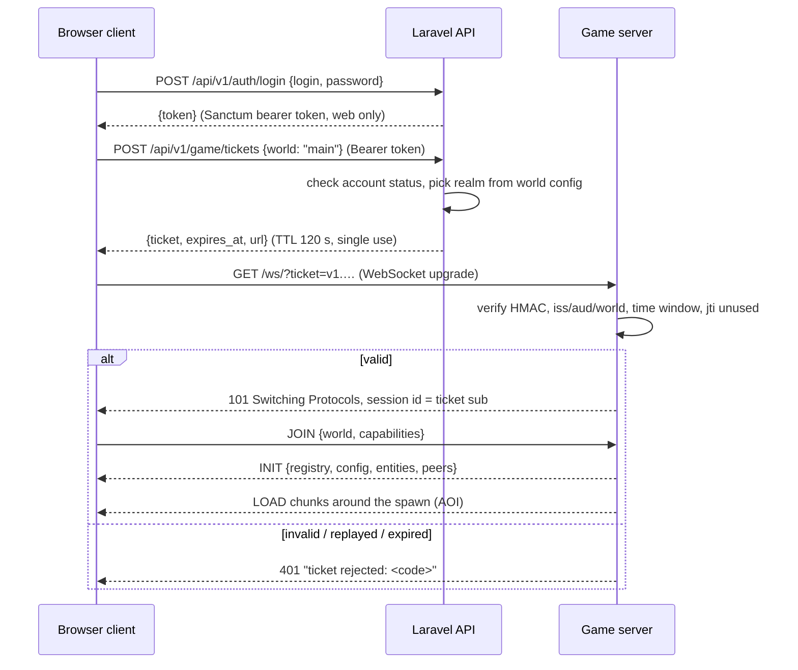

# Network protocol

Two protocols, never mixed:

| | Realtime game protocol | Business API |
| --- | --- | --- |
| Peer | browser ↔ game server | browser / game server ↔ Laravel |
| Transport | WebSocket (binary frames); WebRTC data channel lane already in the engine; WebTransport later | HTTPS |
| Encoding | Protocol Buffers (`messages.proto`) | JSON |
| Versioning | `packages/protocol/src/protocol-version.json` | URL prefix `/api/v1` |
| Spec | this document | [API.md](API.md) |

## 1. Session handshake

- The browser's password and web token never reach the game server; the
  ticket is the only credential it sees ([SECURITY.md](SECURITY.md)).
- The engine client id is the player's `public_id` from the ticket, so a
  reconnect resumes the same player and clients cannot pick their identity.
- A reconnect asks the API for a new ticket; tickets are never reused.
- Transport (bridge) connections (`?is_transport`) authenticate with
  `GAME_TRANSPORT_SECRET` and carry no player identity.

## 2. Frame format

Every frame is one protobuf `protocol.Message` (`messages.proto` at the
repository root), optionally compressed by the transport layer. Message
types used by the platform:

| Type | Direction | Use |
| --- | --- | --- |
| `JOIN` / `LEAVE` | C→S | enter / leave a world |
| `INIT` | S→C | registry (block ids and properties), world config, initial peers and entities |
| `PEER` | both | player transform; client sends its predicted position, server validates and rebroadcasts |
| `ENTITY` | S→C | entity create / update / delete / out-of-range; compact versioned `motion` bytes for clients advertising `motion.v<N>`; stamped with `tick` |
| `LOAD` / `UNLOAD` | S→C | chunks entering / leaving the client's area of interest |
| `UPDATE` | S→C | authoritative voxel and light changes (single or `BulkUpdate` packed arrays). Client→server raw updates are **refused** by the platform game server |
| `METHOD` | C→S | gameplay intents, see §3 |
| `EVENT` | both | named events with JSON payloads (effects, sounds, UI notices) |
| `CHAT` | both | chat lines with `seq` for history merge |
| `STATS` | S→C | world time, tick, weather |
| `ERROR` | S→C | refusals with a machine code |

## 3. Gameplay intents (`METHOD`)

Clients never send results, only intents. Every method name is namespaced
`platform.<area>.<verb>` and its JSON payload is validated against a schema
on the server; unknown fields are refused. The server answers with an
`EVENT` (`platform.<area>.result`) carrying `ok` or an error code, and with
the authoritative state changes (`UPDATE`, inventory events).

| Method | Payload | Server validates | Phase |
| --- | --- | --- | --- |
| `platform.mine.start` | `{x,y,z}` | reach (≤ 6 blocks from eye), block exists and is breakable, land permission | 4 |
| `platform.mine.finish` | `{x,y,z}` | same block still there, elapsed ≥ `mining_rule(...)` × tolerance, held tool | 4 |
| `platform.build.place` | `{x,y,z,face,slot,rotation}` | reach, target replaceable, no entity/player overlap, inventory slot holds a placeable item, land permission, game mode | 4 |
| `platform.inventory.move` | `{from,to,count}` | slots exist, stack rules, container access | 5 |
| `platform.craft` | `{grid,station?}` | grid matches a recipe, inputs owned, output fits | 9 |
| `platform.trade.*` | trade window ops | both parties present, items owned, version matches | 14 |

## 4. Area of interest

The engine keeps per-chunk interest sets (`server/world/interests.rs`): a
client receives `LOAD` for chunks within its render radius (bounded by
the server's `max_chunk_requests` and per-tick send budgets) and `UNLOAD`
when it moves away. Entities and peers are replicated only to clients whose
interest covers their chunk; leaving it sends `OUT_OF_RANGE`. Voxel `UPDATE`s
go only to clients interested in the changed chunk. Nothing outside a
client's area is ever sent.

## 5. Bandwidth and latency

- **Binary**: protobuf with packed repeated fields for bulk voxel updates.
- **Delta**: chunk `UPDATE`s carry only changed voxels; entity replication
  sends deltas of changed components, full snapshots only on create.
- **Compression**: chunk voxel and light arrays are compressed; large frames
  use the WebSocket's aggregated continuations (16 MiB limit).
- **Interpolation**: entity and peer messages carry the server `tick`; the
  client interpolates between snapshots.
- **Prediction / reconciliation**: the client predicts its own movement with
  the shared physics engine; the server clamps impossible movement and the
  client snaps back to the authoritative position.
- **Backpressure**: two outbound lanes (control before bulk), bounded write
  time per frame, slow-ack accounting (`server/runtime.rs`).

## 6. Versioning

`packages/protocol/src/protocol-version.json` is the single source of the
wire version for both Rust and TypeScript. A mismatch closes the socket with
the `mismatchCloseCode` (4000–4999 range); the client treats it as terminal
and asks the player to reload. Fields are only ever added to `messages.proto`
with new tag numbers; tags are never reused.

## 7. Transport migration path

The WebSocket route (`/ws/`) and the WebRTC signalling routes share one
session authenticator, so a WebTransport (QUIC) route added later reuses the
same ticket check and the same message codec. Clients pick the best lane the
server advertises in `/info`; the ticket flow does not change.
