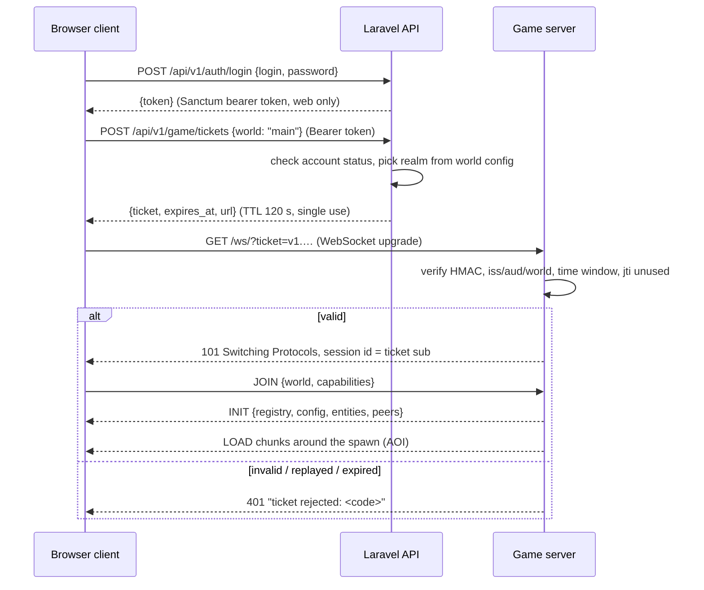

# Network protocol

Two protocols, never mixed:

| | Realtime game protocol | Business API |
| --- | --- | --- |
| Peer | browser ↔ game server | browser / game server ↔ Laravel |
| Transport | WebSocket (binary frames); WebRTC data channel lane already in the engine; WebTransport later | HTTPS |
| Encoding | Protocol Buffers (`messages.proto`) | JSON |
| Versioning | `packages/protocol/src/protocol-version.json` | URL prefix `/api/v1` |
| Spec | this document | [API.md](API.md) |

## 1. Session handshake

- The browser's password and web token never reach the game server; the
  ticket is the only credential it sees ([SECURITY.md](SECURITY.md)).
- The engine client id is the player's `public_id` from the ticket, so a
  reconnect resumes the same player and clients cannot pick their identity.
- A reconnect asks the API for a new ticket; tickets are never reused.
- Transport (bridge) connections (`?is_transport`) authenticate with
  `GAME_TRANSPORT_SECRET` and carry no player identity.

## 2. Frame format

Every frame is one protobuf `protocol.Message` (`messages.proto` at the
repository root), optionally compressed by the transport layer. Message
types used by the platform:

| Type | Direction | Use |
| --- | --- | --- |
| `JOIN` / `LEAVE` | C→S | enter / leave a world |
| `INIT` | S→C | registry (block ids and properties), world config, initial peers and entities |
| `PEER` | both | player transform; client sends its predicted position, server validates and rebroadcasts |
| `ENTITY` | S→C | entity create / update / delete / out-of-range; compact versioned `motion` bytes for clients advertising `motion.v<N>`; stamped with `tick` |
| `LOAD` / `UNLOAD` | S→C | chunks entering / leaving the client's area of interest |
| `UPDATE` | S→C | authoritative voxel and light changes (single or `BulkUpdate` packed arrays). Client→server raw updates are **refused** by the platform game server |
| `METHOD` | C→S | gameplay intents, see §3 |
| `EVENT` | both | named events with JSON payloads (effects, sounds, UI notices) |
| `CHAT` | both | chat lines with `seq` for history merge |
| `STATS` | S→C | world time, tick, weather |
| `ERROR` | S→C | refusals with a machine code |

## 3. Gameplay intents (`METHOD`)

Clients never send results, only intents. Every method name is namespaced
`platform.<area>.<verb>` and its JSON payload is validated against a schema
on the server; unknown fields are refused. The server answers with an
`EVENT` (`platform.<area>.result`) carrying `ok` or an error code, and with
the authoritative state changes (`UPDATE`, inventory events).

| Method | Payload | Server validates | Status |
| --- | --- | --- | --- |
| `platform.mine.start` | `{"voxel":[x,y,z]}` | reach (7.5 blocks to the voxel centre), chunk loaded, solid block, breakable in survival | ✅ |
| `platform.mine.finish` | `{"voxel":[x,y,z]}` | a matching `mine.start` on the same block, elapsed ≥ 80 % of `mining_rule(block, held tool)`, drops fit the inventory (else refused, nothing lost); applies drops and tool wear | ✅ |
| `platform.build.place` | `{"voxel":[x,y,z],"slot"?:n,"block"?:key}` | reach, target air / fluid / non-solid plant, slot holds a placeable item (consumed), no player overlap for solid blocks; `block` honoured only in the creative realm | ✅ |
| `platform.inventory.get` | `{}` | — (answers with a snapshot) | ✅ |
| `platform.inventory.select` | `{"slot":0-8}` | hotbar slot | ✅ |
| `platform.inventory.move` | `{"from":n,"to":n,"count"?:n}` | slots exist, stack limits, partial moves only onto empty or matching stacks | ✅ |
| `platform.craft` | `{"grid":[[key\|null,…],…]}` (2×2, or 3×3 near a workbench) | recipe match, ingredients owned, result fits; all-or-nothing | ✅ |
| `platform.window.open` | `{}` (inventory screen) or `{"voxel":[x,y,z]}` (workbench, furnace, chest) | reach, block kind, alive; closes any other window first | ✅ |
| `platform.window.click` | `{"slot":n,"click":{"type":"left"\|"right"\|"shift"\|"double"\|"hotbar","key"?:0-8\|"drop","all"?:bool}}` | slot rules (result/output take-only, fuel only fuels, armor only armor), stack limits; crafting result consumes one item per grid slot | ✅ |
| `platform.window.drag` | `{"slots":[n,…],"oneEach":bool}` | spreads the cursor evenly (or one each) over compatible slots | ✅ |
| `platform.window.fill` | `{"recipe":key,"max":bool}` | recipe book: moves ingredients from the inventory into the grid (once or as many sets as possible); refuses recipes that do not fit the grid | ✅ |
| `platform.window.close` | `{}` | grid and cursor go back to the inventory; what does not fit drops in the world | ✅ |
| `platform.inventory.drop` | `{"all":bool}` | drops one (or the stack) from the selected hotbar slot | ✅ |
| `platform.eat` | `{"slot"?:n}` | alive, slot holds food, player hungry (survival); consumes one | ✅ |
| `platform.respawn` | `{}` | player is dead; restores vitals, answers `platform.respawn {x,z}` (client moves to that column's surface) | ✅ |
| `platform.trade.*` | trade window ops | both parties present, items owned, version matches | phase 14 |

Answers (events, sent only to the requesting client):

- `platform.result` — `{"intent":"mine.finish","ok":true,…}` or
  `{"intent":…,"ok":false,"code":"too_fast"}`. Codes: `out_of_reach`,
  `not_loaded`, `nothing_there`, `unbreakable`, `no_mining_session`,
  `wrong_block`, `too_fast`, `inventory_full`, `not_placeable`, `occupied`,
  `collides_with_player`, `unknown_block`, `no_recipe`,
  `missing_ingredients`, `needs_workbench`, `bad_slot`, `slot_empty`,
  `bad_count`, `bad_payload`, `not_joined`.
- `platform.inventory` — `{"slots":[{"item":id,"count":n,"durability"?:n}|null ×36],"selected":0-8,"realm":"survival"}`,
  pushed on join and after every change.

- `platform.window` — the open window, authoritative after every change:
  `{"kind":"player"|"workbench"|"furnace"|"chest"|null,"slots":[…],"rules":[…],"inventoryStart":n,"grid":[start,size]|null,"cursor":stack|null,"furnace":{"burnLeft","burnTotal","progress","progressTotal"}|null}`.
  Furnace viewers get updates while it burns; chest viewers see each other's changes.
- `platform.drops` — `{"items":[{"id","item","count","p":[x,y,z]}]}`, dropped items within 64 blocks, up to 10 times a second.
- `platform.pickup` — `{"items":[[item,count],…]}` after walking over drops.
- `platform.vitals` — `{"health","food","air","maxAir","dead","cause":"fall"|"drowning"|"lava"|"starvation"|null,"realm"}`,
  pushed on join and whenever a vital changes (from the server's per-tick
  survival system).

Players' inventories and vitals persist in `<save dir>/<world>/players/<public id>.json`
(atomic writes) and are restored on the next join.

## 4. Area of interest

The engine keeps per-chunk interest sets (`server/world/interests.rs`): a
client receives `LOAD` for chunks within its render radius (bounded by
the server's `max_chunk_requests` and per-tick send budgets) and `UNLOAD`
when it moves away. Entities and peers are replicated only to clients whose
interest covers their chunk; leaving it sends `OUT_OF_RANGE`. Voxel `UPDATE`s
go only to clients interested in the changed chunk. Nothing outside a
client's area is ever sent.

## 5. Bandwidth and latency

- **Binary**: protobuf with packed repeated fields for bulk voxel updates.
- **Delta**: chunk `UPDATE`s carry only changed voxels; entity replication
  sends deltas of changed components, full snapshots only on create.
- **Compression**: chunk voxel and light arrays are compressed; large frames
  use the WebSocket's aggregated continuations (16 MiB limit).
- **Interpolation**: entity and peer messages carry the server `tick`; the
  client interpolates between snapshots.
- **Prediction / reconciliation**: the client predicts its own movement with
  the shared physics engine; the server clamps impossible movement and the
  client snaps back to the authoritative position.
- **Backpressure**: two outbound lanes (control before bulk), bounded write
  time per frame, slow-ack accounting (`server/runtime.rs`).

## 6. Versioning

`packages/protocol/src/protocol-version.json` is the single source of the
wire version for both Rust and TypeScript. A mismatch closes the socket with
the `mismatchCloseCode` (4000–4999 range); the client treats it as terminal
and asks the player to reload. Fields are only ever added to `messages.proto`
with new tag numbers; tags are never reused.

## 7. Transport migration path

The WebSocket route (`/ws/`) and the WebRTC signalling routes share one
session authenticator, so a WebTransport (QUIC) route added later reuses the
same ticket check and the same message codec. Clients pick the best lane the
server advertises in `/info`; the ticket flow does not change.
