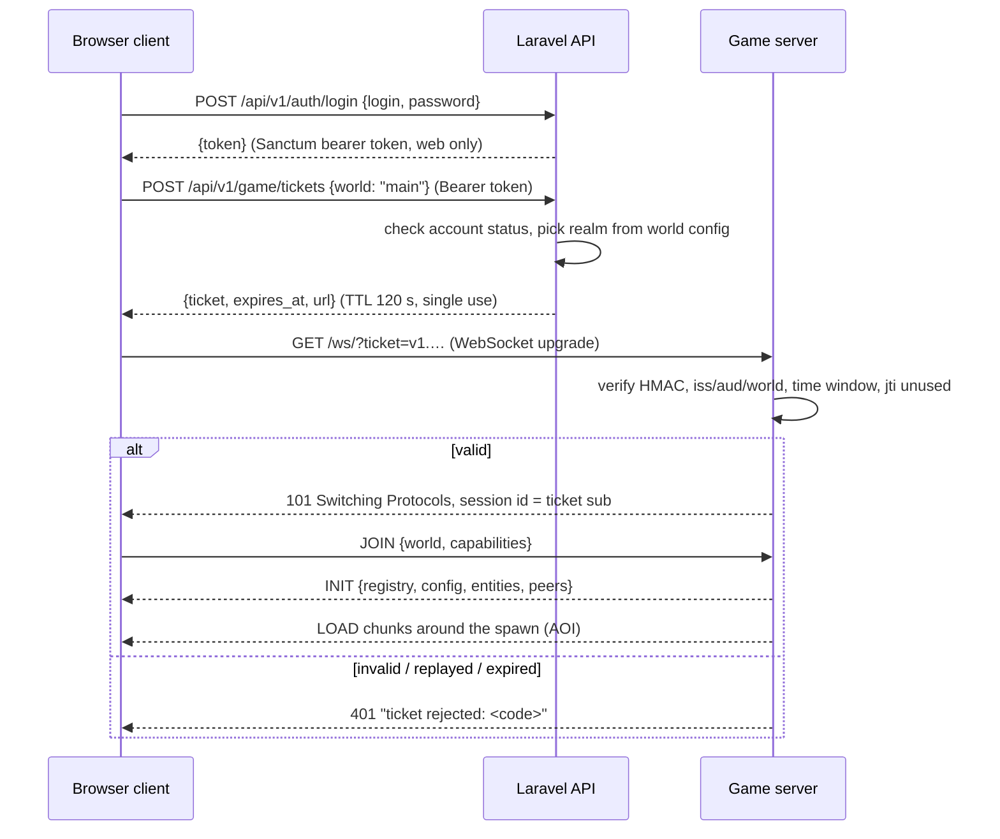

# Network protocol

Two protocols, never mixed:

| | Realtime game protocol | Business API |
| --- | --- | --- |
| Peer | browser ↔ game server | browser / game server ↔ Laravel |
| Transport | WebSocket (binary frames); WebRTC data channel lane already in the engine; WebTransport later | HTTPS |
| Encoding | Protocol Buffers (`messages.proto`) | JSON |
| Versioning | `packages/protocol/src/protocol-version.json` | URL prefix `/api/v1` |
| Spec | this document | [API.md](API.md) |

## 1. Session handshake

- The browser's password and web token never reach the game server; the
  ticket is the only credential it sees ([SECURITY.md](SECURITY.md)).
- The engine client id is the player's `public_id` from the ticket, so a
  reconnect resumes the same player and clients cannot pick their identity.
- A reconnect asks the API for a new ticket; tickets are never reused.
- Transport (bridge) connections (`?is_transport`) authenticate with
  `GAME_TRANSPORT_SECRET` and carry no player identity.

## 2. Frame format

Every frame is one protobuf `protocol.Message` (`messages.proto` at the
repository root), optionally compressed by the transport layer. Message
types used by the platform:

| Type | Direction | Use |
| --- | --- | --- |
| `JOIN` / `LEAVE` | C→S | enter / leave a world |
| `INIT` | S→C | registry (block ids and properties), world config, initial peers and entities |
| `PEER` | both | player transform; client sends its predicted position, server validates and rebroadcasts |
| `ENTITY` | S→C | entity create / update / delete / out-of-range; compact versioned `motion` bytes for clients advertising `motion.v<N>`; stamped with `tick` |
| `LOAD` / `UNLOAD` | S→C | chunks entering / leaving the client's area of interest |
| `UPDATE` | S→C | authoritative voxel and light changes (single or `BulkUpdate` packed arrays). Client→server raw updates are **refused** by the platform game server |
| `METHOD` | C→S | gameplay intents, see §3 |
| `EVENT` | both | named events with JSON payloads (effects, sounds, UI notices) |
| `CHAT` | both | chat lines with `seq` for history merge |
| `STATS` | S→C | world time, tick, weather |
| `ERROR` | S→C | refusals with a machine code |

## 3. Gameplay intents (`METHOD`)

Clients never send results, only intents. Every method name is namespaced
`platform.<area>.<verb>` and its JSON payload is validated against a schema
on the server; unknown fields are refused. The server answers with an
`EVENT` (`platform.<area>.result`) carrying `ok` or an error code, and with
the authoritative state changes (`UPDATE`, inventory events).

| Method | Payload | Server validates | Status |
| --- | --- | --- | --- |
| `platform.mine.start` | `{"voxel":[x,y,z]}` | reach (7.5 blocks to the voxel centre), chunk loaded, solid block, breakable in survival | ✅ |
| `platform.mine.finish` | `{"voxel":[x,y,z]}` | a matching `mine.start` on the same block, elapsed ≥ 80 % of `mining_rule(block, held tool)`, drops fit the inventory (else refused, nothing lost); applies drops and tool wear | ✅ |
| `platform.build.place` | `{"voxel":[x,y,z],"slot"?:n,"block"?:key,"rotation"?:0-5,"yRotation"?:0-15}` | reach, target air / fluid / non-solid plant, slot holds a placeable item (consumed), no player overlap for solid blocks; `block` honoured only in the creative realm; rotation applied only to oriented blocks (`horizontal` uses `yRotation`, `full` both) | ✅ |
| `platform.inventory.get` | `{}` | — (answers with a snapshot) | ✅ |
| `platform.inventory.select` | `{"slot":0-8}` | hotbar slot | ✅ |
| `platform.inventory.move` | `{"from":n,"to":n,"count"?:n}` | slots exist, stack limits, partial moves only onto empty or matching stacks | ✅ |
| `platform.craft` | `{"grid":[[key\|null,…],…]}` (2×2, or 3×3 near a workbench) | recipe match, ingredients owned, result fits; all-or-nothing | ✅ |
| `platform.window.open` | `{}` (inventory screen) or `{"voxel":[x,y,z]}` (workbench, furnace, chest) | reach, block kind, alive; closes any other window first | ✅ |
| `platform.window.click` | `{"slot":n,"click":{"type":"left"\|"right"\|"shift"\|"double"\|"hotbar","key"?:0-8\|"drop","all"?:bool}}` | slot rules (result/output take-only, fuel only fuels, armor only armor), stack limits; crafting result consumes one item per grid slot | ✅ |
| `platform.window.drag` | `{"slots":[n,…],"oneEach":bool}` | spreads the cursor evenly (or one each) over compatible slots | ✅ |
| `platform.window.fill` | `{"recipe":key,"max":bool}` | recipe book: moves ingredients from the inventory into the grid (once or as many sets as possible); refuses recipes that do not fit the grid | ✅ |
| `platform.window.close` | `{}` | grid and cursor go back to the inventory; what does not fit drops in the world | ✅ |
| `platform.inventory.drop` | `{"all":bool}` | drops one (or the stack) from the selected hotbar slot | ✅ |
| `platform.use` | `{"voxel":[x,y,z]}` | reach; a fire striker on a blast charge lights it (the block leaves; a 4 s fuse), on any other solid block that is no portal frame sets the cell above alight; on an anvil: repairs the held item fully for one experience level per quarter of its durability restored (free in creative; `not_enough_xp`, `cannot_use` when nothing is worn), answers `{"repaired":slot,"levels":n}`; on a town hall (`guild_hall`): a member of the guild whose land it stands on makes it their respawn point (overworld halls) and gets `platform.guild.hall {"guild":{"id","tag","name"},"home"}`, others `not_owner`; a held fire striker lights the riftstone frame at the voxel (a closed frame, interior 2×3 to 21×21, all air) and wears; circuit blocks are used whatever is held (lever toggles, button presses, clock steps its period, usable gates open/close); otherwise the held item acts: a hoe tills dirt/turf with air above into farmland (wears the hoe). Answer carries `changed` (cells written) | ✅ |
| `platform.market.list` | `{"slot":n,"count":n,"price":n,"kind"?:"fixed"\|"auction","buyout"?:n,"hours"?:1-168}` | survival realm only (`survival_only`); a backend configured (`market_unavailable`); valid price, buyout above the opening price for auctions only, duration (`bad_listing`); exactly `count` from the slot (`bad_count`). The goods leave the inventory into the player's outbox in one save; `platform.market {"listed"}` follows when the backend holds them, or `{"rejected"}` with the goods returned | ✅ |
| `platform.stall.price` | `{"at":[x,y,z],"slot":0-8,"price":n}` | the stall's owner (`not_owner`), within reach; 0 takes the slot off sale | ✅ |
| `platform.stall.guild` | `{"at":[x,y,z],"guild":bool}` | the stall's owner, within reach; a guild stall's sales pay the owner's guild treasury (fixed per sale when it is bought) | ✅ |
| `platform.stall.buy` | `{"at":[x,y,z],"slot":0-8}` | not the owner, survival buyer and stall (`survival_only`), a priced stocked slot, within reach, a backend; the goods are set aside and paid through the ledger, then `platform.market {"bought"}` (owner: `{"sold"}`) or `{"refused"}` with the goods back on sale | ✅ |
| `platform.blueprint.capture` | `{"min":[x,y,z],"max":[x,y,z],"name":s}` | a backend; box ≤ 32 per side, within 64 blocks, loaded (`not_loaded`), all of it land you may build on (`land_protected`), not empty (`bad_blueprint`); answers `{"blocks","size","materials"}`, then `platform.market {"blueprint":{"stored":id,"blocks"}}` or `{"refused":code}` | ✅ |
| `platform.blueprint.build` | `{"id":s,"at":[x,y,z]}` | a backend, within 64 blocks; then, once the layout arrives: you are the creator or hold a licence (`not_licensed`), land you may build on, every cell free (`occupied`) and no player inside (`collides_with_player`), all materials in the inventory (`missing_ingredients`, survival); all or nothing → `platform.market {"blueprint":{"built":id,"blocks"}}` | ✅ |
| `platform.contract.deliver` | `{"contract":id,"slot":n,"count":n}` | survival; exactly `count` from the slot into the outbox (as for listings); the backend checks the contractor, item and count → `platform.market {"fulfilled":{"contract","item","count"}}`, or `{"rejected"}` with the goods back | ✅ |
| `platform.inventory.creative` | `{"slot":n,"item":key}` | creative realm only (`creative_only`); a full, unworn stack of any item into the slot (`unknown_item`, `bad_slot`) | ✅ |
| `platform.build.place` with a `siege_banner` | as for any block, but on enemy guild land: the placer's guild must be fighting the land's guild (`not_at_war`), one siege per land (`siege_underway`), survival only. The banner holds while members of its guild stand within 12 blocks and no defender does; after `GAME_SIEGE_SECONDS` (600) held the game server asks the backend for the land. Players within 32 blocks get `platform.siege {"at","land","attacker","progress","needed","contested"}` every 2 s, and `{"captured","by","at"}` or `{"failed","code","at"}` at the end (the banner is spent on capture); defenders break the banner to end the siege | ✅ |
| `platform.bottle.fill` | `{}` | holding a glass bottle, water within 4 blocks of the eye (`nothing_there`) → a water bottle | ✅ |
| `platform.weather.set` | `{"kind":"clear"|"rain"|"thunder"}` | creative players only (`creative_only`), overworld | ✅ |
| `platform.bow.draw` | `{}` | holding a bow, alive; the server starts timing the draw | ✅ |
| `platform.bow.shoot` | `{"direction":[x,y,z]}` | after `bow.draw`; the draw time sets the power (full after 1 s, at least 0.1 s: `too_fast`); survival takes an arrow (`no_arrows`) and wears the bow; the arrow flies under gravity (45 blocks/s at full draw), hits creatures, players of a guild at war with yours, or sticks into a block where a survival player's arrow drops as an item → `{"arrow":id,"charge"}` | ✅ |
| `platform.attack.player` | `{"player":id}` | both players survival and alive, their guilds at war (`not_at_war`; the server's guild feed decides), within reach, 0.5 s cooldown; damage from the held weapon (1 by hand), wears it; a kill is reported to the backend and scored for the war (`platform.market {"war_kill"}` to the killer) | ✅ |
| `platform.attack` | `{"mob":id}` | alive, within reach of the creature, 0.5 s cooldown; damage from the held weapon (1 by hand), wears it, knocks the creature back | ✅ |
| `platform.interact` | `{"mob":id}` | within reach, holding the creature's breed item: feeds it (love mode, or a baby grows faster) | ✅ |
| `platform.eat` (potions) | `{"slot"?:n}` | a potion is drunk whatever the hunger: its effect starts (instant healing heals 4 per level) and a glass bottle takes its place | ✅ |
| `platform.eat` | `{"slot"?:n}` | alive, slot holds food, player hungry (survival); consumes one | ✅ |
| `platform.respawn` | `{}` | player is dead; restores vitals, answers `platform.respawn {x,z}` (client moves to that column's surface), or `{x,z,"feet":[x,y,z]}` at the player's town hall while it stands; in another dimension the player is sent home with `platform.travel` instead | ✅ |
| `platform.trade.request` | `{"player":id}` | both survival, alive, within 8 blocks, neither in a trade (`busy`), a backend; the other player gets `platform.trade {"invite":{"from","name"}}` (valid 30 s) | ✅ |
| `platform.trade.accept` | `{"player":inviter}` | a valid invitation, still within 8 blocks; both get the window state | ✅ |
| `platform.trade.offer` | `{"items"?:[{"slot","count"}],"crowns"?:n,"reset"?:bool}` | adds the stacks to your offer (`reset` first takes the whole offer back) and sets your Crowns; at most 9 stacks; items move into your hold, saved with your inventory; clears both confirmations | ✅ |
| `platform.trade.confirm` | `{}` | when both confirm: the Crowns difference moves through the ledger (no fee), then the goods swap; a refused payment reopens the trade unconfirmed | ✅ |
| `platform.trade.cancel` | `{}` | not while paying; everyone's hold comes back. Trades also end when players drift 16 blocks apart, leave or die | ✅ |

Answers (events, sent only to the requesting client):

- `platform.result` — `{"intent":"mine.finish","ok":true,…}` or
  `{"intent":…,"ok":false,"code":"too_fast"}`. Codes: `out_of_reach`,
  `not_loaded`, `nothing_there`, `unbreakable`, `no_mining_session`,
  `wrong_block`, `too_fast`, `inventory_full`, `not_placeable`, `occupied`,
  `collides_with_player`, `unknown_block`, `no_recipe`,
  `missing_ingredients`, `needs_workbench`, `bad_slot`, `slot_empty`,
  `bad_count`, `bad_payload`, `not_joined`, `unknown_item`, `creative_only`,
  `land_protected`, `market_unavailable`, `survival_only`, `bad_listing`,
  `not_owner` (someone else's stall), `busy` (a stall with a sale being paid),
  `bad_blueprint`.
- `platform.inventory` — `{"slots":[{"item":id,"count":n,"durability"?:n}|null ×36],"selected":0-8,"realm":"survival","armor":0-20}` (`armor`: points of the armor worn),
  pushed on join and after every change.

- `platform.window` — the open window, authoritative after every change:
  `{"kind":"player"|"workbench"|"furnace"|"chest"|null,"slots":[…],"rules":[…],"inventoryStart":n,"grid":[start,size]|null,"cursor":stack|null,"furnace":{"burnLeft","burnTotal","progress","progressTotal"}|null}`.
  Furnace viewers get updates while it burns; chest viewers see each other's changes.
- `platform.drops` — `{"items":[{"id","item","count","p":[x,y,z]}]}`, dropped items within 64 blocks, up to 10 times a second.
- `platform.pickup` — `{"items":[[item,count],…]}` after walking over drops.
- `platform.mobs` — `{"mobs":[{"id","key","p","yaw","health","hurt","baby","moving","love"}]}`, creatures within 64 blocks, ten times a second.
- `platform.vitals` — `{"health","food","air","maxAir","dead","cause":"fall"|"drowning"|"lava"|"starvation"|"mob"|"void"|"player"|"fire"|"explosion"|"arrow"|null,"realm","xp","level","progress","burning","effects":[{"kind","level","seconds"}]}` (experience points, level and the fraction towards the next level`,
  pushed on join and whenever a vital changes (from the server's per-tick
  survival system).

- `platform.market` — `{"listed":{"listing","item","count","kind","price"}}`,
  `{"rejected":{"code","item","count"}}` (goods returned),
  `{"received":{"item","count","reason"}}` (a delivery handed over: a
  purchase, an auction won, cancelled or expired goods), or
  `{"waiting":{"item","count"}}` (a delivery needs room in the inventory),
  `{"bought"|"sold":{"item","count","price"}}` and `{"refused":{"code","item","count"}}` for stall sales.
- `platform.weather` — `{"kind":"clear"|"rain"|"thunder","precipitation":"rain"|"snow"|"none"}` on joining, on a change and on walking into a biome where other weather falls; `platform.lightning` — `{"at"}` to players within 160 blocks,
- `platform.combat` — `{"fuses":[{"at","fuse"}],"arrows":[{"id","pos","vel"}]}` ten times a second to players within 96 blocks of anything in flight or burning (and once more when nothing is left),
- `platform.explosion` — `{"at","power"}` to players within 96 blocks; `platform.push` — `{"velocity":[x,y,z]}` the blast's push on this player,
- `platform.stall` — `{"at","owner":{"id","name"},"mine","creative","guild","offers":[{"slot","item","count","price"}],"prices":[9],"pending","stock":[9]|null}`,
  sent when a player opens a trade stall (someone else's stall opens no
  window; the owner also gets the stall's chest-style stock window).
- `platform.trade` — `{"trade":{"id","mine":{"name","items","crowns","confirmed"},"theirs":{…},"paying"}}`
  after every change, `{"trade":null,"ended":"done"|"cancelled"}`,
  `{"invite":{"from","name"}}`, `{"refused":code}` with the state.
- `platform.land` — `{"land":{"id","name","owner":{"id","name"},"guild":{"id","name","tag"}|null,"settlement":{"name","level"}|null,"role","public","min","max"}|null}`
  when the player walks into different land (null: wilderness).
- `platform.teleport` — `{"feet":[x,y,z]}`: the cell the player's feet are
  to stand in. Sent on join (back where they left) and when a traveller is
  placed in a portal; the client moves once that chunk exists.
- `platform.travel` — `{"world":name}`: join that engine world. Sent when a
  player stands in a rift long enough (4 s, 1 s in creative), on respawn
  away from the overworld, and on join when the player's record says they
  are in another dimension. Clients send `JOIN` for that world on the same
  connection (the web client reloads into it); the ticket is the same shard
  ticket.

Players' inventories, vitals, position and dimension persist in
`<save dir>/<world>/players/<public id>.json` (atomic writes, one record per
player across all dimensions) and are restored on the next join.

### Dimensions

`GET /platform/info` lists them: `{"dimensions":{"overworld":"main","sky":"main_sky","underworld":"main_underworld"}}`.
Each dimension is an engine world; a session may be in one at a time and
the server decides which (see `servers/game-server/src/gameplay/travel.rs`).

## 4. Area of interest

The engine keeps per-chunk interest sets (`server/world/interests.rs`): a
client receives `LOAD` for chunks within its render radius (bounded by
the server's `max_chunk_requests` and per-tick send budgets) and `UNLOAD`
when it moves away. Entities and peers are replicated only to clients whose
interest covers their chunk; leaving it sends `OUT_OF_RANGE`. Voxel `UPDATE`s
go only to clients interested in the changed chunk. Nothing outside a
client's area is ever sent.

## 5. Bandwidth and latency

- **Binary**: protobuf with packed repeated fields for bulk voxel updates.
- **Delta**: chunk `UPDATE`s carry only changed voxels; entity replication
  sends deltas of changed components, full snapshots only on create.
- **Compression**: chunk voxel and light arrays are compressed; large frames
  use the WebSocket's aggregated continuations (16 MiB limit).
- **Interpolation**: entity and peer messages carry the server `tick`; the
  client interpolates between snapshots.
- **Prediction / reconciliation**: the client predicts its own movement with
  the shared physics engine; the server clamps impossible movement and the
  client snaps back to the authoritative position.
- **Backpressure**: two outbound lanes (control before bulk), bounded write
  time per frame, slow-ack accounting (`server/runtime.rs`).

## 6. Versioning

`packages/protocol/src/protocol-version.json` is the single source of the
wire version for both Rust and TypeScript. A mismatch closes the socket with
the `mismatchCloseCode` (4000–4999 range); the client treats it as terminal
and asks the player to reload. Fields are only ever added to `messages.proto`
with new tag numbers; tags are never reused.

## 7. Transport migration path

The WebSocket route (`/ws/`) and the WebRTC signalling routes share one
session authenticator, so a WebTransport (QUIC) route added later reuses the
same ticket check and the same message codec. Clients pick the best lane the
server advertises in `/info`; the ticket flow does not change.
