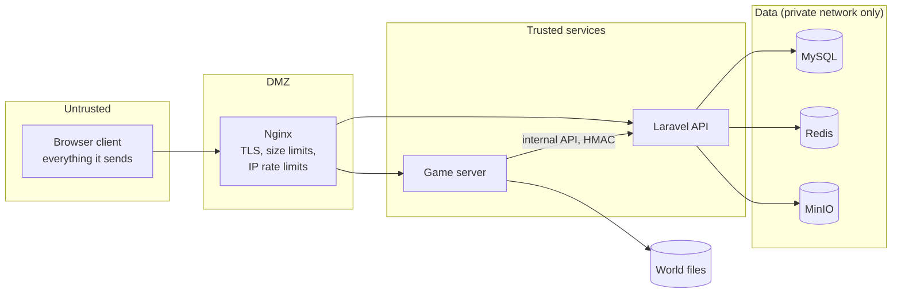

# Security boundaries

## 1. Trust zones



- **Every client packet is untrusted.** The client never decides balance,
  inventory ownership, item creation, damage, trade results, mining results
  or its own identity.
- The game server trusts the API's answers; the API trusts the game server
  only for the narrow internal endpoints its service key allows.
- Data stores are reachable only on the private Docker network; nothing in
  `infrastructure/` publishes MySQL, Redis or MinIO ports outside localhost.

## 2. Authentication

| Who | Credential | Lifetime | Where checked |
| --- | --- | --- | --- |
| Player → API | Sanctum bearer token (from login) | until logout / revocation | Laravel |
| Player → game server | **game ticket** | 120 s, single use | game server (`crates/ticket`) |
| Bridge → game server | `GAME_TRANSPORT_SECRET` | rotated | game server |
| Game server → API | per-server HMAC service key *(phase 13)* | rotated | Laravel |

Passwords are hashed by Laravel (bcrypt, cost 12). The game server never sees
a password or a web token.

### Game tickets

```
v1.<base64url(claims JSON)>.<base64url(HMAC-SHA256(secret, "v1." + claims part))>
claims: iss, aud, sub (player public id), name, world, realm, roles, iat, exp, jti
```

The verifier checks, in order: version prefix, signature against every
configured secret (constant-time; rotation by prepending a new secret),
issuer, audience, world, non-empty identity, lifetime ≤ 300 s, `iat` not in
the future and `exp` not past (5 s leeway), and finally that `jti` was never
redeemed (remembered until expiry). Rejection reasons are stable codes
(`expired`, `replayed`, …). The Rust verifier and the PHP issuer are pinned to
the same vectors in `platform/tests/fixtures/game-ticket-vectors.json`.

The realm in a ticket comes from the server-side world configuration, never
from the client's request.

## 3. Secrets

| Secret | Holders | Minimum |
| --- | --- | --- |
| `APP_KEY` | API | Laravel generated |
| `GAME_TICKET_SECRETS` | API, game servers | 32 bytes each, comma list, newest first |
| `GAME_TRANSPORT_SECRET` | game server, bridges | 32 bytes |
| DB / Redis / MinIO credentials | API (and backup jobs) | generated |

The game server refuses to start without ticket and transport secrets unless
`GAME_INSECURE_DEV=1`, which logs a warning and must never be set on a
reachable host. Secrets come from the environment only and are never logged
or echoed (wrong secrets are not printed either).

## 4. Server authority in the world

- **Raw voxel writes from clients are refused** (`set_raw_update_guard` in
  the game server). Every block change is a validated intent
  ([NETWORK_PROTOCOL.md](NETWORK_PROTOCOL.md) §3).
- Movement: the engine clamps per-update position deltas; the platform adds
  speed, fly and reach checks against the player's game mode and status.
- Mining: a break is accepted only after `mining_rule(block, tool, modifiers)`
  time has elapsed since the matching `mine.start` (with jitter tolerance).
- Building: reach, replaceability, collision with players and entities,
  inventory ownership, land permission and game mode are checked before the
  world changes.
- Inventory, crafting and trading run on the server; the client renders the
  results it is sent.

## 5. Anti-cheat signals

Each detector records a structured signal (`player`, `kind`, `severity`,
`evidence`) instead of acting alone; a policy decides on kicks or reviews.

| Signal | Detection |
| --- | --- |
| speed / fly | movement deltas vs mode, effects and physics envelope |
| reach | target distance from the eye position |
| impossible mining | break earlier than the mining rule allows |
| inventory manipulation | intents referencing slots or items the player does not have |
| item duplication | instance id seen in two places; per-item conservation checks around trades |
| packet replay | single-use tickets; per-session monotonic intent sequence numbers |
| currency manipulation | all money through the ledger; `ledger:verify` invariants |
| bot farming | reward-rate outliers per account and IP, repetitive input timing |

## 6. Economic safety

See [ECONOMY_LEDGER.md](ECONOMY_LEDGER.md): integer money, double entry,
row locks, idempotency keys, append-only entries, invariant verification.
In production the application database user has no `UPDATE`/`DELETE` grant
on `ledger_entries`, `ledger_transactions` and `audit_logs`
(`infrastructure/mysql/init/02-grants.sql`), so even a bug cannot rewrite
history.

## 7. Audit

Every sensitive action writes an `audit_logs` row in the same database
transaction as the action: money creation, administrative item grants, bans,
land seizures, moderation actions, configuration changes. An administrator
cannot create money or items without such a row, because the only code paths
that do it (`LedgerService::mint`, the future item grant service) write it
themselves.

## 8. API hardening

- Rate limits: auth (10/min per IP, 5/min per login), tickets (12/min per
  user), economy (30/min per user); Nginx adds per-IP connection limits.
- Validation on every input; money amounts must be integers.
- Public responses expose `public_id`, never numeric ids or emails.
- Banned and suspended accounts cannot log in or obtain tickets.

## 9. Creative isolation

Creative worlds issue tickets with `realm = creative`; their currency is
`CRT` and their items are created in realm `creative`. Nothing moves from the
creative realm to survival: the ledger refuses mixed-currency transactions
and item instances carry their realm, checked by every transfer.
