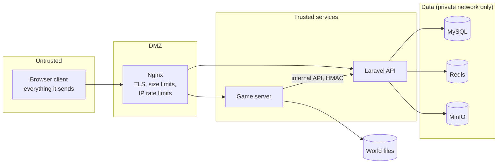

# Security boundaries

## 1. Trust zones



- **Every client packet is untrusted.** The client never decides balance,
  inventory ownership, item creation, damage, trade results, mining results
  or its own identity.
- The game server trusts the API's answers; the API trusts the game server
  only for the narrow internal endpoints its service key allows.
- Data stores are reachable only on the private Docker network; nothing in
  `infrastructure/` publishes MySQL, Redis or MinIO ports outside localhost.

## 2. Authentication

| Who | Credential | Lifetime | Where checked |
| --- | --- | --- | --- |
| Player → API | Sanctum bearer token (from login) | until logout / revocation | Laravel |
| Player → game server | **game ticket** | 120 s, single use | game server (`crates/ticket`) |
| Bridge → game server | `GAME_TRANSPORT_SECRET` | rotated | game server |
| Game server → API | per-server HMAC service key *(phase 13)* | rotated | Laravel |

Passwords are hashed by Laravel (bcrypt, cost 12). The game server never sees
a password or a web token.

### Account recovery and deletion

Password reset tokens are Laravel's (hashed in `password_reset_tokens`, 60
minutes, one use); asking for one never reveals whether an address exists.
A reset or password change revokes the other bearer tokens. Email
confirmation links are signed URLs (24 h) bound to the public id and the
address hash; `AUTH_REQUIRE_VERIFIED_EMAIL` keeps unconfirmed accounts out of
the game. Deleting an account needs the password, refuses while money is in
flight (bids, accepted contracts, a guild to hand over), removes personal
data and game saves, and keeps an anonymised row so the ledger stays
balanced. Players can download their data (`GET /me/export`).

### Game tickets

```
v1.<base64url(claims JSON)>.<base64url(HMAC-SHA256(secret, "v1." + claims part))>
claims: iss, aud, sub (player public id), name, world, realm, roles, iat, exp, jti,
        look (optional)
(`roles` is always `player` plus any of `moderator`, `admin` granted with
`php artisan user:role {user} {role} [--remove]`; game servers let these roles
set game modes. `look` is what the player wears, `{ "outfit": { "body",
"arms", "legs" }, "hat": { "art" } | { "color" } }`; game servers check
every colour and hat picture before anyone sees it, and a look changed in
play arrives in a fresh ticket for the same player, redeemed once)
```

The verifier checks, in order: version prefix, signature against every
configured secret (constant-time; rotation by prepending a new secret),
issuer, audience, world, non-empty identity, lifetime ≤ 300 s, `iat` not in
the future and `exp` not past (5 s leeway), and finally that `jti` was never
redeemed (remembered until expiry). Rejection reasons are stable codes
(`expired`, `replayed`, …). The Rust verifier and the PHP issuer are pinned to
the same vectors in `platform/tests/fixtures/game-ticket-vectors.json`.

The realm in a ticket comes from the server-side world configuration, never
from the client's request.

## 3. Secrets

| Secret | Holders | Minimum |
| --- | --- | --- |
| `APP_KEY` | API | Laravel generated |
| `GAME_TICKET_SECRETS` | API, game servers | 32 bytes each, comma list, newest first |
| `GAME_TRANSPORT_SECRET` | game server, bridges | 32 bytes |
| `GAME_SERVICE_TOKEN` | API, game servers (internal API) | 32 bytes |
| DB / Redis / MinIO credentials | API (and backup jobs) | generated |

The game server refuses to start without ticket and transport secrets unless
`GAME_INSECURE_DEV=1`, which logs a warning and must never be set on a
reachable host. Secrets come from the environment only and are never logged
or echoed (wrong secrets are not printed either).

## 4. Server authority in the world

- **Raw voxel writes from clients are refused** (`set_raw_update_guard` in
  the game server). Every block change is a validated intent
  ([NETWORK_PROTOCOL.md](NETWORK_PROTOCOL.md) §3).
- Movement: the engine clamps per-update position deltas; the platform adds
  speed, fly and reach checks against the player's game mode and status.
- Mining: a break is accepted only after `mining_rule(block, tool, modifiers)`
  time has elapsed since the matching `mine.start` (with jitter tolerance).
- Building: reach, replaceability, collision with players and entities,
  inventory ownership, land permission and game mode are checked before the
  world changes.
- Inventory, crafting and trading run on the server; the client renders the
  results it is sent.
- Land: breaking, placing, tilling and lighting portals need `build`,
  chests and furnaces need `containers`, switches need `use` in the land at
  the target block (owner/manager/builder: all; visitor: use; others: the
  land's public permissions); refused with `land_protected`. The game
  server enforces the backend's claims from the internal feed and keeps the
  last copy on disk; a production server must either have a feed or declare
  `GAME_BACKEND_URL=off`, so land is never silently unenforced.

## 5. Anti-cheat signals

Each detector records a structured signal (`player`, `kind`, `severity`,
`evidence`) instead of acting alone; a policy decides on kicks or reviews.

| Signal | Detection |
| --- | --- |
| speed / fly | movement deltas vs mode, effects and physics envelope |
| reach | target distance from the eye position |
| impossible mining | break earlier than the mining rule allows |
| inventory manipulation | intents referencing slots or items the player does not have |
| item duplication | instance id seen in two places; per-item conservation checks around trades |
| packet replay | single-use tickets; per-session monotonic intent sequence numbers |
| currency manipulation | all money through the ledger; `ledger:verify` invariants |
| bot farming | reward-rate outliers per account and IP, repetitive input timing |

**Movement checks (implemented, `gameplay/anticheat.rs`).** Four times a
second, for every player in survival or adventure (not creative, not
spectating, not within 3 s of being moved by the server or 10 s of joining,
not just hurt): horizontal speed over a 1 s window above any sprint with
their Speed effect ×1.5 (`speed`); more than 2.5 s with no ground, water
or loaded edge under them while not falling (`hover`); feet and head in
solid blocks for 0.75 s (`noclip`). A violation sends them back — down
onto the ground below for hovering, otherwise to the last place they stood
fairly — and counts it (`platform_anticheat_violations_total`). Ten of a
kind within five minutes are reported to the backend
(`POST /api/internal/v1/flags`), which writes `anticheat.<kind>` to the
audit log for moderators; nothing is banned automatically. Reach, mining
time and intent rate are refused per intent (§4). `GAME_ANTICHEAT=off`
switches the movement checks off (scripted test bots move by setting
positions).

**Game server database account.** Game servers write player records with
their own MySQL account (`platform_game`), granted SELECT, INSERT and
UPDATE on `player_states` only: a compromised game server can neither read
accounts nor touch the ledger, and cannot delete records.

## 6. Economic safety

See [ECONOMY_LEDGER.md](ECONOMY_LEDGER.md): integer money, double entry,
row locks, idempotency keys, append-only entries, invariant verification.
In production the application database user has no `UPDATE`/`DELETE` grant
on `ledger_entries`, `ledger_transactions` and `audit_logs`
(`infrastructure/mysql/init/02-grants.sql`), so even a bug cannot rewrite
history.

### Goods between the game and the market

- Creative-realm goods never enter the market (`survival_only`).
- Custody is never ambiguous: listing removes the goods and records an
  outbox entry in the same atomic player-record write; the entry is removed
  only when the backend confirms the listing (one listing per outbox id,
  however often it is resent) or refuses it (goods returned). A delivery is
  applied by adding the goods and remembering its id in the same record
  write, and only then acknowledged; a delivery seen again is only
  acknowledged. Neither a crash nor a lost reply duplicates or loses goods.
- Trade stalls: only the placer owns, prices and breaks a stall (never
  while a sale is being paid); creative stalls and creative buyers never
  trade. A purchase sets the goods aside in a sale saved with the stall
  before money is asked for; the payment is idempotent by the sale's key, so
  a restart asks again and lands on the same outcome; paid goods are handed
  over once (the key is remembered with the buyer's inventory).
- Trade windows: offered items move into the player's hold in the same
  record write as their inventory; a cancelled trade returns the hold as
  saved there, a completed one clears it and adds the other side's goods,
  each player's outcome applied once (keyed like deliveries) and only in
  the trade's world. Crowns move before goods, by the trade's key; a trade
  interrupted by a restart while paying settles when the payment answers.
- Money for bids is locked in a per-listing escrow account; buying, bidding
  and settling each happen in one database transaction with the listing row
  locked.

### Blueprints

- Capturing needs build permission over the whole box (no copying other
  people's land); only placeable blocks are captured (no containers'
  contents, no fluids).
- A stored layout is handed out only to its creator or a licence holder,
  and only if it still matches the SHA-256 recorded at capture.
- Building re-checks everything in the game at the moment of building
  (land, free cells, players, materials) and changes the world and the
  inventory all at once, so a blueprint never conjures blocks.

## 7. Audit

Every sensitive action writes an `audit_logs` row in the same database
transaction as the action: money creation, administrative item grants, bans,
land seizures, moderation actions, configuration changes. An administrator
cannot create money or items without such a row, because the only code paths
that do it (`LedgerService::mint`, the future item grant service) write it
themselves.

## 8. API hardening

- Rate limits: auth (10/min per IP, 5/min per login), tickets (12/min per
  user), economy (30/min per user); Nginx adds per-IP connection limits.
- Validation on every input; money amounts must be integers.
- Public responses expose `public_id`, never numeric ids or emails.
- Banned and suspended accounts cannot log in or obtain tickets.

## 9. Creative isolation

Creative worlds issue tickets with `realm = creative`; their currency is
`CRT` and their items are created in realm `creative`. Nothing moves from the
creative realm to survival: the ledger refuses mixed-currency transactions
and item instances carry their realm, checked by every transfer.
